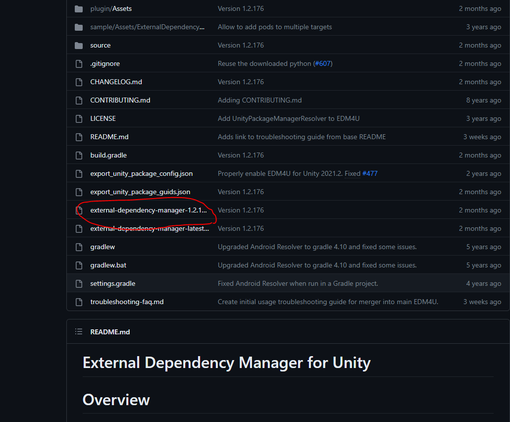
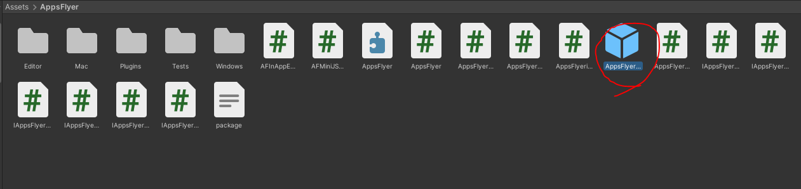
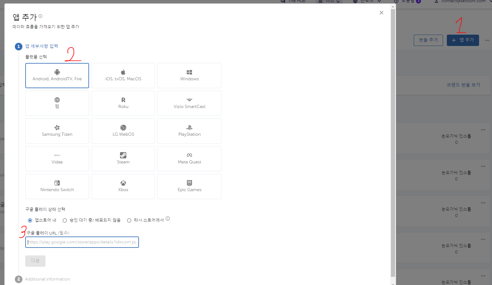
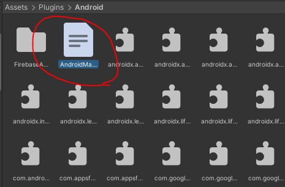
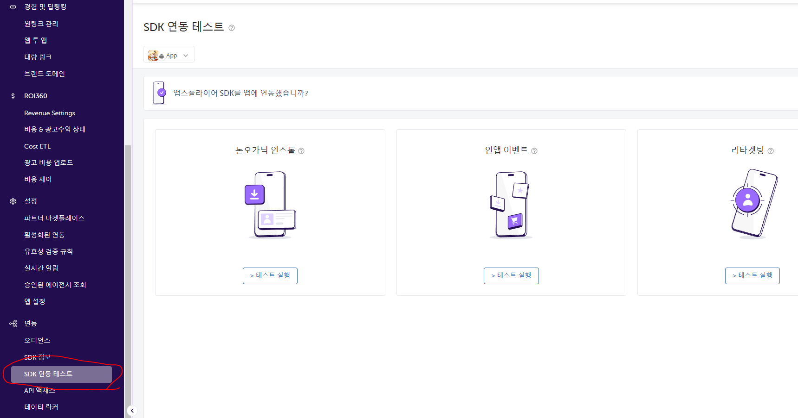
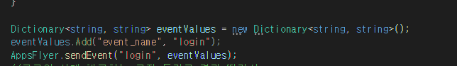
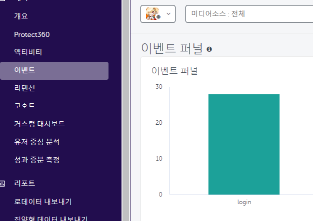

# AppsFlyer.SDK적용

---

<aside>
💡 **HEADER**

</aside>

---

# 개요

---

에셋 파일 안의 데이터를 빼는 방법과 데이터를 순서대로 엑셀에 넣는 것에 대한 문서

<aside>
⚠️ 작성시기 2023년 06월

</aside>

<aside>
⚠️ Visual Studio 2022, Unity 에서 진행되었습니다.

</aside>

---


AppsFlyer SDK를 Unity 프로젝트에 적용을 시켜서 연동을 시키려고 한다.<br><br>

그렇다면 먼저 [AppsFlyer 유니티 설명](https://ko.dev.appsflyer.com/hc/docs/unity-plugin) 설명서에서 나와있는 것들을 살펴보면서 천천히 진행한다.<br><br>

먼저 깃허브에서 플러그인을 다운을 받는다.<br><br>

<br><br>

[AppsFlyer 유니티 플러그인](https://github.com/googlesamples/unity-jar-resolver)<br><br><br>


시간이 지나서 버전이 업데이트가 되어서 버전이 달라졌을 수도 있지만, 제일 최신 버전을 쓰면된다.<br><br>
다운을 받고 원하는 유니티 프로젝트에 넣고 임포트를 하면 된다.<br><br>

<br>

임포트를 했으면 AppsFlyer 폴더가 따로 생겼을 것이다.<br>
AppsFlyer에 들어간 후에 AppsFlyerObject라는 프리펩을 씬으로 이동시킨다.


<br>

Dev Key를 입력하는 칸이 있는데 이것은 AppFlyer 사이트에서 가입을 하고 앱을 추가를 한다면

<br>

대략적인 순서는 이렇게 될 것이다.<br><br>

그리곤 Dev Key를 보여주는 팝업차을 띄울텐데 그걸 복사하고 Dev Key를 입력하는 칸에 붙여놓으면 된다.<br>
참고로 App ID는 IOS 용이다. Android는 App ID 칸은 아무것도 쓰지말고 빈 칸으로 나두면 된다.<br><br><br>


또한 AndroidManifest파일에 코드를 추가해야되는데 


<br>

위의 사진에 있는 경로를 따라서 AndroidManifest.xml 파일에 들어간다.


```c#

<uses-permission android:name="android.permission.INTERNET" />
<uses-permission android:name="android.permission.ACCESS_NETWORK_STATE" />
<uses-permission android:name="android.permission.ACCESS_WIFI_STATE" />

```

위에 있는 코드를 추가하면 끝인데,
만약 API 수준 31(안드로이드 12)을 타겟팅하는 앱은 AndroidManifest.xml에 다음 권한을 추가하여 안드로이드 광고 식별자에 액세스할 수 있어야 하기에 
```c#
<uses-permission android:name="com.google.android.gms.permission.AD_ID" />
```

이렇게 추가를 하면 된다.

이렇게 되면 연동이 되었는지 확인을 해야되는데 AppsFlyer 사이트에서 연동이 되었는지 확인할 수 있다.

<br><br>

연동을 확인할 앱을 정하고 그림에 표시하는 곳으로 가서  
연동이 확인할 방법을 알 수 있다. <br>
원하는 방법을 선택하여 사이트에서 원하는 수서대로 진행한다면 수월하다.<br>


이제 인 앱 이벤트를 통해 분석을 하기 위해서는 따로 스크립트를 붙여된다.<br>


<br><br>

먼저 나는 부분을 지나가면 login이라는 이벤트가 발생되어 숫자가 오르게 만들었는데<br>
만약 연동이 완벽하게 되었다면 2시간이내에 확인할 수 있는데<br>


<br><br>

이벤트에 들어가보면 자신이 이벤트를 활성화 시킨 수만큼<br>
숫자가 올라가있는 것을 발견할 수 있을 것이다.<br>


만약 코드를 무엇을 어떻게 짜야하는지 몰라도 걱정할 필요는 없다.
AppsFlyer에서 따로 인 앱 이벤트 스크립트 제작 사이트를 만들어줬었기 때문이다.<br>

[IN-APP-Event Generator](https://evgen.appsflyer.com/)<br><br>


여기에서 원하는 이벤트를 골라서 코드를 그대로 쓰거나 참고를 하면
좀 더 수월하게 코드를 작성할 수 있다.

예를 들어 


---
<aside>

- 참고자료

</aside>


[AppsFlyer Guide1](https://support.appsflyer.com/hc/ko/articles/360007314277)<br><br>
[AppsFlyer Guide2](https://ko.dev.appsflyer.com/hc/docs/install-android-sdk)<br><br>

