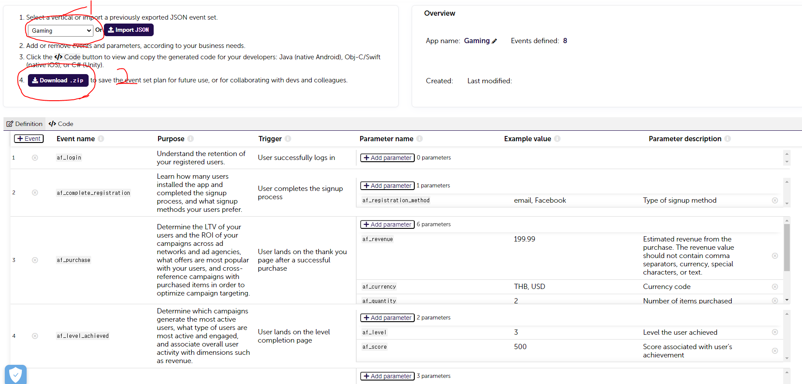
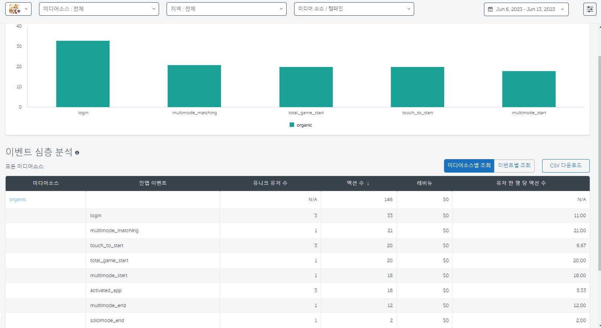
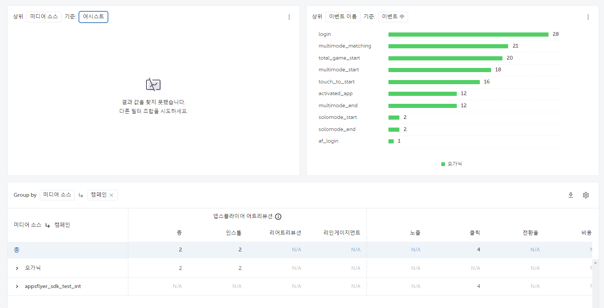
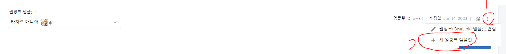
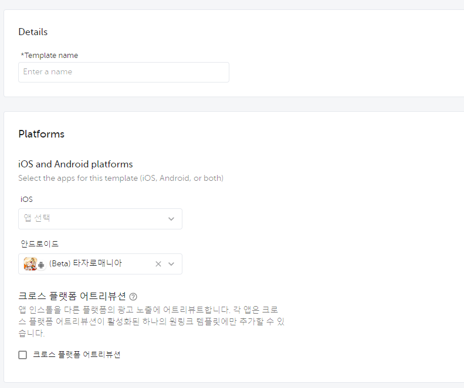
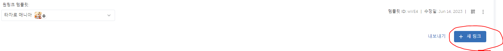
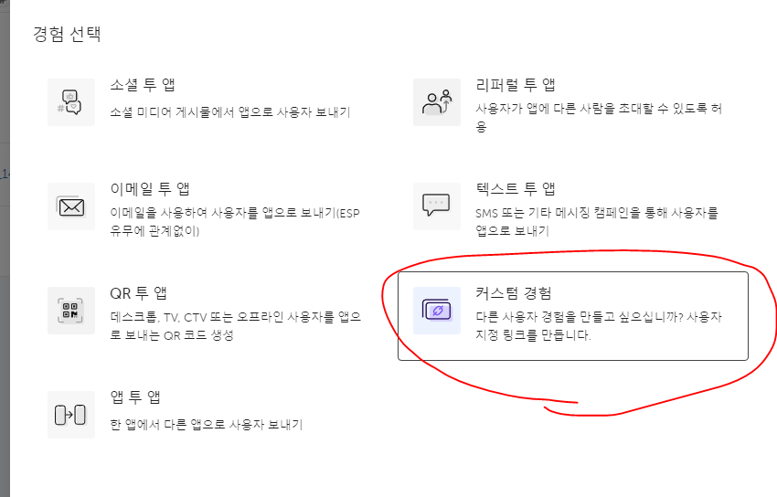
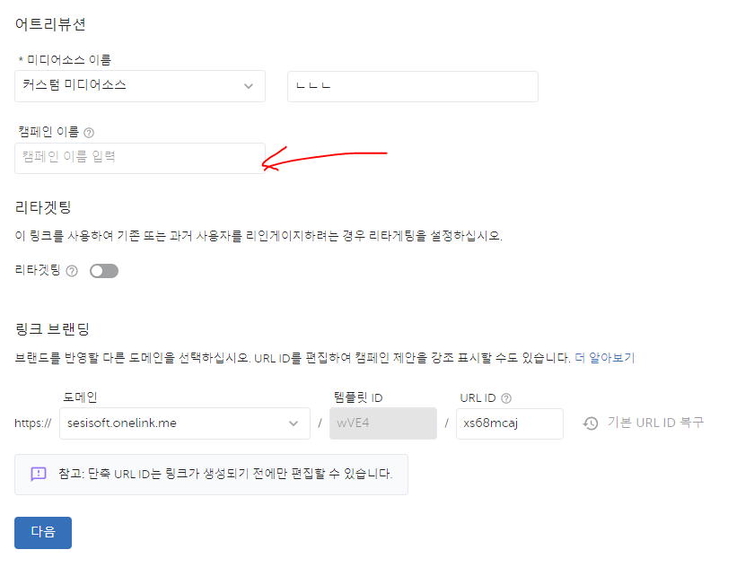
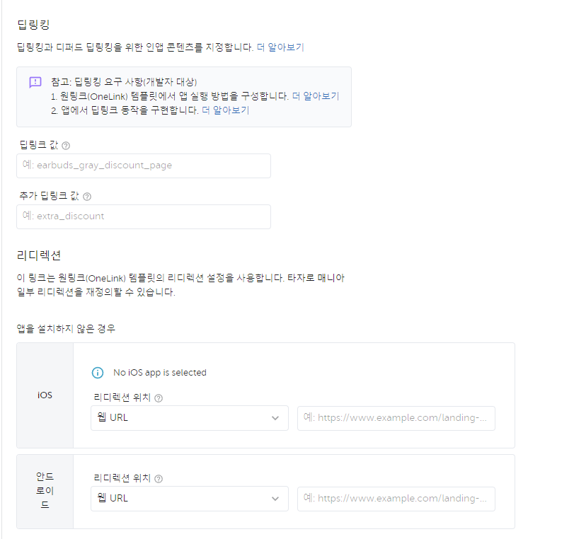
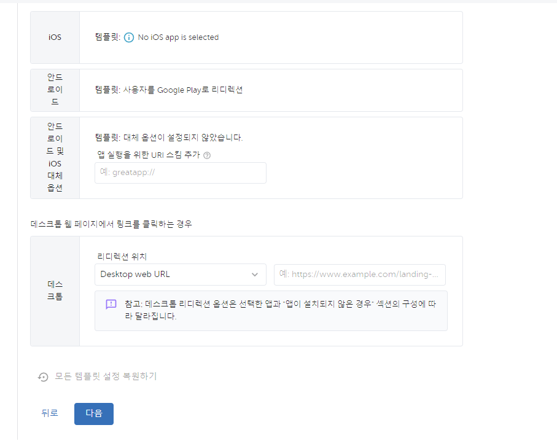

# AppsFlyer.SDK적용

---

<aside>
💡 **HEADER**

</aside>

---

# 개요

---

에셋 파일 안의 데이터를 빼는 방법과 데이터를 순서대로 엑셀에 넣는 것에 대한 문서

<aside>
⚠️ 작성시기 2023년 06월

</aside>

<aside>
⚠️ Visual Studio 2022, Unity 에서 진행되었습니다.

</aside>

---


AppsFlyer SDK를 Unity 프로젝트에 적용을 시켜서 연동을 시키려고 한다.<br><br>

그렇다면 먼저 [AppsFlyer 유니티 설명](https://ko.dev.appsflyer.com/hc/docs/unity-plugin) 설명서에서 나와있는 것들을 살펴보면서 천천히 진행한다.<br><br>

먼저 깃허브에서 플러그인을 다운을 받는다.<br><br>

<br><br>


다운을 받고 원하는 유니티 프로젝트에 넣고 임포트를 하면 된다.<br><br>

<br>

임포트를 했으면 AppsFlyer 폴더가 따로 생겼을 것이다.<br>
AppsFlyer에 들어간 후에 AppsFlyerObject라는 프리펩을 씬으로 이동시킨다.


<br>

Dev Key를 입력하는 칸이 있는데 이것은 AppFlyer 사이트에서 가입을 하고 앱을 추가를 한다면

<br>

대략적인 순서는 이렇게 될 것이다.<br><br>

그리곤 Dev Key를 보여주는 팝업차을 띄울텐데 그걸 복사하고 Dev Key를 입력하는 칸에 붙여놓으면 된다.<br>
참고로 App ID는 IOS 용이다. Android는 App ID 칸은 아무것도 쓰지말고 빈 칸으로 나두면 된다.<br><br><br>


또한 AndroidManifest파일에 코드를 추가해야되는데 


<br>

위의 사진에 있는 경로를 따라서 AndroidManifest.xml 파일에 들어간다.


```c#

<uses-permission android:name="android.permission.INTERNET" />
<uses-permission android:name="android.permission.ACCESS_NETWORK_STATE" />
<uses-permission android:name="android.permission.ACCESS_WIFI_STATE" />

```

위에 있는 코드를 추가하면 끝인데,
만약 API 수준 31(안드로이드 12)을 타겟팅하는 앱은 AndroidManifest.xml에 다음 권한을 추가하여 안드로이드 광고 식별자에 액세스할 수 있어야 하기에 
```c#
<uses-permission android:name="com.google.android.gms.permission.AD_ID" />
```

이렇게 추가를 하면 된다.

이렇게 되면 연동이 되었는지 확인을 해야되는데 AppsFlyer 사이트에서 연동이 되었는지 확인할 수 있다.

<br><br>

연동을 확인할 앱을 정하고 그림에 표시하는 곳으로 가서  
연동이 확인할 방법을 알 수 있다. <br>
원하는 방법을 선택하여 사이트에서 원하는 수서대로 진행한다면 수월하다.<br>


이제 인 앱 이벤트를 통해 분석을 하기 위해서는 따로 스크립트를 붙여된다.<br>

```C#
        Dictionary<string, string> eventValues = new Dictionary<string, string>();
        eventValues.Add("event_name", "login");
        AppsFlyer.sendEvent("login", eventValues);

```

먼저 나는 부분을 지나가면 login이라는 이벤트가 발생되어 숫자가 오르게 만들었는데<br>
만약 연동이 완벽하게 되었다면 2시간이내에 확인할 수 있는데<br>


<br><br>

이벤트에 들어가보면 자신이 이벤트를 활성화 시킨 수만큼<br>
숫자가 올라가있는 것을 발견할 수 있을 것이다.<br>


만약 코드를 무엇을 어떻게 짜야하는지 몰라도 걱정할 필요는 없다.
AppsFlyer에서 따로 인 앱 이벤트 스크립트 제작 사이트를 만들어줬었기 때문이다.<br>

[IN-APP-Event Generator](https://evgen.appsflyer.com/)<br><br>


여기에서 원하는 이벤트를 골라서 코드를 그대로 쓰거나 참고를 하면
좀 더 수월하게 코드를 작성할 수 있다.

예를 들어 주제를 게임에 맞춰서 인앱 이벤트를 작성할 때는 

<br><br>

위의 사진에 있는 1번에서 주제를 고를 수 있는데 그곳에서 원하는 주제를 고르면 되고 <br>
만약 자신이 원하는 커스텀이 끝났으면 2번에 있는 다운로드 버튼을 클릭한다.<br><br>
그렇다면 5개의 파일이 있는데 필요한 언어로 작성된 파일을 선택하여 이용하면 된다. <br>

이렇게 이벤트를 만들고 코드를 게임 오브젝트에 넣어서 사이트로 전송을 시켜준다면 

<br><br>

최대 2시간 이내에는 코드에서 전송된 정보들이 갱신되어 있을 것입니다.


또 이 어플을 대상으로 광고를 하여 광고 네트워크가 얼머나 인스톨에 영향을 미쳤는지 알 수 있다. <br><br>
<br><br>
자세한건 [링크](https://support.appsflyer.com/hc/ko/articles/207040506)를 참고하자.<br><br>


## 구글 애즈에서 단축링크가 필요할 때는 원링크 관리로 향하자!<br><br><br>


만약 구글 애즈로 우리의 게임을 홍보할 때 링크가 필요하다고 말할 수 있다.<br><br>
그럴 땐 대시보드에 원링크 관리로 가서 새로운 링크를 만들어주면 된다.<br><br>


<br><br>

먼저 원링크 관리로 가서 보면 아직 원링크 템플릿에 우리가 링크로 만들고픈 앱이 없을 것이다.<br><br>
그래서 먼저 새 원링크 템플릿을 만들어준다.<br><br>
사진에 나와있듯이 1 -> 2 순서로 해준다. <br><br><br>


<br><br>

그렇게 사진대로 왔다면 템플릿의 이름과 자신이 Android로 만들었거나 IOS로 만들었으면 하나를 선택하여 설정해주자<br>
물론 두 개 다 만들었다면 두 개 다 선택해주면 된다.<br><br><br>

설정을 끝내고 템플릿을 만들어주면 아까 없었던 템플릿을 선택하는 칸에 <br>
하나 생겼을 것이다.<br><br>

<br><br>

그것을 선택하고 새 링크를 누른다.<br><br>


<br><br>

그러면 경험 선택이란 창이 뜨는데 커스텀 경험을 눌러준다.<br><br>


<br><br>

그 다음 설정을 해줘야하는데 이름을 써줘야한다.<br>
미디어, 캠페인 이름을 적어줘야하는데 도메인은 없으면 안해줘도 된다.<br><br>

<br><br>

그리고 링크나 앱스토어 위치 등을 적는 곳들이 있는데<br>
자신이 사전예약 페이지나 따로 페이지를 만들었다면 그런 것들을 섞어 쓰면 되겠지만<br>
지금은 간단한 구글 플레이 스토어를 띄룰려고 하기 때문에 <br>
따로 웹 URL을 선택하여 복사해둔 구글 플레이스토어 링크를 붙여넣었다.<br><br>


<br><br>

여기도 마찬가지로 붙여넣고 나머지 패스하고 만들어주면 <br>
단축링크가 뜰 것인데 그것을 구글 애즈에 넣으면 끝이다.<br><br>


---
<aside>

- 참고자료

</aside>


[AppsFlyer Guide1](https://support.appsflyer.com/hc/ko/articles/360007314277)<br><br>
[AppsFlyer Guide2](https://ko.dev.appsflyer.com/hc/docs/install-android-sdk)<br><br>

