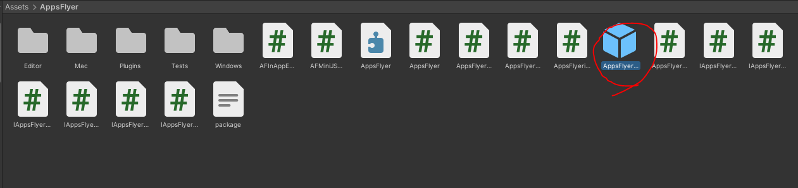
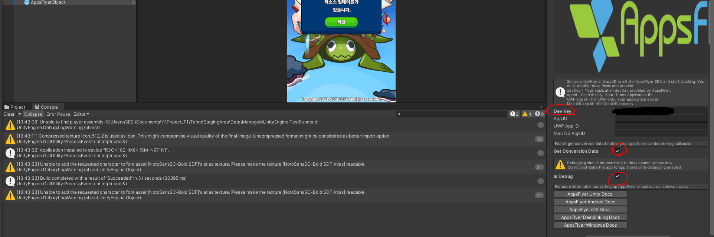

# AppsFlyer.SDK적용

---

<aside>
💡 **HEADER**

</aside>

---

# 개요

---

에셋 파일 안의 데이터를 빼는 방법과 데이터를 순서대로 엑셀에 넣는 것에 대한 문서

<aside>
⚠️ 작성시기 2023년 06월

</aside>

<aside>
⚠️ Visual Studio 2022, Unity 에서 진행되었습니다.

</aside>

---

AppsFlyer SDK를 Unity 프로젝트에 적용을 시켜서 연동을 시키려고 한다.  

그렇다면 먼저 [AppsFlyer 유니티 플러그인](https://ko.dev.appsflyer.com/hc/docs/unity-plugin) 설명서에서 나와있는 것들을 살펴보면서 천천히 진행한다.  

먼저 깃허브에서 플러그인을 다운을 받는다.  

 

사간이 지나서 버전이 업데이트가 되어서 버전이 달라졌을 수도 있지만, 제일 최신 버전을 쓰면된다.  
다운을 받고 원하는 유니티 프로젝트에 넣고 임포트를 하면 된다.  

 

임포트를 했으면 AppsFlyer 폴더가 따로 생겼을 것이다. 
AppsFlyer에 들어간 후에 AppsFlyerObject라는 프리펩을 씬으로 이동시킨다.

 

Dev Key를 입력하는 칸이 있는데 이것은 AppFlyer 사이트에서 가입을 하고 앱을 추가를 한다면

 

대략적인 순서는 이렇게 될 것이다.  

마지막에 Dev Key를 보여주는 팝업차을 띄울텐데 그걸 복사하고 Dev Key를 입력하는 칸에 붙여놓으면 된다. 
참고로 App ID는 IOS 용이다. Android는 App ID 칸은 아무것도 쓰지말고 빈 칸으로 나두면 된다.   

[AppsFlyer Guide1](https://support.appsflyer.com/hc/ko/articles/360007314277)  
[AppsFlyer Guide2](https://ko.dev.appsflyer.com/hc/docs/install-android-sdk)  
[IN-APP-Event Generator](https://evgen.appsflyer.com/)  
