# AndroidManifest 오류와 FireBase 기능인 Auth, Message SDK를 추가하여 활성화 

---

<aside>
  
💡 **HEADER**

</aside>
 
--- 

# 개요 

---
 
FireBase 기능인 Auth, Message SDK를 추가하여 활성화하기 및 오류 해결

<aside>
⚠️ 작성시기 2023년 04월

</aside>

<aside>
  
⚠️ Visual Studio 2022, Unity에서 진행되었습니다.

</aside>

---

* 사용 목적
  1. FireBase 기능인 Auth, Message SDK를 추가하여 활성화를 하는 것과 오류를 고치기. 

* 구성 요소
    1.  FirebaseAuth.package, FirebaseMessaging.package, google-signin-plugin-1.0.4.package (최신 버전으로 준비 권장)
    2. 유니티 2022.1.24f1 버전
    3.	Android 버전으로 개발 중인 게임 프로젝트 (상관 없음)

 *  다운로드 링크 <br>
-> "https://github.com/googlesamples/google-signin-unity/releases" (google-sign 패키지) <br>
-> "https://firebase.google.com/download/unity?hl=ko" (Firebase 패키지)

---------------------------------------------------------------------------------------------------------------------------------------------

## 목차
- [짚고 넘어가야할 오류(AndroidManifest)](#AndroidManifest-오류)
- [준비 작업](#준비-작업)
- [FireBase Unity3D 유저 인증](#FireBase-Unity3D-유저-인증)
- [FireBase Unity3D 푸시 기능 사용](#FireBase-Unity3D-푸시-기능-사용)
- [게스트 로그인, 구글 로그인](#게스트-로그인-구글-로그인)
- [Unity ADS 붙이기](#Unity-ADS-붙이기)


---------------------------------------------------------------------------------------------------------------------------------------------


# AndroidManifest 오류

시작하기 전 먼저 AndroidManifest가 뭔지 알아보자.

AndroidManifest란?
==============================================================================================================================================================

```AndroidManifest.xml은 안드로이드 앱에서 필수적으로 필요한 파일 중 하나로, 
앱의 구성요소 및 설정 정보를 포함하고 있는 XML 파일이다.

안드로이드 운영체제는 앱을 실행하기 전에 반드시 AndroidManifest.xml 파일을 읽어 앱의 
구성요소(액티비티, 서비스, 브로드캐스트 리시버, 프로바이더)와 앱의 권한 정보, 
그리고 앱의 기본 설정 정보들을 파악한다.

앱의 구성요소는 안드로이드 운영체제가 앱의 코드를 실행하는 방법을 제어하는데 
예를 들어, AndroidManifest.xml 파일에 등록된 액티비티는 다른 앱이나 시스템에서 
액티비티를 시작하거나 해당 액티비티에 대한 인텐트를 발행할 수 있다. 이를 통해, 
액티비티가 어떤 화면에 표시되는지나 사용자와의 상호작용 방법 등을 정의할 수 있다.

또한 AndroidManifest.xml 파일은 앱이 사용할 수 있는 권한을 정의하고, 
앱의 권한을 관리하는데 사용되는데. 이를 통해, 앱이 필요로 하는 권한을 
정확히 지정하고, 
사용자에게 권한 동의를 요청할 수 있다.

마지막으로, AndroidManifest.xml 파일은 앱의 기본 설정 정보를 포함하고 있다. 
예를 들어, 앱의 이름, 아이콘, 버전, 라이브러리 등의 
코드를 수정함으로 변경할 수 있다.

```

 - 현재 오류가 난 경위는 이러하다.
 - SourceTree로 다른 사람의 프로젝트를 받고 그 위에 Firebase.Auth, google-Login, Firebase.Message를 Import를 했을 때 build를 했을 경우 오류가 생겼다.   
 - 밑에 어떤 유니티 에러가 나왔는지 써놓았다.


### 유니티 에러

### 1)
```C#
Building Library\Bee\artifacts\Android\Manifest\LauncherManifestDiag.txt failed with output:
System.NullReferenceException: Object reference not set to an instance of an object.
   at Unity.Android.Gradle.AndroidManifest.SetFixedWindowSize(String activity, 
   Int32 defaultWidth, Int32 defaultHeight, Int32 minimumWidth, Int32 minimumHeight)
   at AndroidPlayerBuildProgram.Actions.GenerateManifests.PatchLibraryManifest
   (AndroidManifest manifest, ManifestDiagnostics diagnostics)
   at AndroidPlayerBuildProgram.Actions.GenerateManifests..ctor(Arguments arguments)
   at AndroidPlayerBuildProgram.Actions.GenerateManifests.Run(CSharpActionContext context, Arguments arguments)
UnityEngine.GUIUtility:ProcessEvent (int,intptr,bool&)
```

### 2)
```C#
BuildFailedException: Incremental Player build failed!
UnityEditor.Modules.BeeBuildPostprocessor.PostProcess (UnityEditor.Modules.BuildPostProcessArgs args)
(at <2adcb7d86536472884d6a11c9ab8e115>:0)
UnityEditor.Modules.DefaultBuildPostprocessor.PostProcess (UnityEditor.Modules.BuildPostProcessArgs args,
UnityEditor.BuildProperties& outProperties) (at <2adcb7d86536472884d6a11c9ab8e115>:0)
UnityEditor.Android.AndroidBuildPostprocessor.PostProcess (UnityEditor.Modules.BuildPostProcessArgs args, 
UnityEditor.BuildProperties& outProperties) (at <7e22973cbf66497e9da4d9832ba208e4>:0)
UnityEditor.PostprocessBuildPlayer.Postprocess (UnityEditor.BuildTargetGroup targetGroup, 
UnityEditor.BuildTarget target, System.Int32 subtarget, System.String installPath, System.String companyName,
System.String productName, System.Int32 width, System.Int32 height, UnityEditor.BuildOptions options, 
UnityEditor.RuntimeClassRegistry usedClassRegistry, UnityEditor.Build.Reporting.BuildReport report)
(at <2adcb7d86536472884d6a11c9ab8e115>:0)
UnityEngine.GUIUtility:ProcessEvent(Int32, IntPtr, Boolean&)
```
### 3)
```C#
Build completed with a result of 'Failed' in 2 seconds (2130 ms)
UnityEngine.GUIUtility:ProcessEvent (int,intptr,bool&)
```
### 4)
```C#
UnityEditor.BuildPlayerWindow+BuildMethodException: 3 errors
  at UnityEditor.BuildPlayerWindow+DefaultBuildMethods.BuildPlayer 
  (UnityEditor.BuildPlayerOptions options) [0x002da] in <2adcb7d86536472884d6a11c9ab8e115>:0 
  at UnityEditor.BuildPlayerWindow.CallBuildMethods (System.Boolean askForBuildLocation,
  UnityEditor.BuildOptions defaultBuildOptions) [0x00080] in <2adcb7d86536472884d6a11c9ab8e115>:0 
UnityEngine.GUIUtility:ProcessEvent (int,intptr,bool&)
```

---------------------------------------------------------------------------------------------------------------------------------------------

 - 결과적으로 이런일은 Firebase.Massage를 임포트를 했을 경우 생겨나는 일이다.
 - AndroidManifest 속 activity에는 intent-filter 요소가 있으며, 이는 해당 activity가 메인 액티비티이자 런처 액티비티로 설정되어 있음을 나타내는데. 
 - 앱이 실행될 때, 원래라면 FireBase.Message를 실행되어야 된다. 그러나 다른 사람한테 Firebase Cloud Messaging에서 제공하는 액티비티로 설정되어 있지 않으므로, 앱이 실행될 때 Firebase Cloud Messaging과 관련된 작업이 정상적으로 처리되지 않아 오류가 발생된다.

 - 그리고 서로의 설정이 , SetFixedWindowSize() 관련 오류가 발생할 수 있는데,
 - 이 문제를 해결하기 위해서는 AndroidManifest.xml 파일에 다른 사람이 제작하던 프로젝트에 사용하던 코드들의 스타일 테마를 일치시키는 방향으로 코드를 수정한다.

 - 경로는 Assets/Plugins/Android/AndroidManifest.xml이고, 아래에는 예시이다.

```C#
<activity android:name="com.unity3d.player.UnityPlayerActivity"
          android:theme="@style/UnityThemeSelector"
          android:screenOrientation="landscape"
          android:resizeableActivity="false">
    <meta-data android:name="unityplayer.ForwardNativeEventsToDalvik" android:value="true" />
    <intent-filter>
        <action android:name="android.intent.action.MAIN" />
        <category android:name="android.intent.category.LAUNCHER" />
    </intent-filter>
    <meta-data android:name="unityplayer.UnityActivity" android:value="true" />
    <meta-data android:name="android.max_aspect" android:value="2.1" />
    <meta-data android:name="android.support.PARENT_ACTIVITY"
               android:value="com.unity3d.player.UnityPlayerActivity" />
    <meta-data android:name="android.windowLayoutMode"
               android:value="fullscreen" />
</activity>

```
 - </activity> 밑에 맞는 맞는 설정과 코드를 추가한다면 오류가 사라지는 것을 볼 수 있다.
 - 하지만 만약 코드를 바꾸고 다시 실행을 해봐도 코드가 다시 변경전으로 되돌아오거나
 - 여전히 오류가 뜬다면 Custom Main Manifest 체크박스를 체크해줘야한다.
 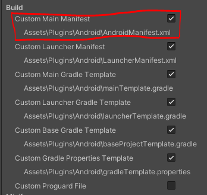<br><br><br> 
 - 사진에는 6개를 체크를 했지만 Manifest를 수정하는 것만으로는 첫 번째로 충분하다.


---------------------------------------------------------------------------------------------------------------------------------------------
## 준비 작업

 - 1. 유니티 허브를 들어가서 에디터 설치를 클릭<br><br><br>
  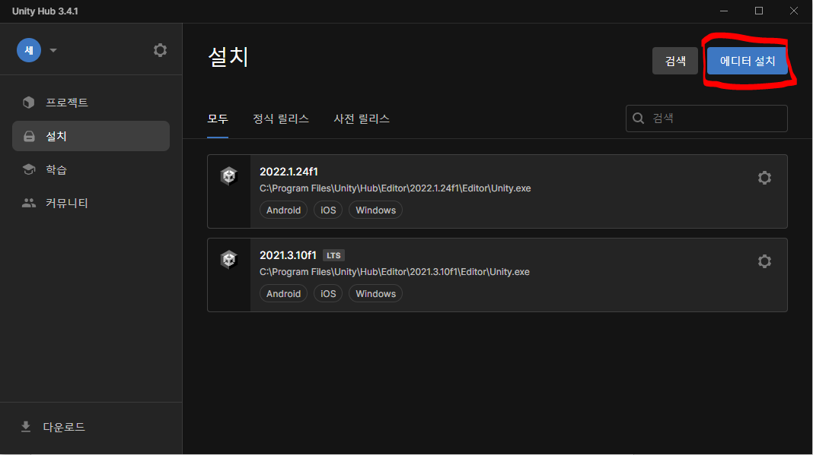<br>
 - 2. 현재 기준으로 정식 릴리스 칸에 없기 때문에 아카이브 칸으로 가서 아카이브 웹페이지로 이동한다. (현재 2023.04.05)<br><br><br>
  <br>
 - 3. 그리고 Unity 2022.1.24라고 쓰인 곳으로 가보면 Unity Hub라는 단추를 누르면<br><br><br>
  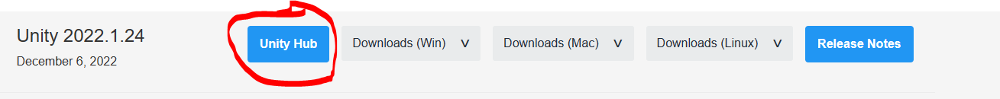<br>
 - 4. 모듈 설치 선택상자에서 Android build Support 와 iOS build Support 꼭 체크하도록 한다.<br><br><br> 
  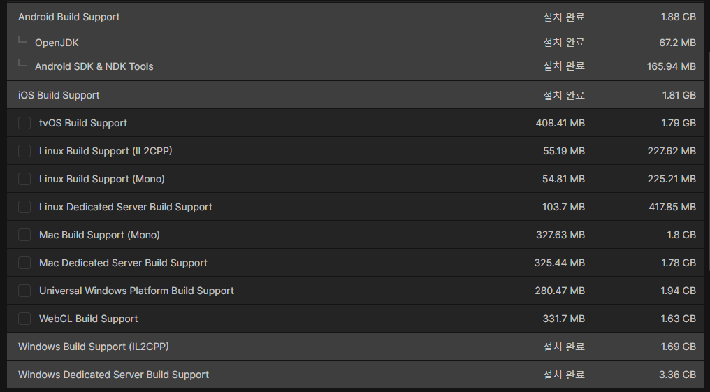<br> 
  
---------------------------------------------------------------------------------------------------------------------------------------------

## FireBase Unity3D 유저 인증

https://cafe.naver.com/sesisoftdev.cafe?iframe_url=/ArticleRead.nhn?articleid=20

먼저 네이버 블로그에 있는 Firebase Setting 과정을 모두 진행한다.
1부터 5번까지 진행하면 된다. 

진행했다면 아래 링크를 참고하여 Unity3d Client Build Setting 을 각자 프로젝트에 맞게 세팅한다.

https://cafe.naver.com/sesisoftdev/27

Assets 메뉴 - Import Package - Custom Package 로 다운로드 받은 firebase_unity_sdk 폴더로 간 후 firebase sdk 를 추가한다. <br>
                                                                                                         
---------------------------------------------------------------------------------------------------------------------------------------------

 - 먼저 FirebaseAuth.unitypackage를 추가할텐데
 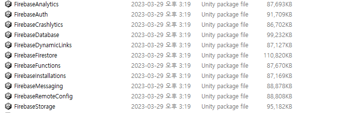<br> 

 - FirebaseAuth를 현재 유니티에 임포트한다.
그리고 다운받은 google-signnin-unity를 추가할텐데 붉은 색 원안에 있는 것을 다운을 받았으면. <br> <br><br>
 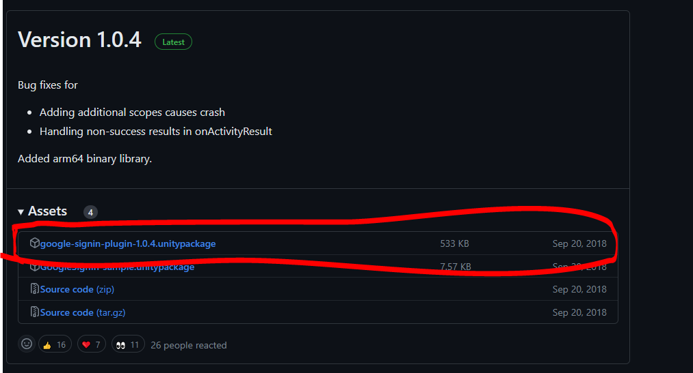<br> 
 - 구글 로그인 패키지을 임포트를 해야 되는데 여기서 주의할 점이 있다. <br> <br><br>
 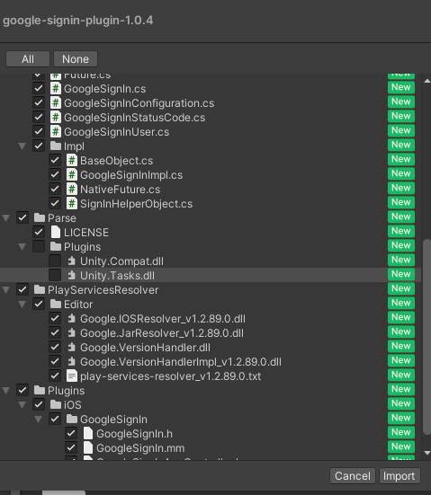<br> 
 - 유니티에 뜨는 임포트 창에서 “Unity.Compat.dll”과 “Unity.Tasks.dll”을 제외 시켜준다.
그리고 임포트를 해주면 오류가 뜨는데 <br> <br><br>
 <br> 
 - 이럴 땐 “Google.VersionHandler”와 “Google.VersionHandlerImpl_v1.2.89.0”를 삭제해주면 된다. <br> <br><br>
 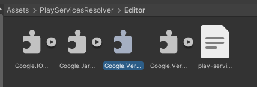<br><br>
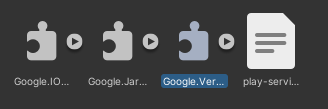<br><br>
 - 그리고 나머지는 "https://cafe.naver.com/sesisoftdev.cafe?iframe_url=/ArticleRead.nhn?articleid=20" 여기서 말하는대로 세팅하고 테스트를 하면 되는데<br> <br><br>

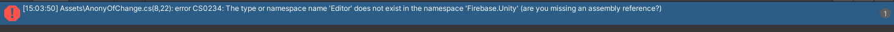<br><br>
- AnonyOfChange.cs를 다운 받고 유니티로 넣었을 때 이런 오류가 생길 수 있다.
 - 그럴 땐 8줄에 있는 Using Firebase.Unity.Editor;를 주석 처리하고 나면 또 다른 이슈가 생기는데
 - Login.cs에서 EmailCreatePanel이 없을 때 나타나는 오류다.<br> <br><br>

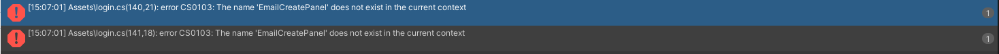<br><br>
 - 이럴 때는 간단히 코드에 public GameObject EmailCreatePanel; 을 넣어준다면 해결이 가능하다.

그렇게 유저 인증을 마치게 된다면 푸시 기능으로 넘어가보자.

---------------------------------------------------------------------------------------------------------------------------------------------
## FireBase Unity3D 푸시 기능 사용

 - 먼저 "https://cafe.naver.com/sesisoftdev/37"을 기반으로 제작한다.
 - 블로그에 써져 있는 내용이 현재 거의 오류가 없지만, 시간이 지나면서 바뀐 것을 알려주도록 하겠다.
 
 - 1. 먼저 FireBase Message는 그냥 Message로 바뀌었다.
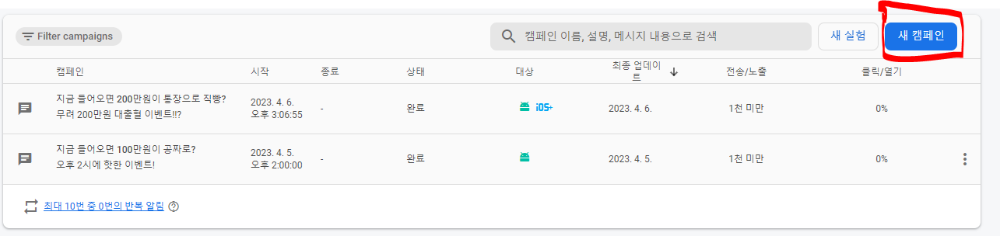<br><br>
 - 2. 새 캠페인을 들어가면 알림과 인앱 메시지가 있는데 대략적으로 설명하면 알림은 핸드폰 상단바에 있는 메시지같은 것이고, 인앱 메시지는 재난 문자라고 생각하면 편하다.
 - 3. 일단 알림으로 실험을 할 것인데 중요한 것은 단 두가지로 볼 수 있다.
 - 4. 타겟과 예약이다. 먼저 타겟은 어떤 프로젝트와 어떤 종류의 핸트폰을 선택하여 메시징을 보낼 지 선택할 수 있다.
  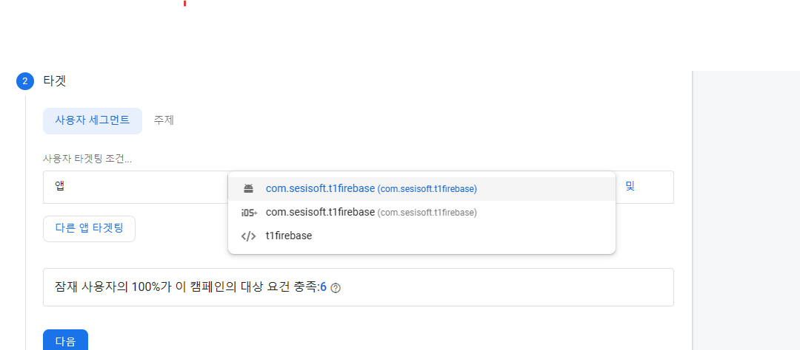<br><br>
 - 5. 예약은 지금 보낼 지 예약을 해서 기간을 정할 수 있다.
  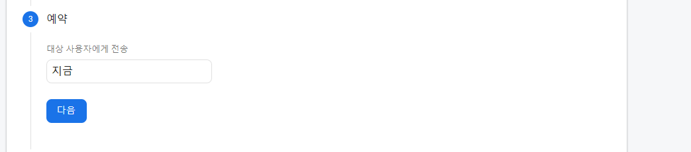<br><br>
 - 6. 그렇게 설정을 해서 보내는데 성공을 한다면 내가 정한 제목의 캠페인에서 몇 개의 메시지가 전송에 성공했다는 말을 볼 수 있다.
 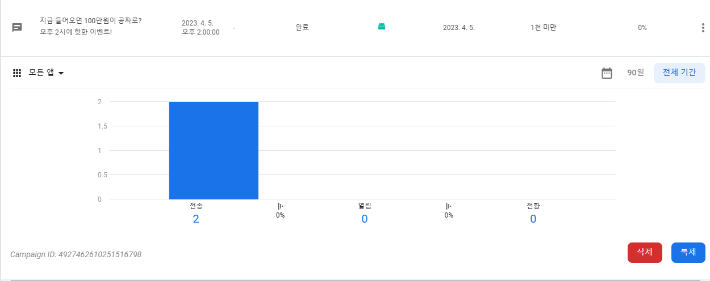<br><br>


---------------------------------------------------------------------------------------------------------------------------------------------
## 게스트 로그인 구글 로그인


 - 이 부분은 유저인증 이후에 진행되는 부분입니다. 

```C#
using Firebase.Auth;
using Google;
using System.Threading.Tasks;
using UnityEngine;
using UnityEngine.SceneManagement;

public class GuestLoginManager : MonoBehaviour
{
    private FirebaseAuth auth;
    // 사용자 계정
    FirebaseUser user = null;
    private void Awake()
    {
        //auth = FirebaseAuth.DefaultInstance;
        // 초기화
        auth = Firebase.Auth.FirebaseAuth.DefaultInstance;

        // 유저의 로그인 정보에 어떠한 변경점이 생기면 실행되게 이벤트를 걸어준다.
        //auth.StateChanged += AuthStateChanged;
        //AuthStateChanged(this, null);
        if (auth.CurrentUser == null)
        {
            // If there is no current user, create a new guest user.
            auth.SignInAnonymouslyAsync().ContinueWith(task => {
                if (task.IsCanceled)
                {
                    Debug.LogError("Guest sign-in was canceled.");
                    return;
                }
                if (task.IsFaulted)
                {
                    Debug.LogError("Guest sign-in encountered an error: " + task.Exception);
                    return;
                }

                // Guest user created successfully. Load the main scene.
                Debug.Log("Guest user signed in successfully.");
                
                //SceneManager.LoadScene("Main");
            });
        }
        else
        {
            // If there is already a current user, go straight to the main scene.
            Debug.Log("User already signed in. Skipping login.");
      
            //SceneManager.LoadScene("LobbyScene");
        }
    }
    public void Start()
    {
        onAnonyToGoogle();
    }
    // 익명 로그인 -> 구글 로그인
    public void onAnonyToGoogle()
    {
        auth = Firebase.Auth.FirebaseAuth.DefaultInstance;
        if (auth.CurrentUser != null)
        {
            Debug.Log(auth.CurrentUser.UserId);

            if (GoogleSignIn.Configuration == null)
            {
                GoogleSignIn.Configuration = new GoogleSignInConfiguration
                {
                    RequestIdToken = true,
                    RequestEmail = true,
                    // Copy this value from the google-service.json file.
                    // oauth_client with type == 3
                    WebClientId = ""
                };

            }
            Task<GoogleSignInUser> signIn = GoogleSignIn.DefaultInstance.SignIn();
            TaskCompletionSource<FirebaseUser> signInCompleted = new TaskCompletionSource<FirebaseUser>();

            signIn.ContinueWith(task =>
            {
                if (task.IsCanceled)
                {
                    Debug.Log("Google Login task.IsCanceled");
                }
                else if (task.IsFaulted)
                {
                    Debug.Log("Google Login task.IsFaulted");
                }
                else
                {
                    Credential credential = Firebase.Auth.GoogleAuthProvider.GetCredential(((Task<GoogleSignInUser>)task).Result.IdToken, null);

                    //string currentUserId = auth.CurrentUser.UserId;
                    //string cureentEmail = auth.CurrentUser.Email;
                    //string currentDisplayName = auth.CurrentUser.DisplayName;
                    //System.Uri currentPhotoUrl = auth.CurrentUser.PhotoUrl;

                    auth.CurrentUser.LinkWithCredentialAsync(credential).ContinueWith(authTask =>
                    {
                        if (authTask.IsCanceled)
                        {
                            signInCompleted.SetCanceled();
                            Debug.Log("Google Login authTask.IsCanceled");
                            return;
                        }
                        if (authTask.IsFaulted)
                        {
                            signInCompleted.SetException(authTask.Exception);
                            Debug.Log("Google Login authTask.IsFaulted");
                            return;
                        }

                        user = authTask.Result;
                        Debug.LogFormat("Google User signed in successfully: {0} ({1})", user.DisplayName, user.UserId);
                    });
                }
            });
        }
        else
        {
            Debug.Log("Not logged in");
        }
    }
}

```
 - 위의 코드는 게스트 로그인을 하고 게스트 로그인이 되었을 때 구글로그인을 하는 코드이다.
 - WebClientId 는 Firebase 사이트에서 받아오면 된다. 이 부분의 자세한 것은 유저 인증에 링크를 걸어놓았다.  
 - FireBase Unity3D 유저 인증을 진행했다면, 게스트로그인까지 성공을 했지만 구글로그인이 안되었을 수도 있다.
 - 안드로이드로 APK로 빌드를 해봐도 파이어베이스에 저장이 안되었다면 이걸 살펴보자.


 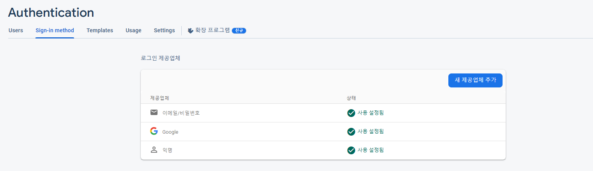<br><br>
 
 - 구글 로그인이 파이어베이스로 저장하게 하려면 Authentication -> sign in method 로 가서 새로운 제공업체를 추가해줘야 한다.
 - 만약 구글 제공업체를 추가를 하지 않는다면 파이어베이스는 구글 로그인을 제공하지 않는다.
 - 구글을 추가를 하고 로그인을 하면 아래의 사진처럼 구글 로그인이 추가가 된 것을 볼 수 있다.


 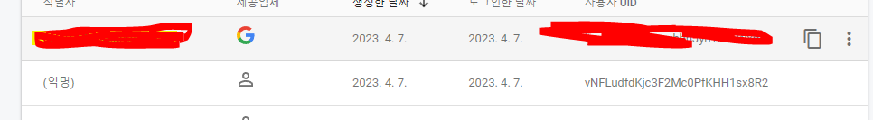<br><br>


---------------------------------------------------------------------------------------------------------------------------------------------
## Unity ADS 붙이기

 - Unity Ads를 프로젝트에 추가합니다. 
 - Unity Editor에서 "Window" 메뉴에서 "Package Manager"를 선택하고, "All Packages" 탭에서 "Unity Ads"를 검색하여 "Install" 버튼을 클릭합니다.
 - Unity Ads를 사용할 씬에 "Unity Ads Manager"를 추가합니다. 
 - 이를 위해서는 씬을 열고, "GameObject" 메뉴에서 "Unity Ads"를 선택한 다음, "Unity Ads Manager"를 클릭합니다.

 - Unity Ads Manager의 Inspector 창에서, "Ads Id" 필드에 앱의 Unity Ads ID를 입력합니다. 이 ID는 Unity Ads 대시보드에서 생성할 수 있습니다.

 - 필요한 경우, Unity Ads Manager에서 "Test Mode" 옵션을 선택합니다. 이 옵션을 선택하면, Unity Ads 서비스에서 제공하는 광고가 아닌 테스트 광고가 표시됩니다.

 - Unity Ads를 호출할 코드를 작성합니다. 예를 들어, 다음과 같은 코드를 사용하여 보상형 동영상 광고를 로드하고, 재생할 수 있습니다. 

 - 만약 알 수 없이 씬 로드가 안되거나 데이터베이스 접속이 안되는 오류가 생겼다면 Ads Mediation이랑 Advertisement를 임포트를 하고 둘이 겹치는 부분이 생겼기 때문이다.<br>
 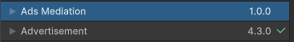<br><br><br>
 - 아마 그 오류는 버전에 따라 다르겠지만 Google Play Services의 Jetifier라는 기능과 관련이 있다. Jetifier는 안드로이드 앱에서 AndroidX 라이브러리를 사용할 때, 
 - 이전 버전의 Support 라이브러리와 충돌을 방지하기 위해 사용되는데, 
 - Jetifier 버전이 업데이트 되었으나 그에 따른 변경사항이 Ad Mediation 및 Advertisement 라이브러리와 충돌이 나서 발생하는 것이다.
 - 하지만 광고 중계를 하려면 Ads Mediation이 필요할테니 해결 방법으로는 Google Play Services Resolver 라이브러리를 사용하여 Jetifier를 비활성화하거나, 
 - 새로운 Jetifier 버전을 사용하는 것이 있다.


 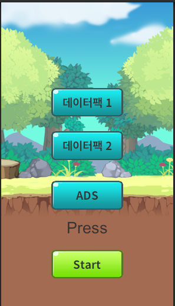<br><br><br>
  
 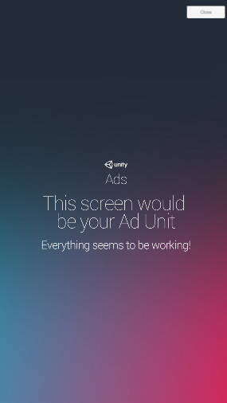<br><br><br>
