 
 - Unity 프로젝트 안에 구글 애드몹 미디에이션을 붙이기

--- 

<aside>
 
⚠️ 작성시기 2023년 04월

</aside>

--- 
<aside>
  
⚠️ Visual Studio 2022, Unity 2022.1.24f1에서 진행되었습니다.

</aside>

--- 


# 목차

1. 용어 정리 <br>
1_1. 광고의 정의<br>
1_2.	광고 네트워크<br>
1_3.	메디에이션이란?<br>
1_4. 메디에이션 플랫폼이란?<br>
1_5.	메디에이션의 용도는?<br>
1_6.	워터폴 방식이란?<br>
1_7.	여러 용어의 뜻이란?(CPC, CPM, eCpm, 유효 노출률...)<br>
2. 무슨 메디에이션을 써야 할까? <br>
2_1. 메디에이션을 써야하는 이유<br>
2_2. 메디에이션 플랫폼의 추천 순위<br>
2_2_1. Google AdMob<br>
2_2_2. MAX<br>
2_2_3. IronSource<br>
2_3. 메디에이션 플랫폼 결정<br>
3. 구글 애드몹 <br>
3_1. 구글 애드몹 사이트 설정<br>
3_2. 구글 애드몹 SDK 붙이기<br>
3_2_1. 구글 애드몹 SDK 붙이기<br>
3_3. 다른 광고 네트워크 붙이기<br>
3_4. Admob 수익 지급<br>
3_5. 광고 네트워크 수신 테스트<br>

99. 의문 정리<br>
100. 오류 정리<br>

<br><br><br>


# 1. 용어 정리 <br><br><br>

## 1_1. 광고의 정의 

```
광고주가 광고를 게시하고 싶은 미디어(예: 모바일 앱, 웹사이트 등)에 제공한 광고 콘텐츠입니다. 
광고주는 광고 네트워크, 광고 대행사 또는 직접 미디어와 계약하여 광고를 게시하고, 이를 통해 
제품 또는 서비스를 홍보하고 판매를 촉진하려고 합니다.
 ```

 <br>

-----------------------------------------------------------------------------------------------------------------------------------------------------------------
 
## 1_2.	광고 네트워크
```
광고를 게시하는 미디어와 광고주 간의 중개자 역할을 하는 기업이나 플랫폼입니다. 
광고 네트워크는 여러 개의 미디어에 광고를 게시하고, 
광고주에게 광고 노출 및 클릭 수, 수익 등의 정보를 제공합니다.
일부는 광고주로부터 수수료를 받습니다. 
```
 <br>
-----------------------------------------------------------------------------------------------------------------------------------------------------------------

##	1_3.	메디에이션이란?
```
앱에 광고를 게재하기 위해 사용하는 광고 소스를 한곳에서 관리할 수 있는 기능
```

-----------------------------------------------------------------------------------------------------------------------------------------------------------------

##	1_4. 메디에이션 플랫폼이란?
```
여러 광고 네트워크를 하나의 플랫폼으로 통합하고 중앙화하여 여러분의 수익화 운영을 하나의 대시보드를
통해 관리할 수 있게 해줍니다. 

```
 <br>
-----------------------------------------------------------------------------------------------------------------------------------------------------------------

##	1_5.	메디에이션의 용도는?
```
기술을 사용하여 디스플레이 유효노출률과 eCpm 비율을 높여 앱 게시자의 광고 수익화를 극대화한다.
```

-----------------------------------------------------------------------------------------------------------------------------------------------------------------

##	1_6.	워터폴 방식이란?
```
우선순위의 광고 네트워크가 경매를 진행하고, 낙찰되지 못한 인벤토리는 차순위 광고 네트워크에 넘어가는 방식.
미디에이션 플랫폼이 운영되는 전통적인 방식 중 하나로, eCPM, Fill rate 등 지표를 기반으로 
결정된 광고 노출 우선순위를 결정하고,
우선순위가 높은 애드 네트워크 순서로 광고를 호출하는 방식입니다.
```
 <br>
-----------------------------------------------------------------------------------------------------------------------------------------------------------------
##	1_7. 여러 용어의 뜻이란?(CPC, CPM, eCpm, 유효 노출률...)


### 퍼블리셔의 광고수익(약68%) + 구글에게 주는 수수료 약(32%) 
### 광고 수익 = 광고 요청(광고 단가) * 유효노출률 * eCPM

 - CPC라고 하면 Cost Per Clicks의 약자로서 클릭당 '비용'  
 - CPM = Cost Per Mille = 1000회 광고 노출당 비용  
 - eCPM = Effective cost per 1000 impressions  (또는 Effective cost per mille)    (여기에서 impressions 라는 단어의 의미는 '명사'로 '광고 노출되는 횟수'를 의미. ) 
= 1000회 유효 광고 노출시 퍼블리셔에게 발생되는 예상 광고 수익

##	유효 노출률
광고 요청 시 광고가 실제로 할당된 요청된 횟수의 비율입니다. '유효 노출률 = 총 광고 노출 수 / 광고 요청 건수'라는 등식이 성립합니다. 영어로는 'Fill rate'라고 합니다.

-----------------------------------------------------------------------------------------------------------------------------------------------------------------

# 2. 무슨 메디에이션을 써야 할까? <br><br><br>


##	2_1. 메디에이션을 써야하는 이유
```
광고를 하고 싶은 브랜드와, 그 광고를 노출해줄 수 있는 매체/개발사의 사이를 이어준다고 할 수 있습니다. 
광고 수익을 효율적으로 내기 위해서는 여러 광고 플랫폼을 광고 시청자의 조건에 맞게 보여주는 
미디에이션을 쓰는 게 수익이 훨씬 잘나온다고 합니다.
```


##	2_2. 메디에이션 플랫폼의 추천 순위
-----------------------------------------------------------------------------------------------------------------------------------------------------------------

##	메디에이션 플랫폼의 추천 순위는 다음과 같습니다.
1.	[구글 애드몹(Google)](#2_2_1-google-admob)
2.	[MAX(Applovin)](#2_2_2-max)
3.	[IronSource(Unity)](#2_2_3-ironsource)


##	메디에이션 플랫폼의 간략한 장단점입니다.

-----------------------------------------------------------------------------------------------------------------------------------------------------------------

### 2_2_1. Google AdMob
 <br>
구조 - 입찰 구조, 워터폴 구조, 하이브리드 구조.(선택)

수입은 최고봉이지만, 무조건 메디에이션 플랫폼으로 해야한다는 건 아니다. 규제와 정지가 너무 매섭기 때문. 하지만 꼭 끼워넣어야한다는건 사실이다. <br><br>
 - 장점: 수입적으로는 1등이자 최고의 Ecpm, 미디에이션 플랫폼 지원.<br>
 - 단점: 광고 정책이 매우 엄격하여 정지를 먹을 확률이 높음, 유지가 힘듦, 없는거나 마찬가지인 고객센터<br>

 -	입찰
광고 소스가 실시간 입찰 경쟁을 통해 광고 요청을 처리합니다. 

 -	워터폴 구조 
미디에이션은 광고 소스가 지불할 의향이 있는 금액이 아니라 사용자가 설정한 평균 eCPM을 기준으로 광고 소스를 하나씩 호출합니다. 

 -	하이브리드 방식
단일 미디에이션 그룹에서 입찰 광고 소스와 폭포식 구조 광고 소스를 모두 사용하는 경우입니다. 광고 요청이 미디에이션 그룹과 일치하면 입찰 경매가 실시간으로 진행됩니다. 그런 다음 낙찰된 입찰 광고 소스가 폭포식 구조 광고 소스와 함께 연쇄 광고 호출 조정에 배치됩니다. 
입찰에서 낙찰된 입찰 광고 소스가 먼저 연쇄 광고 호출 조정에 배치되면 이 입찰 광고 소스에 광고를 게재할 기회가 주어집니다. 하지만 입찰 광고 소스의 eCPM이 연쇄 광고 호출 조정에서 가장 높지 않은 경우 폭포식 구조 광고 소스가 먼저 호출됩니다. 

-----------------------------------------------------------------------------------------------------------------------------------------------------------------

### 2_2_2. MAX 
 <br>
구조 - 워터폴 구조<br>

안그래도 북미에서 강세인 광고 플랫폼이었는데 모펍 인수 후에 폭발적으로 성장하고 있는 광고 플랫폼. 최근에는 거의 애드몹과 맞먹는 수준의 ecpm을 보여주기도 한다.
 - 장점 : 메디에이션 플랫폼 지원, 준수한 수익, sdk 통합 쉬움
 - 단점 : 메디에이션을 하면 대시보드에서 예상 수익을 제멋대로 보여줌, 고객센터에 이슈가 조금씩 있음

 -	워터폴 구조 
광고 파트너를 설정하면 인앱 입찰과 CPM 업데이트를 결합하여 워터폴 구조 관리가 자동화됩니다.

-----------------------------------------------------------------------------------------------------------------------------------------------------------------

### 2_2_3. IronSource 
 <br>
구조 - 워터폴 구조

게임 특화 광고 플랫폼. 최근에 유니티에서 인수하면서 뭔가 혁신적인 변화가 있지 않을까 했지만 변한게 없다는 것이 함정이다.
 - 장점 : 메디에이션 플랫폼 지원, sdk 통합 쉬움
 - 단점 : 수익이 낮음, 대시보드가 너무 안좋음, 돈 받을 때 직접 돈 달라고 버튼 눌려야 송금해주는 이상한 정책


-----------------------------------------------------------------------------------------------------------------------------------------------------------------
##	2_3. 메디에이션 플랫폼 결정

회사가 원하는 방향은 **수익성**이다.<br>
2023년 4월 기준으로 수익성이 가장 높은 플랫폼은 구글 애드몹이다.<br>
현재 구글 애드몹은 모든 플랫폼중에서 eCPM이 가장 높게 나오기 떄문에 <br>
구긍 애드몹을 메디에이션 플랫폼으로 결정하고 다른 광고 네트워크 붙여넣을 것입니다. <br>


하지만, 구글은 위험성이 있기 때문에 만약 수익성만이 최우선이 아니라 안정성까지 잡고 싶다면,<br>
안정성도 잡고 싶다면 MAX를 메인으로 잡는 것을 추천한다.<br>


-----------------------------------------------------------------------------------------------------------------------------------------------------------------
# 3. 구글 애드몹 <br><br><br>

## 3_1. 구글 애드몹 사이트 설정<br><br>

먼저 구글 애드몹을 가입을 했다면 <br><br>

 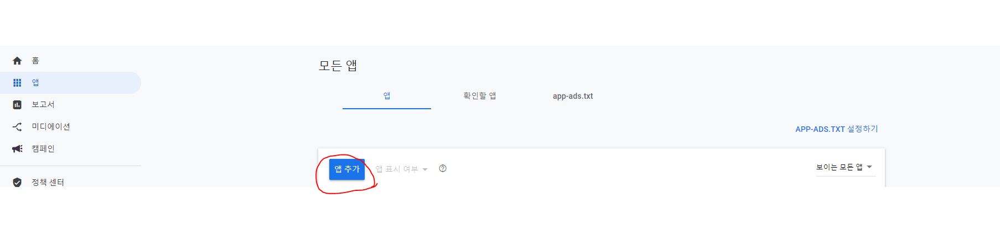<br>

사진처럼 앱추가를 진행한다.<br><br>

 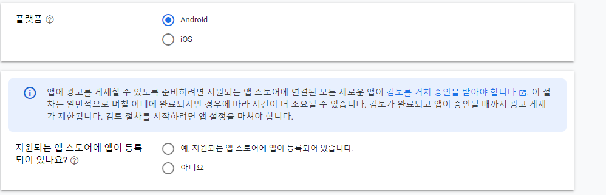<br>

플랫폼과 앱스토어 등록여부, 앱의 이름들을 물어볼 건데 <br>
편하게 작성하면 된다. 틀렸으면 바꾸거나 새로 만들면 되니까.<br><br>


앱을 만드는데 완료를 했다면 다음은 광고 단위를 설정해야한다.<br><br>

 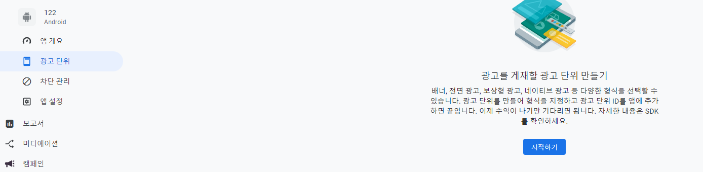<br>

광고 단위를 만들게 되면 첫 번째는 원하는 광고 형식을 선택할 텐데<br>
지금은 보상형 전면 광고를 주제로 잡았기에 그것을 선택했고 <br>


 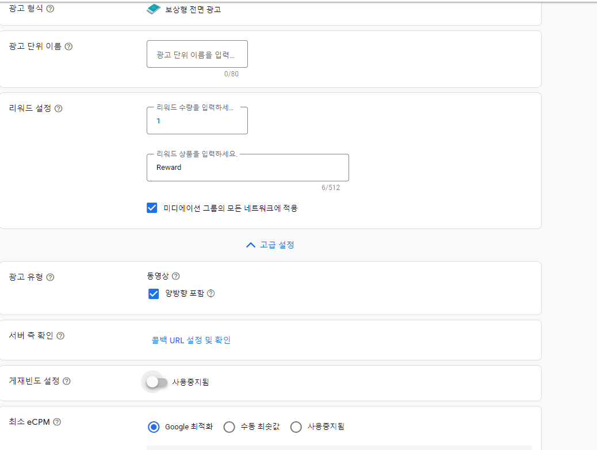<br><br>


다음은 이름, 리워드 설정을 간단히 하는데 <br>
고급 설정에 들어가면 세부적으로 설정을 해야하는 것이 있을 것이다.<br><br>
광고 유형이나 서버측 확인, 게제빈도 설정, 최소 eCPM 등이 있는데 <br>
모두 중요한 것이나 나는 그저 광고를 어떻게 만드는지 알리기 위해서 하는 것이니 그냥 모두 패스했다.<br>
만약 자신이 필요하다면 고급 설정에서 설정을 하시면 될 거 같다.<br>
<br><br>


 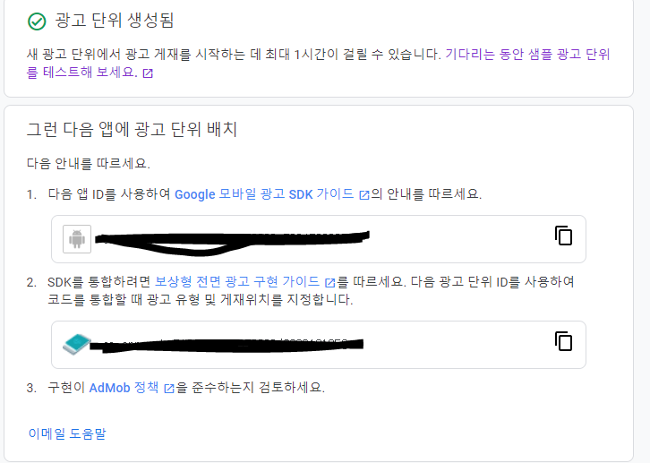<br><br>

그렇게 설정이 모두 끝났으면 광고 단위를 볷하여 저장해준다.

그럼 광고형식을 만들기는 모두 끝이 났는데 

 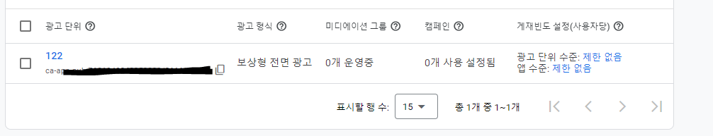<br><br>

나오면 자신이 만든 광고 형식이 하나 자리 잡았을 것이다.
자신이 만든 광고 형식을 클릭하면 설정을 수정할 수 있는 것을 볼 수 있다.


 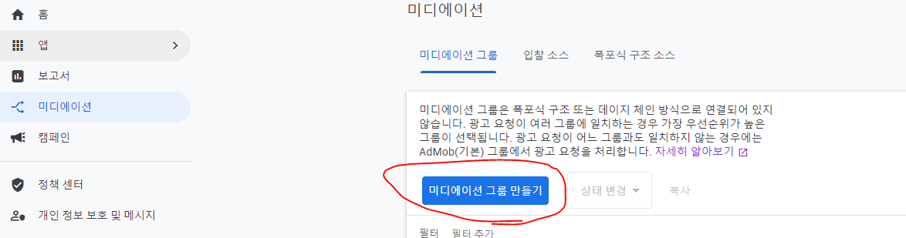<br><br>

다음은 마지막으로 미디에이션 설정이다.

사진위에 미디에이션 그룹 만들기를 클릭하고
광고형식과 플랫폼을 선택한다.

 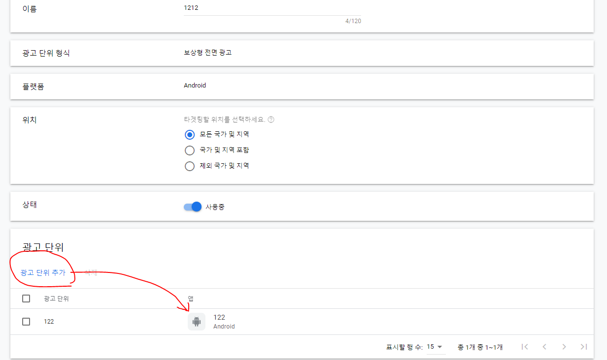<br><br>

그리고 광고추가를 누르게 된다면 아까 우리가 만들었던 광고 단위가 있을 텐데 그것을 선택하면 된다.

 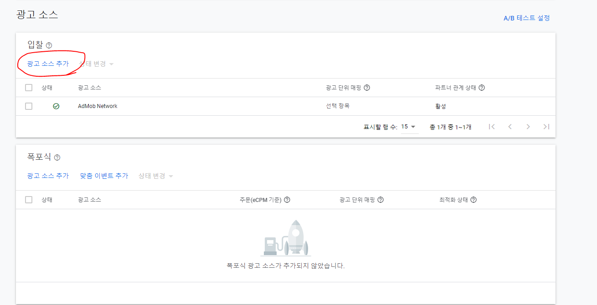<br><br>

그렇게 광고 단위를 추가를 하고 이제는 광고 소스를 추가해야하는데 <br>
현재 보상형 전면 광고는 광고 소스가 별로 없을 수 있다.<br><br>

 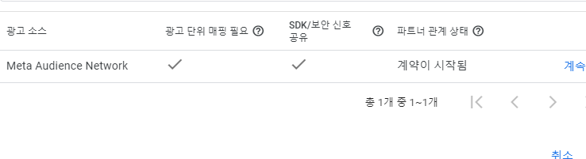<br><br>

위의 사진이 보상형 광고 소스는 하나밖에 없기 때문에 <br>
그것을 연결해주면 되겠다.<br><br>
물론 연결하기위해선 그쪽 사이트를 가입하고 해야하기 때문에 <br>
거기서 하라는대로만 하면 연결시킬 수 있다.<br>


 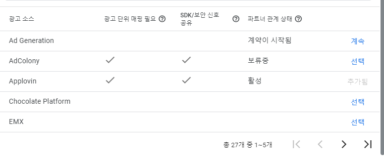<br><br>

여담으로 보상형 전면 광고는 하나밖에 없지만  <br>
리워드 광고는 현재 총 27개 많은 광고 소스가 있다.<br>
입맛에 맞는 소스를 선택하면 되겠다.<br><br>


## 3_2. 구글 애드몹 SDK 붙이기<br><br>
[구글 애드몹 SDK](https://developers.google.com/admob/unity/quick-start?hl=ko)

위의 링크로 들어가보면 구글 애드몹에서 SDK를 붙이는 매뉴얼이 자세하게 적혀있는데

 <br>

먼저 네모난 박스 안에 있는 링크로 들어가서 유니티패키지 파일을 받고 유니티에 임포트를 해준다.

임포트를 성공했다면 유니티에서 ASSETS -> GOOGLE MOBILE ADS -> SETTINGS 로 들어가 준다.

만약 GOOGLE MOBILE ADS가 ASSETS 에 생겨나지 않았다면 다시 임포트를 하고 ASSETS -> EXTERNAL DEPENDENCY MANAGER -> ANDROID RESOLVER -> FORCE RESOLVER 를
눌러서 다운로드를 기다린다면 생겨날 것이다.

-----------------------------------------------------------------------------------------------------------------------------------------------------------------
## 3_3. 다른 광고 네트워크 붙이기 <br>

웹 사이트 속에 있는 여러 광고 네트워크가 있다. <br>
여기서 원하는 광고 네트워크를 선택해서 사이트에 있는 설명대로 따라하기 만 한다면,<br>
광고 네트워크를 붙일 수 있다.<br>

[Admob 보상형 광고붙이기](https://developers.google.com/admob/unity/rewarded-interstitial?hl=ko)<br>
 
 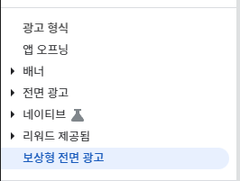<br>

<br>
광고를 만들 때 광고의 형식을 먼저 정해야 한다.<br>
현재는 보상형 전면 광고를 대상으로 정하고 진행하지만 다른 광고 형식을 진행하고 싶다면 <br>
링크로 들어가서 다른 광고 형식을 선택하고 가이드대로 진행하면된다.<br>


 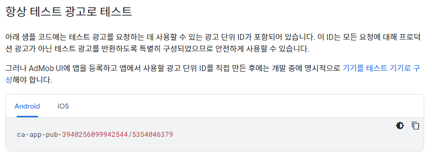<br>


먼저 광고는 테스트로 진행한다. 왜냐하면 자신이 갖고 있는 광고의 ID를 쓴다면<br>
Admob 광고 계정이 정지를 먹을 확률이 농후하기에 테스트 ID로 진행하게 된다.<br>

 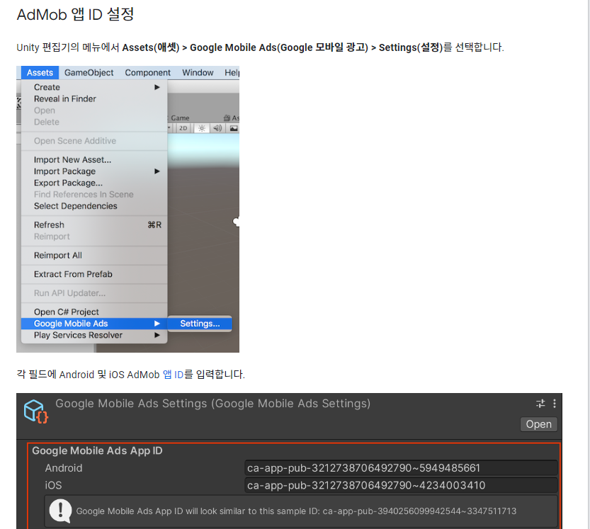<br>

물론 여기에도 테스트 ID로 진행하면 된다.<br>

보상형 전면 광고 칸에 가게 되면 단계가 있다.<br>

1.보상형 전면 광고 로드<br>
2.[선택사항] 서버 측 확인 (SSV) 콜백 확인<br>
3.리워드 콜백으로 보상형 전면 광고 표시<br>
4.보상형 전면 광고 이벤트 수신<br>
5.보상형 전면 광고 정리<br>
6.다음 보상형 전면 광고 미리 로드<br><br><br>

이 단계들을 순서대로 진행을 하고 자신의 입맛대로 변화시키면 문제없이 돌아갈 것이다.<br>

```C#

    public void LoadRewardedInterstitialAd()
    {
       
#if UNITY_EDITOR
        string _adUnitId = "unused";
#elif UNITY_ANDROID
        string _adUnitId = "ca-app-pub-3940256099942544/5224354917";
#elif UNITY_IPHONE
        string _adUnitId = "ca-app-pub-3940256099942544/1712485313";
#else
        string _adUnitId = "unexpected_platform";
#endif
        // Initialize the Google Mobile Ads SDK.
        MobileAds.Initialize((InitializationStatus initStatus) =>
        {
            Dictionary<string, AdapterStatus> map = initStatus.getAdapterStatusMap();
            foreach (KeyValuePair<string, AdapterStatus> keyValuePair in map)
            {
                string className = keyValuePair.Key;
                AdapterStatus status = keyValuePair.Value;
                switch (status.InitializationState)
                {
                    case AdapterState.NotReady:
                        // The adapter initialization did not complete.
                        MonoBehaviour.print("Adapter: " + className + " not ready.");
                        break;
                    case AdapterState.Ready:
                        // The adapter was successfully initialized.
                        MonoBehaviour.print("Adapter: " + className + " is initialized.");
                        break;
                }
            }
            //LoadRewardedInterstitialAd();
        });
        MobileAds.RaiseAdEventsOnUnityMainThread = true;
        // Clean up the old ad before loading a new one.
        if (rewardedInterstitialAd != null)
        {
            rewardedInterstitialAd.Destroy();
            rewardedInterstitialAd = null;
        }

        Debug.Log("Loading the rewarded interstitial ad.");

        // create our request used to load the ad.
        var adRequest = new AdRequest.Builder().Build();

        // send the request to load the ad.
        RewardedInterstitialAd.Load(_adUnitId, adRequest, (RewardedInterstitialAd ad, LoadAdError error) =>
        {
            // If the operation failed, an error is returned.
            if (error != null || ad == null)
            {
                Debug.LogError("Rewarded interstitial ad failed to load an ad with error : " + error);
                return;
            }

            // If the operation completed successfully, no error is returned.
            Debug.Log("Rewarded interstitial ad loaded with response : " + ad.GetResponseInfo());
            List<string> deviceIds = new List<string>();
            deviceIds.Add("2077ef9a63d2b398840261c8221a0c9b");

            // Create and pass the SSV options to the rewarded ad.
            var options = new ServerSideVerificationOptions
                                  .Builder()
                                    
                                  .SetCustomData("SAMPLE_CUSTOM_DATA_STRING")
                                  .Build();
    ad.SetServerSideVerificationOptions(options);
            rewardedInterstitialAd = ad;
            RegisterEventHandlers(rewardedInterstitialAd);
            ShowRewardedInterstitialAd();
        });
    }
    public void ShowRewardedInterstitialAd()
    {
        const string rewardMsg =
            "Rewarded interstitial ad rewarded the user. Type: {0}, amount: {1}.";

        if (rewardedInterstitialAd != null && rewardedInterstitialAd.CanShowAd())
        {
            rewardedInterstitialAd.Show((Reward reward) =>
            {
                // TODO: Reward the user.
                Debug.Log("RewardedInterstitial 왔다감");
                Debug.Log(String.Format(rewardMsg, reward.Type, reward.Amount));
            });
        }
        //rewardedInterstitialAd.Destroy(); // 메서드를 호출하여 메모리 누수 방지
    }
    private void RegisterEventHandlers(RewardedInterstitialAd ad)
    {
        // Raised when the ad is estimated to have earned money.
        ad.OnAdPaid += (AdValue adValue) =>
        {
            Debug.Log(String.Format("Rewarded interstitial ad paid {0} {1}.",
                adValue.Value,
                adValue.CurrencyCode));
        };
        // Raised when an impression is recorded for an ad.
        ad.OnAdImpressionRecorded += () =>
        {
            Debug.Log("Rewarded interstitial ad recorded an impression.");
        };
        // Raised when a click is recorded for an ad.
        ad.OnAdClicked += () =>
        {
            Debug.Log("Rewarded interstitial ad was clicked.");
        };
        // Raised when an ad opened full screen content.
        ad.OnAdFullScreenContentOpened += () =>
        {
            Debug.Log("Rewarded interstitial ad full screen content opened.");
        };
        // Raised when the ad closed full screen content.
        ad.OnAdFullScreenContentClosed += () =>
        {
            Debug.Log("Rewarded interstitial ad full screen content closed.");
        };
        // Raised when the ad failed to open full screen content.
        ad.OnAdFullScreenContentFailed += (AdError error) =>
        {
            Debug.LogError("Rewarded interstitial ad failed to open full screen content " +
                           "with error : " + error);
        };
    }
    private void RegisterReloadHandler(RewardedInterstitialAd ad)
    {
        // Raised when the ad closed full screen content.
        ad.OnAdFullScreenContentClosed += () =>
    {
            Debug.Log("Rewarded interstitial ad full screen content closed.");

            // Reload the ad so that we can show another as soon as possible.
            LoadRewardedInterstitialAd();
        };
        // Raised when the ad failed to open full screen content.
        ad.OnAdFullScreenContentFailed += (AdError error) =>
        {
            Debug.LogError("Rewarded interstitial ad failed to open full screen content " +
                           "with error : " + error);

            // Reload the ad so that we can show another as soon as possible.
            LoadRewardedInterstitialAd();
        };
    }
}

```
<br>
이해가 안된다면 위의 코드를 보도록 하자.<br>


[Admob 미디에이션 시작](https://developers.google.com/admob/unity/mediate?hl=ko)<br>


[Admob 네트워크 선택](https://developers.google.com/admob/unity/choose-networks?hl=ko)<br>

 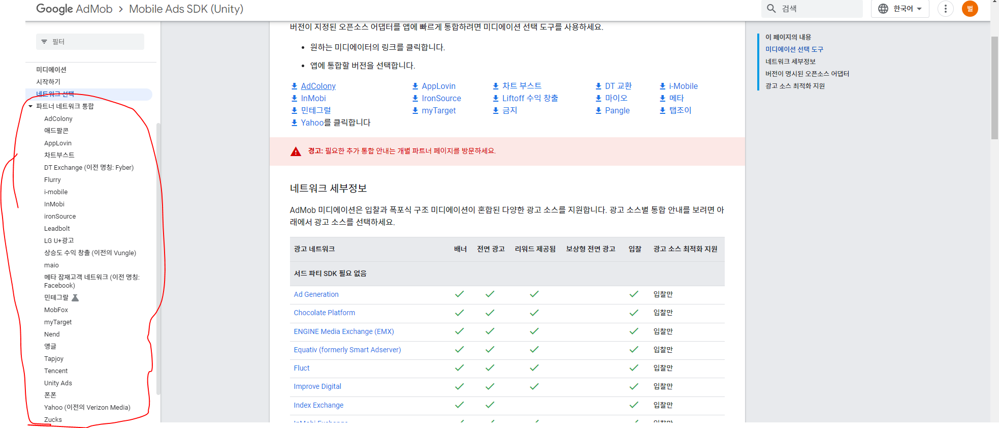<br>


-----------------------------------------------------------------------------------------------------------------------------------------------------------------

## 3_4. Admob 수익 지급 <br>


총액이 US$100.00(판매 대금 기준액) 이상인 경우 월별 지급


은행 계좌 정보 입력
은행 계좌 정보를 추가할 때 은행 기록에 표시된 것과 정확히 일치하는 세부정보를 입력하세요. 은행 정보를 입력하는 방법은 다음과 같습니다.

1. 애드센스 계정에 로그인합니다.
2. 왼쪽의 탐색 패널에서 지급을 클릭합니다.
3. 지급 수단 추가를 클릭합니다.
4. '은행 계좌로 송금' 라디오 버튼을 선택하고 계속을 클릭합니다.
5. 은행 계좌 정보를 입력하고 확인하고 계속하기를 클릭합니다.

금융 정보를 확인하는 데 도움이 필요한 경우 거래 은행에 문의하여 해외에서 은행 송금을 받는 방법에 대한 안내를 요청하시기 바랍니다.


-----------------------------------------------------------------------------------------------------------------------------------------------------------------
## 3_5. 광고 네트워크 수신 테스트<br>

만약 미디에이션을 사용했을 때 다양한 광고 네트워크로 부터 광고를 받아오는데 그게 어떤 광고 네트워크에서 가져오는지 모를 수 있습니다.<br>
그럴 땐 테스트 기기를 등록하여 실제로 광고를 입찰을 해서 나오는지 확인해야합니다.<br><br>
[Admob 미디에이션 테스트](https://developers.google.com/admob/unity/ad-inspector)<br>


-----------------------------------------------------------------------------------------------------------------------------------------------------------------

## -------------------------------------------- 다른 게임을 살펴보자

 <br>

# - 레전드 오브 슬라임의 광고 종류
 - 레전드 오브 슬라임의 광고 체계는 보상형 광고로 이루어졌지만, 자세히 보면 두 개로 나뉘어집니다.

## 1. 보상형 동영상 광고
## 2. 보상형 전면 광고

이 두개의 치이로는 보상형 동영상 광고는 스킵이 안되고 보싱형 전면 광고는 일정 시간이 지난 후엔 스킵이 된다는 사실입니다.

# - 레전드 오브 슬라임의 메디에이션 플랫폼

[레전드 오브 슬라임 링크 글](https://www.is.com/community/case-studies/loadcomplete-raises-revenue-and-retention-with-luna/)

위의 주소로 가서 살펴보면 레전드 오브 슬라임의 회사인 로드 컴플리트가 아이언 소스와 파트너쉽을 맺었다는 사실을 알 수 있는데.
아이언 소스의 Luna를 통해서 원스톱 쇼핑 크리에이티브 솔루션을 받았다는 것을 볼 수 있습니다.


```
크리에이티브 분석을 원스톱 상점으로 전환한 것은 단순히 더 효율적으로 행동할 수 있는 것보다 더 큰 영향을 미쳤으며, 
이를 통해 확장할 가치가 있는 채널을 쉽게 식별하고 이러한 채널 전반에서 데이터를 정렬할 수 있었습니다. 
이제 교차 채널 크리에이티브 데이터를 지역, 배포, 채널 및 시간에 따라 구성하고 시각화할 수 있습니다. 
D7 수익을 의사 결정 지표로 사용하여 이제 어떤 크리에이티브가 효과가 있고 어떤 크리에이티브가 효과가 없는지 
효율적으로 식별할 수 있었습니다.
```

결국 레전드 오브 슬라임은 아이언소스의 루나로부터 솔루션(분석)을 받아 수익이 올라갔다고 하는데 우리한테도 이득이 될지는 알 수 없는 사실입니다.


<br><br><br>
# 99. 의문 정리 <br><br><br>


##	Admob에는 자체 광고 네트워크가 있으므로 다른 광고 네트워크를 중재하여 얻을 수 있는 것은 무엇입니까?
```
AdMob은 다른 광고 네트워크와 마찬가지로 경쟁을 강화하고 수익을 극대화하기 위해 게시자에게 광고 미디에이션을 
서비스로 제공합니다. 
AdMob은 다른 광고 네트워크와 함께 미디에이션하여 더 많은 광고 요청을 고수익 광고로 처리할 수 있으므로 
게시자와 AdMob 자체의 수익을 높일 수 있습니다.
```

-----------------------------------------------------------------------------------------------------------------------------------------------------------------

##	항상 자신의 네트워크에서 광고를 표시하지 않습니까?
```
AdMob은 가능한 경우 자체 네트워크에서 광고를 게재할 인센티브가 있지만 게시자의 
수익을 극대화하는 것의 중요성도 인식하고 있습니다. 
경쟁 네트워크의 광고가 AdMob 광고보다 더 많은 수익을 창출할 것으로 예상되는 경우 
게시자의 전체 수익을 늘리기 위해 AdMob에서 경쟁 광고를 게재합니다.
```

-----------------------------------------------------------------------------------------------------------------------------------------------------------------


<br><br><br>
# 100. 오류 정리 <br><br><br>

-----------------------------------------------------------------------------------------------------------------------------------------------------------------


## 1. 초기화문제 

 - 프로젝트에 있는 코드들 중 함수에서 사용되는 변수 중 하나가 null로 초기화 되지 않아서 오류가 발생할 수 있다.<br><br>
 ```
 Building Library\Bee\artifacts\Android\Manifest\LauncherManifestDiag.txt failed with output:
System.NullReferenceException: Object reference not set to an instance of an object.
   at Unity.Android.Gradle.AndroidManifest.SetFixedWindowSize(String activity, Int32 defaultWidth, Int32 defaultHeight, Int32 minimumWidth, Int32 minimumHeight)
   at AndroidPlayerBuildProgram.Actions.GenerateManifests.PatchLibraryManifest(AndroidManifest manifest, ManifestDiagnostics diagnostics)
   at AndroidPlayerBuildProgram.Actions.GenerateManifests..ctor(Arguments arguments)
   at AndroidPlayerBuildProgram.Actions.GenerateManifests.Run(CSharpActionContext context, Arguments arguments)
UnityEngine.GUIUtility:ProcessEvent (int,intptr,bool&)
외 3개의 오류들
 ```

그럴 경우엔 오류 메시지에 있는 문제들을 찾아서 집어넣어줘야하는데 <br><br>

Assets/Plugins/Android/AndroidManifest.xml 파일에서 코드를 추가해준다.<br><br>

```
<manifest xmlns:android="http://schemas.android.com/apk/res/android" package="com.example.myapp">
    <application>
        <!-- 앱 구성 요소 및 기타 정보 -->
    </application>
    
    <activity android:name=".MainActivity">
        <!-- MainActivity의 기타 정보 -->
        <meta-data android:name="unityplayer.ForwardNativeEventsToDalvik" android:value="true" />
        
        <!-- SetFixedWindowSize() 함수의 속성들 -->
        <meta-data android:name="android.max_aspect" android:value="2.1" />
        <meta-data android:name="android.min_aspect" android:value="1.86" />
        <meta-data android:name="android.min_width" android:value="320" />
        <meta-data android:name="android.min_height" android:value="480" />
        <meta-data android:name="android.default_width" android:value="1080" />
        <meta-data android:name="android.default_height" android:value="1920" />
        <meta-data android:name="android.resizeableActivity" android:value="false" />
    </activity>
</manifest>

```
-----------------------------------------------------------------------------------------------------------------------------------------------------------------

## 2. 최적화 및 버전 관련 오류

```
Building Library\Bee\artifacts\Android\ManagedStripped failed with output: 
C:\Program Files\Unity\Hub\Editor\2022.1.24f1\Editor\Data\il2cpp\build\deploy\UnityLinker.exe 
--search-directory=C:/Users/SESI/Documents/mytestbase/MyTestT1/Library/Bee/Player
```

대강 이런 오류가 난다면 해당 프로젝트에 구 버전이 섞여있거나 시스템에 필요한 도구가 없어서 오류가 발생하는 경우가 대다수 입니다.<br><br>
이럴 경우에는 Burst를 활용하여 코드를 최적화로 만드는 것이 문제를 없앨 수 있습니다.<br><br>

먼저<br><br>

Window -> Package Manager 로 가서 왼쪽 상단에 Unity Registry를 선택해줍니다.<br><br>

[사진]

그리고 오른쪽 상단에 burst를 검색해주고 Burst를 install 해주신다면 끝입니다.<br><br>
이제 실행을 하게 된다면 오류가 없어질 것인데 아직도 오류가 난다면 현재 말하고 있는 <br><br>
오류때문이 아닐 수 있으니 참고하시기 바랍니다.<br><br>

-----------------------------------------------------------------------------------------------------------------------------------------------------------------

## 3. SDK 호환 오류 및 버전 오류로 인한 AppLovin 호출이 불가

만약 로그캣으로 광고를 클릭을 했는데 AppLovin은 준비가 안 되었다는 메시지가 뜰 수 있다.<br><br>

```
AppLovinSdk [AppLovinSdk] Current SDK version (11.7.1) is outdated. Please integrate the latest version of the AppLovin SDK (11.9.0).
Doing so will improve your CPMs and ensure you have access to the latest revenue earning features.
```

이럴 때는 메시지를 잘 살펴봐 주면 오류가 무슨 이유인지가 알 수 있는 데 지금은 SDK 버전 차이로 인한 문제라는 것을 알 수 있다.<br><br>

해결책은 AppLovinMediationDependencies 파일 속의 내용을 현재의 버전에 맞게 바꿔주면 된다.<br><br>
```
<androidPackage spec="com.google.ads.mediation:applovin:'바꿔줄 버전'">
```


-----------------------------------------------------------------------------------------------------------------------------------------------------------------


## 4. GooglePlayGamesPlugin 오류 

open the file Assets/GooglePlayGames/com.google.play.games/Editor/GooglePlayGamesPluginDependencies.xml <br><br>

* change line `Packages/com.google.play.games/Editor/m2repository` to `Assets/GooglePlayGames/com.google.play.games/Editor/m2repository`

* run Android Force Resolve


