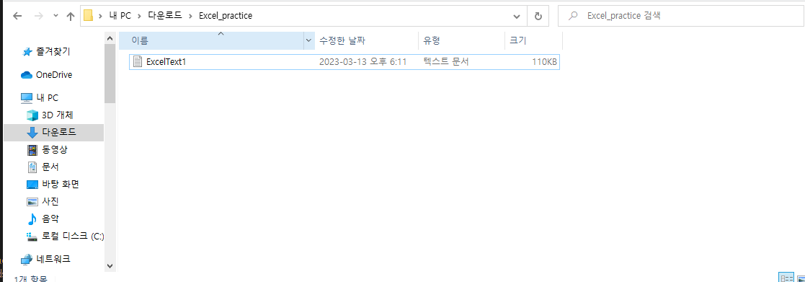
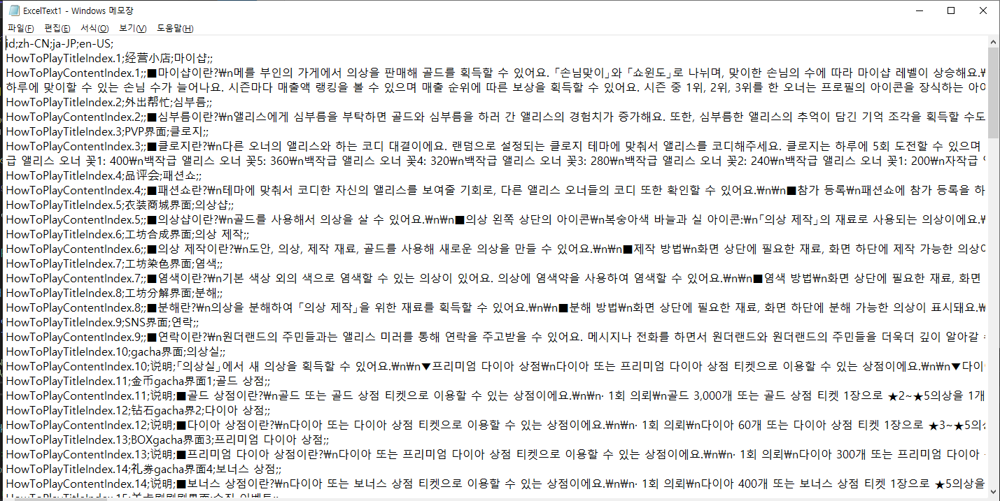

# Parser 인앤아웃

---

<aside>
💡 **HEADER**

</aside>

---

# 개요

---

엑셀 안의 데이터를 빼는 방법과 텍스트를 엑셀에 넣는 것에 대한 문서

<aside>
⚠️ 작성시기 2023년 03월

</aside>

<aside>
⚠️ Visual Studio 2022, Excel 2013에서 진행되었습니다.

</aside>

---

## 이 코드를 실행하기 전 Visual Studio 2022에서는 프로젝트->참조 추가->COM->검색에서 'Excel' 타이핑 해주면 Microft Excel 15.0 Object Library가 나오는데 왼쪽 상자를 클릭하여 추가하고 확인을 눌러줘야 합니다.

## 엑셀 안의 데이터를 텍스트화 시키는 코드

<h1> 코드 내용 </h1>


```C#
 string excelFilePath = @"C:\Users\SESI\Downloads\language.howtoplay.xlsx";
 string textFilePath = @"C:\Users\SESI\Downloads\Excel_practice\ExcelText1.txt";
```
* string excelFilePath와 string textFilePath는 각각 엑셀 파일의 경로와 텍스트 파일의 경로를 나타내는 문자열 변수입니다.
* excelFilePath에는 @"엑셀 파일 경로" 
* textFilePath에는 @"저장할 폴더경로\새로만들파일이름.txt" 를 정해줍니다. 


```C#

            Excel.Application excel = new Excel.Application();
            Excel.Workbook workbook = null;


```
* Excel.Application은 Excel 애플리케이션을 나타내는 COM 객체입니다. Excel.Application() 생성자를 호출하여 객체를 만듭니다.
* Excel.Workbook은 Excel 워크북을 나타내는 COM 객체입니다.

```C#
            try
            {
                workbook = excel.Workbooks.Open(excelFilePath);
                Excel.Worksheet worksheet = workbook.Worksheets[1];
```
* try 블록 안에서 excel.Workbooks.Open(excelFilePath)를 호출하여 엑셀 파일을 연 후 Excel.Workbook 개체를 할당합니다.
* 첫 번째 워크시트 가져옵니다. 


```C#
 using (StreamWriter sw = new StreamWriter(textFilePath))
                {
                    // 각 행을 탐색하여 셀 값을 읽어 텍스트 파일에 쓰기
                    for (int row = 1; row <= worksheet.UsedRange.Rows.Count; row++)
                    {
                        for (int col = 1; col <= worksheet.UsedRange.Columns.Count; col++)
                        {
                            // 셀 값 읽어오기
                            Excel.Range range = worksheet.Cells[row, col];
                            string cellValue = (range.Value2 == null) ? "" : range.Value2.ToString();

                            // 텍스트 파일에 쓰기
                            sw.Write(cellValue);

                            // 마지막 셀이 아니면 구분자(세미콜론) 쓰기
                            if (col != worksheet.UsedRange.Columns.Count)
                            {
                                sw.Write(";");
                            }
                        }
                        sw.WriteLine(); // 다음 행으로 이동하여 쓰기
                    }
                }
```


```C#


```


```C#


```


<br>


* 세팅을 완료한 후에 실행하면 몇 초의 시간이 지난 후 텍스트 파일이 생성되었다는 말과 함께 

<br>

* 정해준 폴더 안에 파일이 생기게 됩니다.

<br>

* 그 파일을 열어보면 엑셀 안의 데이터가 전부 들어가 있고, 셀이 구분되는 부분은 ';'(세미콜론)으로 쓰여졌다는 것을 알 수 있는데.

* 이 부분에서 sw.Write(";"); 가 셀이 구분되는 부분을 세미콜론으로 정한 코드이고, 괄호 안을 바꾸어주면 그에 따라 구분자도 바뀌게 됩니다.


<전체코드>
```C#
using System;
using System.Collections.Generic;
using System.IO;
using System.Linq;
using System.Text;
using System.Threading.Tasks;

using System.Runtime.InteropServices;
using System.Data.OleDb;
using System.IO;
using Excel = Microsoft.Office.Interop.Excel;
using Microsoft.Office.Interop.Excel;
using System.Drawing;

namespace Excel_MakeText
{
    internal class Program
    {
        static void Main(string[] args)
        {
            string excelFilePath = @"C:\Users\SESI\Downloads\language.howtoplay.xlsx"; //텍스트로 만들어낼 엑셀 파일의 경로 지정
            string textFilePath = @"C:\Users\SESI\Downloads\Excel_practice\ExcelText1.txt"; //생성할 텍스트 파일의 이름과 경로 설정 

            Excel.Application excel = new Excel.Application();
            Excel.Workbook workbook = null;

            try
            {
                workbook = excel.Workbooks.Open(excelFilePath);

                // 첫 번째 워크시트 가져오기
                Excel.Worksheet worksheet = workbook.Worksheets[1];

                // 텍스트 파일 생성
                using (StreamWriter sw = new StreamWriter(textFilePath))
                {
                    // 각 행을 탐색하여 셀 값을 읽어 텍스트 파일에 쓰기
                    for (int row = 1; row <= worksheet.UsedRange.Rows.Count; row++)
                    {
                        for (int col = 1; col <= worksheet.UsedRange.Columns.Count; col++)
                        {
                            // 셀 값 읽어오기
                            Excel.Range range = worksheet.Cells[row, col];
                            string cellValue = (range.Value2 == null) ? "" : range.Value2.ToString();

                            // 텍스트 파일에 쓰기
                            sw.Write(cellValue);

                            // 마지막 셀이 아니면 구분자(세미콜론) 쓰기
                            if (col != worksheet.UsedRange.Columns.Count)
                            {
                                sw.Write(";");
                            }
                        }
                        sw.WriteLine(); // 다음 행으로 이동하여 쓰기
                    }
                }

                Console.WriteLine("텍스트 파일이 생성되었습니다.");
            }
            catch (Exception ex)
            {
                Console.WriteLine("오류가 발생하였습니다: " + ex.Message);
            }
            finally
            {
                if (workbook != null)
                {
                    workbook.Close();
                }
                excel.Quit();

                // COM 오브젝트 해제
                System.Runtime.InteropServices.Marshal.ReleaseComObject(excel);
            }
        }
    }
}


```


## 텍스트안에 있는 데이터를 엑셀로 옮기는 코드

텍스트의 데이터들을 엑셀 로 변환시키는 코드
텍스트 속의 셀의 단위를 ';'지정하여 나누어줍니다.
* 먼저 테스트로 뽑아낼 파일의 위치를 지정해주세요.
* File.ReadAllLines 함수 옆에 위치를 지정하는 곳에 넣으면 됩니다.


```C#
using System;
using System.Collections.Generic;
using System.Linq;
using System.Text;
using System.Threading.Tasks;

using System.Runtime.InteropServices;
using System.Data.OleDb;
using System.IO;
using Excel = Microsoft.Office.Interop.Excel;
using Microsoft.Office.Interop.Excel;
using System.Drawing;


namespace Excel_makeByText
{
    internal class Program
    {
        static void Main(string[] args)
        {
            
            Application excel = new Application();// 어플리케이션 선언 
            Workbook workbook = excel.Workbooks.Add(); // 워크 북 더하기
            Worksheet worksheet = workbook.Sheets[1]; // 데이터를 넣을 워크 시트 선언 
            string[] lines = File.ReadAllLines(@"C:\\Users\\SESI\\Downloads\\language.howtoplay.txt"); // 텍스트 파일을 읽을 경로 설정 

            int row = 1;
            foreach (string line in lines)
            {
                string[] values = line.Split(';'); //텍스트 안의 글자들 속에 ';'마다 셀로 나누어줍니다.
                int column = 1;
                foreach (string value in values)
                {
                    worksheet.Cells[row, column] = value; // 순서대로 글자를 셀에 입력해줍니다.
                    worksheet.Columns[column].AutoFit(); // 글자의 길이에 따라 셀이 늘어나는 코드
                    worksheet.Cells[row, column].WrapText = true; //셸이 줄바꿈이 되는 코드
                    column++;
                }
                row++;
            }

            string savePath = @"C:\Users\SESI\Downloads\Excel_practice\output.xlsx"; //엑셀파일을 저장할 경로를 설정
            workbook.SaveAs(savePath); // 엑셀 파일저장
            workbook.Close(); // 워크 북 종료
            excel.Quit(); // 엑셀 나가기
        }
    }
}
```
