# 개요 
 
 - Unity 프로젝트 안에 구글 애드몹 미디에이션을 붙이기

--- 

<aside>
 
⚠️ 작성시기 2023년 05월

</aside>

--- 
<aside>
  
⚠️ Visual Studio 2022, Unity 2022.1.24f1, Google Cloud, Firebase, GooglePlay Console에서 진행되었습니다.

</aside>

--- 


소스트리
'git clone https://sesiprojectoregon@bitbucket.org/projectoregon/mytestbase.git'


# 목차

1. 광고 메디에이션(ADS Scene) <br>
2. 리더보드, 업적, 랭킹 등(GameService Scene) <br>
3. 파이어베이스 로그인 및 푸시, 결제(Login Scene) <br>
4. 구글 시트 파싱 (Parsing Scene) <br>
5. 구글 클라우드 JSON 세이브로드 (SaveLoad Scene) <br>
6. 오류 정리 <br>


<br><br><br>
# 0 타이틀 씬
처음 시작을 했을 때는 타이틀 씬이 가장 먼저 보일 것이다.
[사진]

여기서 원하는 기능을 실험하거나 테스트할 수 있다.


# 1 광고 메디에이션(ADS Scene) <br>

광고 메디에이션을 등록시키려면 밑에 있는 설명서를 참고한다.<br><br>
[광고 메디에이션](https://github.com/SesisoftTFT/Schedule/blob/main/Mediation.md)


# 2 리더보드, 업적, 랭킹 등(GameService Scene)<br>

먼저 현재 GooglePlayGamesPlugin 플러그인이 설치가 되어 있다. 현재는 로그인 문제로 인해 play-games-plugin-for-unity-10.14버전을 사용하고 있다.<br>
하지만 잘 되던 것이 갑자기 오류가 날 경우 업데이트 문제일 수 도 있으니 GooglePlayGames 폴더를 삭제하고 따로 플러그인을 임포트 해줘야한다.<br><br>

플러그인 문제가 없거나 마무리 했으면 웹에서 세팅을 해줘야한다.<br>

[구글 콘솔 개발자](https://play.google.com/console/u/0/developers)<br>

먼저 위에 있는 사이트에 들어가서 로그인을 해준다.<br>


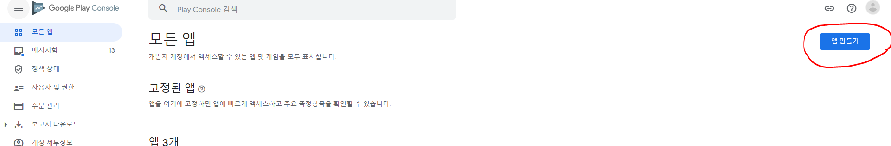<br>


그리고 앱 만들기 버튼을 눌러서 리더보드와 업적 같은 설정을 해줄 앱을 만들어준다.<br><br>
앱 설정은 나중에 바꿀 수 있으니 대충 빠르게 만들어준다.<br><br>


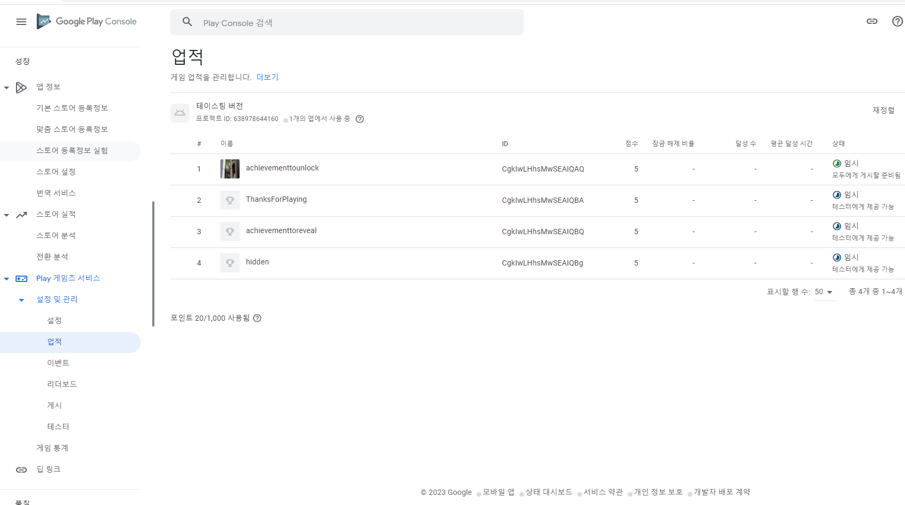<br>

그리고 Play 게임즈 서비스를 통해서 리더보드나 업적을 설정해줘야하는데<br>
만약 보이지 않는다면, 위의 검색창을 통해서 Play 게임즈 서비스를 복붙한후 들어가면 활성화를 할 수 있다.<br><br>

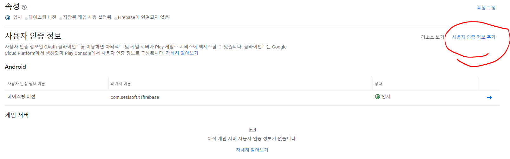<br>

그리고 사용자 인증 정보 추가를 눌러서 OAuth 클라이언트를 추가를 해줘야 한다.

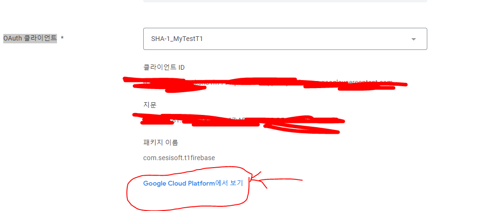<br>

이제 구글 플레이 콘솔과 클라우드를 연동 시켜야 되는데 먼저 위의 사진에서 가르키고 있는 링크로 간다.
그러면 구글 클라우드로 이동하게 되는데 구글 클라우드를 로그인하거나 가입을 해야한다.


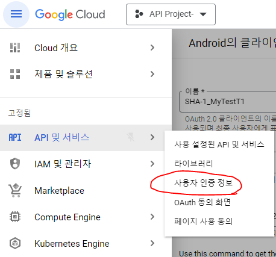<br>

클라우드에 성공적으로 들어왔으면 위의 사진을 보고 '사용자 인증 정보'로 이동한다.

<br>

구글 플레이 콘솔에서 요구하는 것은 OAuth 클라이언트였다 그러니 OAuth 클라이언트 ID를 만들어준다.<br>
애플리케이션 유형은 'Android'로 설정하고 패키지 이름과 SHA-1 인증서 디지털 지문을 해줘야하는데<br>


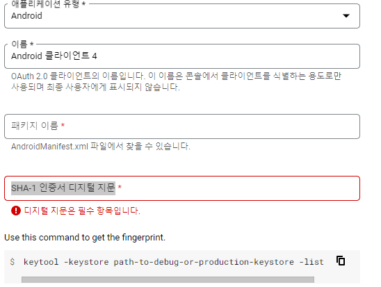<br>

유저키와 CMD로 SHA-1 인증서를 뽑아내야하기 때문에 방법은 아래의 링크를 따라한다.<br>
https://cafe.naver.com/sesisoftdev/25 <br>

만약 파이어베이스와 동시에 사용하고 싶다면,<br>
파이어베이스(https://firebase.google.com/?hl=ko&authuser=0)는 SHA-256 인증서 코드로 바꿔주고 클라우드는 SHA-1 인증서 코드를 사용하면 된다.<br>
자세한건 https://cafe.naver.com/sesisoftdev/26 를 살펴보도록 하자.<br>

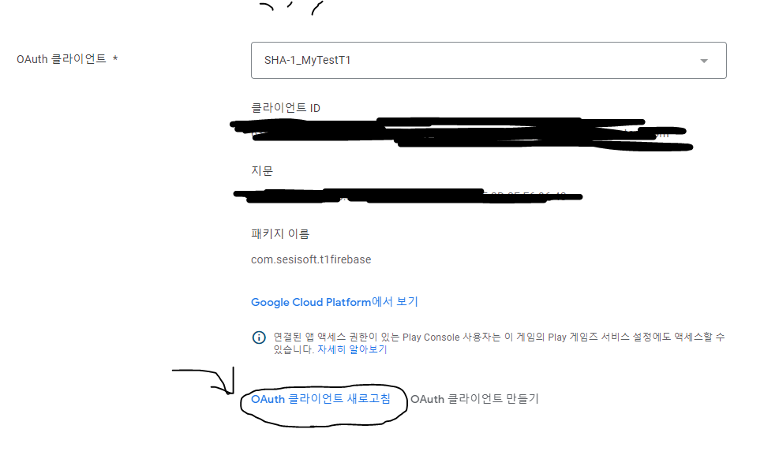<br>

이제 구글 플레이 콘솔에 들어가서 OAuth 클라이언트 새로고침을 한다면 아까 만들었던 클라이언트의 이름이 뜨게 될 겁니다. <br>
그럼 업적과 리더보드, 이벤트를 만들 준비가 되었습니다.<br>


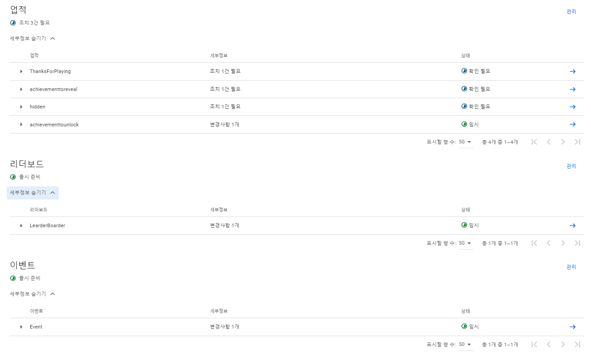<br>

이렇게 업적과 리더보드, 이벤트를 각각 만들어줬으면<br>

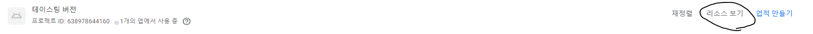<br>

업적, 이벤트, 리더보드, 설정 창들 중 어디든 리소스 보기가 있고 다 똑같으니 리소스 보기를 눌러서 <br>
코드를 복사해준다.

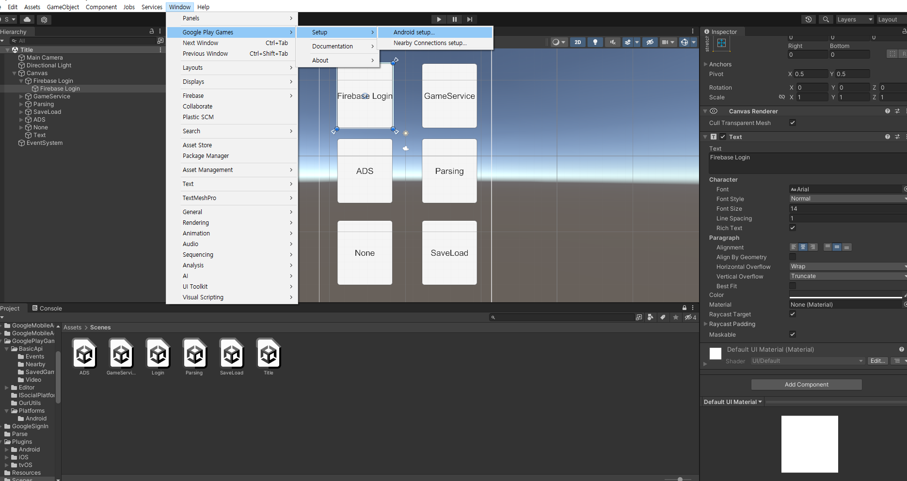<br>

그런 다음 위의 사진에 있는 경로에 따라서 Android Setup에 들어가 주게 되면 <br>

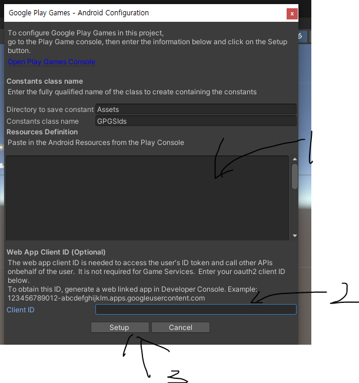<br>

위에 같은 하나 창이 뜨게 되는데 순서대로 1은 아까 복사한 리소스 코드를 붙여넣고 2는 아까 만들었던 OAuth 클라이언트에서 클라이언트 ID를 갖고 온다.<br>
물론 Google play console이나 Google Cloud에 똑같은게 있으니 둘 중 하나를 찾아서 붙이기를 하고 마지막으로 Setup 버튼을 누르면 GPGSIds라는 스크립트가 생기게 된다.<br>

이것을 기반으로 코드를 수정하거나 추가하면 된다.<br>

===========================================================================================================


# 3 파이어베이스 로그인 및 푸시, 결제(Login Scene)<br>

현재 이 씬에서는 게스트 로그인, 구글 로그인, 인앱 결제, 로그인 토큰 저장의 기능이 들어있다.<br>
지금은 google-services 파일이 작성자의 것으로 되어 있기 때문에 <br>
자신의 유저키를 바꾸고 파이어베이스 사이트에서 유저키의 SHA-1을 넣어서 새로운 google-services 파일을 넣어야<br>
바뀔 것이다.<br>

그 부분은 [파이어베이스 깃허브](https://github.com/SesisoftTFT/Schedule/blob/main/FireBase%20%EA%B8%B0%EB%8A%A5%EC%9D%B8%20Auth,%20Message%20SDK%EB%A5%BC%20%EC%B6%94%EA%B0%80%ED%95%98%EC%97%AC%20%ED%99%9C%EC%84%B1%ED%99%94.md) 를 참고하도록 하자<br>

맞게 설정을 다 마쳤다면 이제 안드로이드로 빌드를 해보자.<br>

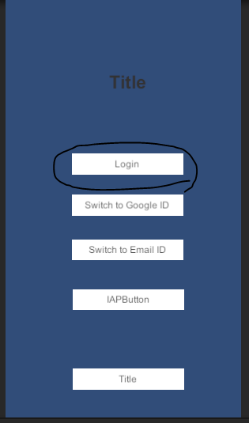<br>
<br>
먼저 Login 버튼은 게스트 로그인이다. <br>
이 버튼을 누르면 다음에 들어왔을 때도 토큰이 저장이 되어 있어서 게스트로그인이 유지가 된다.<br>

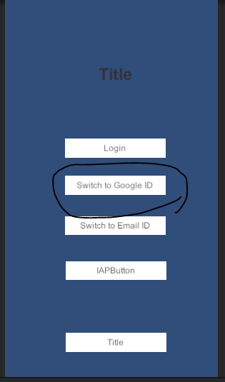<br>
<br>
다음은 게스트 로그인을 구글 로그인으로 바꾸는 버튼이다.<br>
게스트로그인을 하고 이 버튼을 누르면 게스트가 구글로 바뀔 것이다<br>
참고로 앱에서 빌드를 해야만 구글 로그인이 가능하다.<br>
<br>
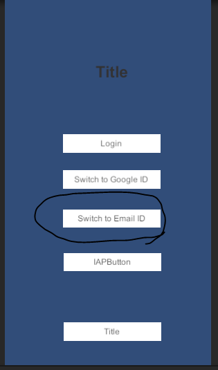<br>
<br>
마지막으로 게스트 로그인을 이메일 로그인으로 바꾸는 것이다.<br>
지금은 그냥 이메일 형식만 갖춰있어도 이메일로그인으로 바뀌는 것이 가능하지만,<br>
추후 가능하면 바꿀 예정이다.<br>
<br>
이 외에도 푸시기능은 FCM라는 오브젝트가 담당하고 있고<br>
결제는 IAP라는 오브젝트가, LoginManager라는 오브젝트는 게스트나 구글 로그인이 되어 있다면 계속 유지를 시키는 기능이 담겨있다. <br>
<br>


# 4 구글 시트 파싱 (Parsing Scene)<br>

현재 이 씬에는 두 개의 스크립트가 있다. 
GoogleSheetData, GlobalData 시트가 있는데 
말하자면
GoogleSheetData는 원하는 구글 스프레드 시트에서 데이터를 가져오는 곳,
GlobalData는 딕셔너리를 통해 저장하는 곳이다.


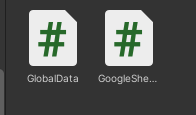<br>

이 스크립트는 현재 다른 구글 스프레드 시트를 지정하고 있지만 현재 자신이 원하는 
시트를 찾아서 바꾸고 코드를 작성하면 된다.


# 5 구글 클라우드 JSON 세이브로드 (SaveLoad Scene)<br>

이 것은 구글 클라우드와 유니티를 연결시켜서 저장시키는 것이다.<br><br>
그러니 먼저 다운로드를 받아야하는 것이 있기도 하다.<br>

먼저 우리가 구글 클라우드를 원활하게 상호작용을 할 수 있도록 하려면 아래의 파일들을 모두 유니티에 집어넣어야<br>
코드가 작동을 할 수 있다.<br><br>

밑에는 파일들에 대한 설명이다.<br>


```
System.Threading.Tasks.Extensions.dll은 .NET Framework 및 
.NET Core에서 비동기 프로그래밍을 지원하는 기능을 제공하는 어셈블리

System.Runtime.CompilerServices.Unsafe.dll는 Unsafe 클래스와 메모리 조작 기능 제공

Newtonsoft.Json.dll는 JSON 데이터를 다루기 위한 
.NET용 라이브러리인 Newtonsoft.Json의 실행 파일

Microsoft.Extensions.DependencyInjection.Abstractions.dll은 .NET Core 및 
.NET Standard 기반의 의존성 주입(Dependency Injection) 패턴을 지원하기 위한 Microsoft 확장 기능 파일

Microsoft.Bcl.AsyncInterfaces.dll은 비동기 프로그래밍을 위한 인터페이스와 유틸리티를 제공하는 
Microsoft BCL(기본 클래스 라이브러리)의 일부입니다. 이 어셈블리는 .NET Standard 2.1 이전 버전에서 비동기 작업을 지원

Google.Cloud.Storage.V1.dll은 구글 클라우드 스토리지를 사용하기 위한 Google Cloud Storage 
클라이언트 라이브러리입니다. 이 라이브러리는 구글 클라우드 스토리지와 상호 작용하기 위한 기능과 클래스를 제공

Google.Apis.Storage.v1.dll은 Google Cloud Storage API의 .NET 클라이언트 라이브러리입니다. 
이 라이브러리는 Google Cloud Storage 서비스와 상호 작용하기 위한 기능과 클래스를 제공

Google.Apis.dll은 Google API 클라이언트 라이브러리의 핵심 어셈블리입니다. 
이 라이브러리는 Google 서비스와의 상호 작용을 위한 일반적인 기능과 클래스를 제공

Google.Apis.Core.dll은 Google API 클라이언트 라이브러리의 핵심 기능을 제공하는 어셈블리입니다.
이 라이브러리는 Google API와의 상호 작용에 필요한 핵심 구성 요소와 유틸리티 기능을 제공

Google.Apis.Auth.PlatformServices.dll은 Google API 클라이언트 라이브러리에서 제공되는
플랫폼 서비스에 대한 구현을 포함하는 어셈블리입니다. 이 어셈블리는 
.NET 환경에서 Google API와 상호 작용할 때 필요한 플랫폼 종속 기능을 지원

Google.Apis.Auth.dll은 Google API 클라이언트 라이브러리의 일부로서,
Google API와의 인증을 관리하기 위한 기능을 제공합니다. 이 라이브러리는 .NET 환경에서 
Google API에 접근하고 사용자 인증 및 권한 부여를 처리하는 데 사용

Google.Api.Gax.Rest.dll은 Google API 클라이언트 라이브러리의 일부로서, 
Google API와의 RESTful API 통신을 단순화하고 간소화하는 기능을 제공합니다. 
이 라이브러리는 .NET 환경에서 Google API에 대한 HTTP 요청을 수행하고 응답을 처리하는 데 사용

Google.Api.Gax.dll은 Google API 클라이언트 라이브러리의 핵심 구성 요소입니다. 
이 라이브러리는 Google 클라우드 플랫폼과 상호 작용하기 위한 일반적인 유틸리티와 기능을 제공
```

여기 다른 깃허브에 파일을 넣어놨으니 링크로 들어가서 dll파일들을 받기 바란다. [파일 링크](https://github.com/ChoiHB02/sesi) <br>

만약 시간이 지나서 몇 개의 파일이 작동이 안될 수 있는데 <br>
그럴땐 무엇이 안되는지 보고 알맞는 파일을 업데이트를 하면 된다.<br>

그리고 Newtonsoft.Json은 유니티에 오류가 나오기 <br><br><br>


# 6 오류 정리 <br>

-----------------------------------------------------------------------------------------------------------------------------------------------------------------


## 1. 초기화문제 

 - 프로젝트에 있는 코드들 중 함수에서 사용되는 변수 중 하나가 null로 초기화 되지 않아서 오류가 발생할 수 있다.<br><br>
 ```
 Building Library\Bee\artifacts\Android\Manifest\LauncherManifestDiag.txt failed with output:
System.NullReferenceException: Object reference not set to an instance of an object.
   at Unity.Android.Gradle.AndroidManifest.SetFixedWindowSize(String activity, Int32 defaultWidth, Int32 defaultHeight, Int32 minimumWidth, Int32 minimumHeight)
   at AndroidPlayerBuildProgram.Actions.GenerateManifests.PatchLibraryManifest(AndroidManifest manifest, ManifestDiagnostics diagnostics)
   at AndroidPlayerBuildProgram.Actions.GenerateManifests..ctor(Arguments arguments)
   at AndroidPlayerBuildProgram.Actions.GenerateManifests.Run(CSharpActionContext context, Arguments arguments)
UnityEngine.GUIUtility:ProcessEvent (int,intptr,bool&)
외 3개의 오류들
 ```

그럴 경우엔 오류 메시지에 있는 문제들을 찾아서 집어넣어줘야하는데 <br><br>

Assets/Plugins/Android/AndroidManifest.xml 파일에서 코드를 추가해준다.<br><br>

```
<manifest xmlns:android="http://schemas.android.com/apk/res/android" package="com.example.myapp">
    <application>
        <!-- 앱 구성 요소 및 기타 정보 -->
    </application>
    
    <activity android:name=".MainActivity">
        <!-- MainActivity의 기타 정보 -->
        <meta-data android:name="unityplayer.ForwardNativeEventsToDalvik" android:value="true" />
        
        <!-- SetFixedWindowSize() 함수의 속성들 -->
        <meta-data android:name="android.max_aspect" android:value="2.1" />
        <meta-data android:name="android.min_aspect" android:value="1.86" />
        <meta-data android:name="android.min_width" android:value="320" />
        <meta-data android:name="android.min_height" android:value="480" />
        <meta-data android:name="android.default_width" android:value="1080" />
        <meta-data android:name="android.default_height" android:value="1920" />
        <meta-data android:name="android.resizeableActivity" android:value="false" />
    </activity>
</manifest>

```
-----------------------------------------------------------------------------------------------------------------------------------------------------------------

## 2. 최적화 및 버전 관련 오류

```
Building Library\Bee\artifacts\Android\ManagedStripped failed with output: 
C:\Program Files\Unity\Hub\Editor\2022.1.24f1\Editor\Data\il2cpp\build\deploy\UnityLinker.exe 
--search-directory=C:/Users/SESI/Documents/mytestbase/MyTestT1/Library/Bee/Player
```

대강 이런 오류가 난다면 해당 프로젝트에 구 버전이 섞여있거나 시스템에 필요한 도구가 없어서 오류가 발생하는 경우가 대다수 입니다.<br><br>
이럴 경우에는 Burst를 활용하여 코드를 최적화로 만드는 것이 문제를 없앨 수 있습니다.<br><br>

먼저<br><br>

Window -> Package Manager 로 가서 왼쪽 상단에 Unity Registry를 선택해줍니다.<br><br>

[사진]

그리고 오른쪽 상단에 burst를 검색해주고 Burst를 install 해주신다면 끝입니다.<br><br>
이제 실행을 하게 된다면 오류가 없어질 것인데 아직도 오류가 난다면 현재 말하고 있는 <br><br>
오류때문이 아닐 수 있으니 참고하시기 바랍니다.<br><br>

-----------------------------------------------------------------------------------------------------------------------------------------------------------------

## 3. SDK 호환 오류 및 버전 오류로 인한 AppLovin 호출이 불가

만약 로그캣으로 광고를 클릭을 했는데 AppLovin은 준비가 안 되었다는 메시지가 뜰 수 있다.<br><br>

```
AppLovinSdk [AppLovinSdk] Current SDK version (11.7.1) is outdated. Please integrate the latest version of the AppLovin SDK (11.9.0).
Doing so will improve your CPMs and ensure you have access to the latest revenue earning features.
```

이럴 때는 메시지를 잘 살펴봐 주면 오류가 무슨 이유인지가 알 수 있는 데 지금은 SDK 버전 차이로 인한 문제라는 것을 알 수 있다.<br><br>

해결책은 AppLovinMediationDependencies 파일 속의 내용을 현재의 버전에 맞게 바꿔주면 된다.<br><br>
```
<androidPackage spec="com.google.ads.mediation:applovin:'바꿔줄 버전'">
```


-----------------------------------------------------------------------------------------------------------------------------------------------------------------


## 4. GooglePlayGamesPlugin 오류 

open the file Assets/GooglePlayGames/com.google.play.games/Editor/GooglePlayGamesPluginDependencies.xml <br><br>

* change line `Packages/com.google.play.games/Editor/m2repository` to `Assets/GooglePlayGames/com.google.play.games/Editor/m2repository`

* run Android Force Resolve


