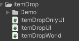

# 3D 던지기 로직
## 1. 개요
1) 개발목적  
   - 추후 발사체 구현
      - 직사 혹은 곡사가 필요할때 사용하기 위해서

       
2) 다운로드
   - 다운로드 : [유니티패키지](https://github.com/SesisoftTFT/Schedule/tree/main/Unitypacakge/[3D]ItemDropKit.unitypackage)  
  
3) 주의사항
   - 유니티 버전 2021.3.10f1 에서 제작 
   - DOTween 플러그인 사용
     - ItemDropUI, ItemDropOnlyUI 스크립트에서 사용됨
   - 3D 좌표계에서 사용
     - 시점 무관
     - 2D좌표계는 2D ItemDrop 메뉴얼 참고
   - 발사체의 레이어끼리는 충돌하지 않게 설정
     - Edit - ProjectSettings - Physics 하단
     - 땅 이외에는 충돌이 안나게 하는것 추천

4) 스크립트 종류
   - 
   - ItemDropUI
     - 날아갈 목표가 캔버스의 UI일 경우 사용 (코인 이미지 등)
   - ItemDropWorld
     - 날아갈 목표가 일반 월드일 경우 사용 (플레이어 등)
   - ItemDropOnlyUI
     - 처음 생성때부터 UI일 경우 사용
     - 2D 좌표계만 사용

## 2. 사용법


1) 발사체로 하고자 할 빈 게임 오브젝트에 스크립트 적용
   - 사용 용도에 따라서 ItemDropUI, ItemDropWorld중 하나만 적용
     - ItemDropUI: 월드에서 떨어진 아이템이 UI를 향해 날아갈때
     - ItemDropWorld: 월드에서 떨어진 아이템이 월드에 있는 무언가에 날아갈때
  
2) 모델이나 이미지 자식 오브젝트로 설정
   - 빈 오브젝트 - 모델부모 - 모델

3) 발사체에 리지드바디, 콜라이더 적용
   - ItemDropOnlyUI는 적용하지 않아도 됨
   - useGravity 사용안함 
    
4) 적용한 스크립트의 설정값 설정
   - 날아가는 목표가 될 오브젝트의 이름을 적는 칸에서 정확하게 적기

5) 어떤 방식이든 해당 발사체 소환
   - 밯사체를 소환하고 위치 설정
   - 예시 코드 (Demo의 Enemy스크립트중 일부)
```
    public void Dead()
    {
        for (int i = 0; i < dropCount; i++)
        {
            Debug.Log("Dead");
            GameObject coin = Instantiate(coinPrefab);
            coin.transform.position = transform.position;
        }

        Destroy(gameObject);
    }
```

## 3. Demo폴더
1) 드랍 방식
   - Enemy종류에 따라 다른 드랍방식이 적용됨
  
2) 플레이어
   - 단순히 Enemy를 소환하고 제거하는 역할
   - ItemDropWorld의 목표
  
3) 게임 시작
   - Q: ItemDropU인 Enemy 생성
   - W: ItemDropWorld Enmy 생성
   - E: ItemDropOnlyUI Enemy 생성, 목표 = UI의 코인 이미지
   - R: ItemDropOnlyUI Enemy 생성, 목표 = 플레이어
   - K: Enemy태그의 게임 오브젝트 랜덤 제거 (코인 드랍)
   - A: ItemDropUI Enemy 생성후 바로 제거 
   - S: ItemDropWorld Enemy 생성후 바로 제거 
   - D: ItemDropOnlyUI Enemy 생성후 바로 제거 
   - F: ItemDropOnlyUI Enemy 생성후 바로 제거 
