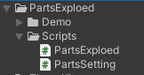
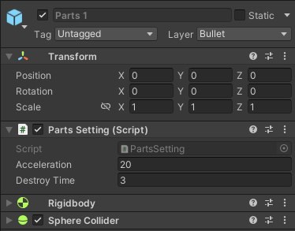
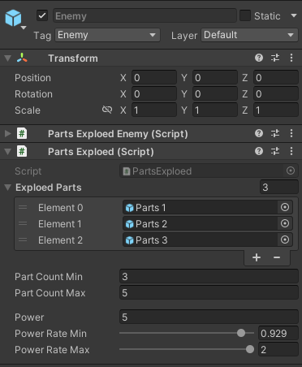

 # 3D 잔해 폭발
## 1. 개요
1) 개발목적  
   - 추후 적 구현에서 사용
      - 적을 처치했을때 여러 물체가 터지면서 사방으로 퍼지는 로직
       
2) 다운로드
   - 다운로드 : [유니티패키지](https://github.com/SesisoftTFT/Schedule/tree/main/Unitypacakge/[3D]PartsExploedKit.unitypackage)  
  
3) 주의사항
   - 유니티 버전 2021.3.10f1 에서 제작 
   - 3D 좌표계에서 사용
     - 시점 무관
     - 2D좌표계는 2D ItemDrop 메뉴얼 참고
   - 발사체의 레이어끼리는 충돌하지 않게 설정
     - Edit - ProjectSettings - Physics 하단
     - 땅 이외에는 충돌이 안나게 하는것 추천

4) 스크립트 종류
   - 
   - PartsExploed
     - 에너미에게 적용, 프리펩을 랜덤으로 뿌리는 기능
   - PartsSetting
     - 날아갈 오브젝트에 적용

## 2. 사용법


1) 부품 오브젝트에 리지드바디, 콜라이더 적용
   - 이때 부품 오브젝트는 빈 오브젝트
   - 리지드바디의 중력은 사용 안함
  
2) 부품 오브젝트에 PartsSetting 스크립트 적용및 설정
   - Accelration: 중력 가속도
   - DestroyTime: 생성후 사라지기까지 걸리는 시간



3) 에너미 오브젝트에 PartsExploed 적용 및 설정
   - ItemDropOnlyUI는 적용하지 않아도 됨
   - useGravity 사용안함 
    
4) 적용한 스크립트의 설정값 설정
   - ExploedParts: 위에서 설정한 부품들을 할당
   - PartsCountMin / Max: 부품들이 나오는 개수
   - Power: 부품들이 날아가는 힘
   - PowerRate Min / Max: 파워에 랜덤으로 곱해지는 힘

5) 에너미가 PartsExploed의 ExploedStart() 사용
   - 예시 코드 (Demo의 Enemy스크립트중 일부)
```
    public void Dead()
    {
        if (GetComponent<PartsExploed>() != null)
            GetComponent<PartsExploed>().ExploedStart();

        Destroy(gameObject);
    }
```

## 3. Demo폴더
1) 플레이어
   - 단순히 Enemy를 소환하고 제거하는 역할
  
2) 게임 시작
   - R: Enemy랜덤 생성
   - Q: Enemy랜덤 제거 (폭발)
