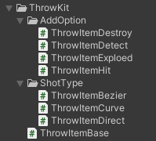
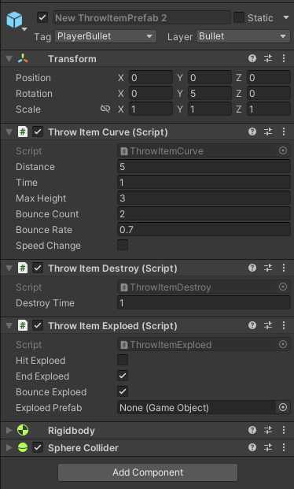

# 3D 던지기 로직
## 1. 개요
1) 개발목적  
   - 추후 발사체 구현
      - 직사 혹은 곡사가 필요할때 사용하기 위해서
       
2) 다운로드 
   - 다운로드 : [유니티패키지](https://github.com/SesisoftTFT/Schedule/tree/main/Unitypacakge/[3D]ItemDropKit.unitypackage)  

4) 주의사항
   - 유니티 버전 2021.3.10f1 에서 제작 
   - 3D 탑뷰에서 사용    
     - 2D좌표계는 2D 던지기 메뉴얼 참고
   - 발사체의 게임 오브젝트에서 아이템 모델은 자식으로 설정
   - 스크립트를 적용할 오브젝트에는 리지드바디와 콜라이더가 있어야함
   - 발사체의 레이어끼리는 충돌하지 않게 설정
     - Edit - ProjectSettings - Physics 하단
     - 땅 이외에는 충돌이 안나게 하는것 추천

4) 스크립트 종류
   - 
   - ThrowItemBase (상속용)
   - 발사 방식에 따른 스크립트 (ShotType)
     - ThrowItemDirect (직사)
     - ThrowItemCurve (곡사)
     - ThrowItemBezier (곡선)
   - 추가 효과 스크립트 (AddOption)
     - ThrowItemDestroy
       - 발사체를 삭제하는용
      - ThrowItemHit
        - 발사체의 히트 판정용
      - ThrowItemDetect
        - 발사체의 적 탐지용 (유도미사일 등)
      - ThrowItemExploed
        - 여러 조건에서 폭발

## 2. 사용법

1) 발사체로 하고자 할 게임 오브젝트에 발사 방식 스크립트 적용
   - ThrowItemDirect, ThrowItemCurve, ThrowItemBezier중 원하는 스크립트를 적용
   - 세 개중 하나만 적용
    
2) 적용한 스크립트의 설정값 설정
   - 세 스크립트 공통적인 설정값
     - Distance: 목적지 까지의 거리
     - Time: 목적지 까지 도달하는데 걸리는 시간 
   - ThrowItemDirect
     - 없음
   - ThrowItemCurve
     - MaxHeight: 처음 던졌을때 올라가는 높이
     - BounceCount: 목적지까지 도착하는데 몇번 튕기고 도착할건지
     - BounceRate: 튕길때 올라가는 힘이 얼마나 복원되는지
     - SpeedChange: 타겟이 있을때 속도가 변하는지
       - ture일때 타겟이 가까이 오면 속도가 느려진다.
   - ThrowItemBezier
     - TracingTarget: 타겟이 있을 경우 끝까지 적을 추적하며 투사체가 이동
     - StartDistotion: 발사할때 꺽이는 정도
     - EndDistotion: 도착할때 꺽이는 정도
       - Distotion류는 0이면 직사처럼 작동함

3) 추가 효과 스크립트 적용 및 설정(필수 아님)
   - ThrowItemDestory 
     - DestroyTime: 소환 후 사라지기까지의 시간
   - ThrowItemHit
     - HitRange: 피격 판정 범위 (구의 반지름)
     - MaxHitCount: 최대 피격 횟수
   - ThrowItemDetect
     - ReserchRange: 감지 범위 (구의 반지름)
   - ThrowItemExploed
     - HitExploed: Hit판정이 날때마다 폭발
     - EndExploed: 어떤 방법이든 끝나면 폭발
     - BounceExploed: 튕기면 폭발
     - ExploedPrefab: 폭발이 일어날시 생성되는 프리펩 (폭발은 이 프리펩을 생성하는것이 )


4) 외부 스크립트에서 선언
   - 발사 방식 스크립트는 모두 ThrowItemBase를 상속중
   - 외부 스크립트에서 ThrowItemBase를 참조하여 ThrowItemStart() 선언
     - 매개변수로 각도 입력 가능 (targetEnemy가 있으면 작동 안함)
     - 선언 전에 targetEnemy를 먼저 할당해주면 각도와 상관 없이 타겟팅으로 작동
     - 예시 코드 (Demo의 Player스크립트중 일부)
```
    private void Throw(int itemID, int angle)
    {
        GameObject throwItem = Instantiate(throwItemPrefab[itemID]);
        throwItem.transform.position = transform.position + Vector3.up;

        ThrowItemBase throwItemLogic = throwItem.GetComponent<ThrowItemBase>();
        throwItemLogic.ThrowStart(angle);
    }
```

## 3. Demo폴더
1) 발사체
   - 발사체는 3개가 존재
     - 각각 직사, 곡사, 베지어샷
2) 플레이어
   - 데모씬에서 Player의 Player스크립트에서 해당 발사체가 할당되어있음
3) 게임 시작
   - 게임 시작 후 상단 숫자 1~3으로 발사할 발사체 선택
   - Number패드의 1~9키로 해당 방향으로 발사
