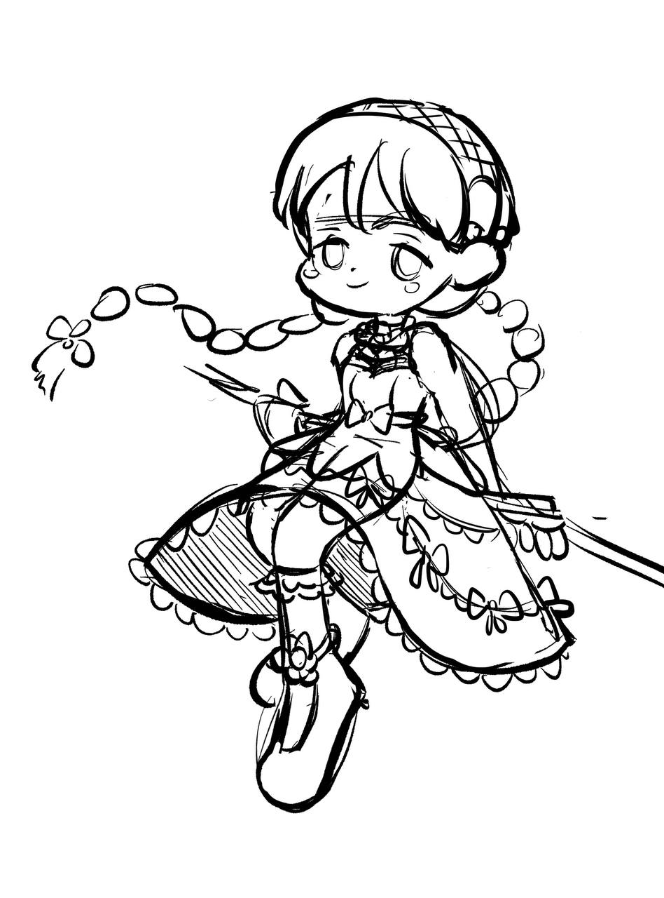
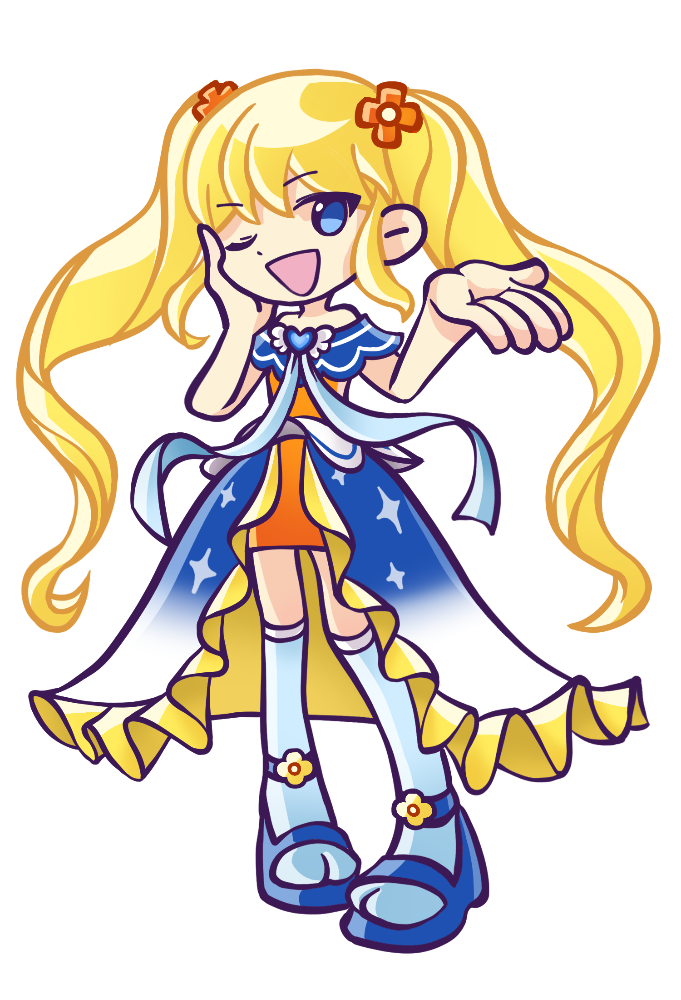
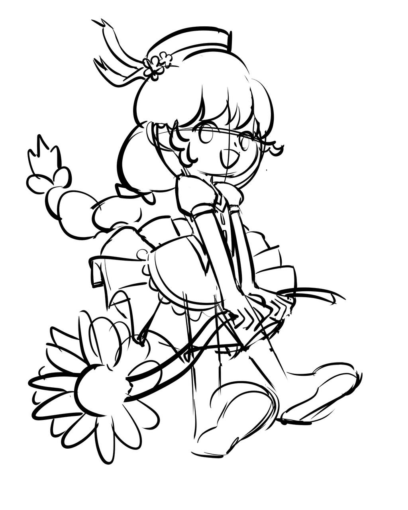
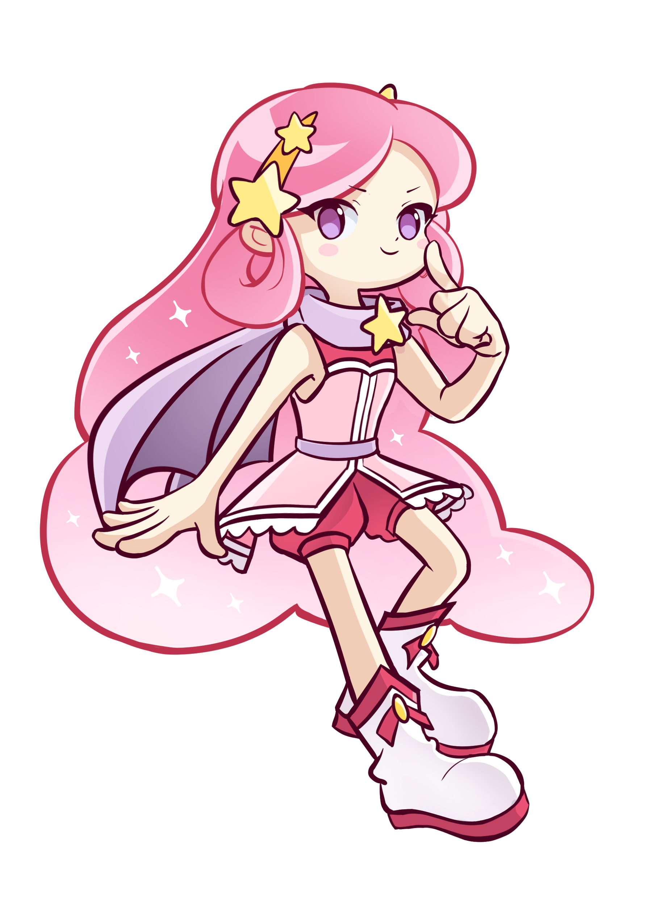

# 캐릭터 제작 (가안)
## 1. 캐릭터 제작을 위한 테스트
1) 캐릭터 작업 기간, 방향등을 체크하기 위해 진행
2) 뿌요 뿌요 캐릭터를 사용할지 유무가 결정되지 않았다.
3) 오리지날 캐릭터도 제작 테스트 했다. 

## 2. 결론
1) 장당 이미지 제작 시간은 2~3일 정도 걸릴것 같다. 
2) 뿌요 이미지를 사용하던 안하던 제작 시간은 비슷하다. 
3) 남은 개발 기간이 2달이라는 가정하에 
4) 추가 캐릭터는 최대 20개일것 같다. 

## 3. 참고
1) 기획에서 화면 액션을 적게 하고 타이핑에 집중했으면 하는 의견이 있음
2) 캐릭터 세팅 시간도 필요하다.
3) 이전 기획에서는 캐릭터별 이펙트가 달랐다. 현재도 그러한지 
    - 캐릭 1은 공격시 주먹 이펙트, 캐릭 2는 공격시 꽃 이펙트.. 
    - 위와 같은 방법으로 캐릭터마다 이펙트를 달리 했다. 
    - 미쓰, 실패등 액션마다 캐릭터 차별화 할지..
4) 개발 기간은 디자인과 설정이 변수 

---
# 제작 테스트 과정 설명 (기존 사용 캐릭터) 
## 1. 타자로 매니아 캐릭터
1) 총 4종중 첫번째 두번째 2종 사용
2) 첫번째 두번째 캐릭터는 공격 액션이 있음 
    - 최초 기획은 액션마다 컷을 추가 하는 것이었다.
    - 작업 기간이 많이 걸려서 1컷에 이펙트로 액션을 주는 방식으로 수정 
3) 좌우에 동일 캐릭터 일 경우 칼라가 달라야 해서 칼라가 다른 버전이 있음

<table width = 100%><tr>
    <td width = 25% ></td>
    <td width = 25% ></td>
    <td width = 25% ></td>
    <td width = 25% ></td>
</tr></table>

## 2. 현재 샘플에 사용된 뿌요 뿌요 캐릭터 
1) 뿌요 뿌요 캐릭터중 2종 선택 (장시내)
2) 이미지 한컷
3) 액션넘버 
  = 아이들 
  - 데미지

<table width = 100%><tr>
    <td width = 60% ></td>
    <td width = 40%></td>
</tr></table>
---

# 제작 테스트 과정 설명 (자체 준비중 캐릭터) 
## 1. 프리드로임
1) 오더 : 스타일없이 편하게 빨리 작업 해줄것
2) 결과 : 호불호가 있음 (좋다는 사람과 별로라는 사람이 나뉨)

<table width = 100%><tr>
    <td width = 25% ></td>
    <td width = 25% ></td>
    <td width = 25% ></td>
    <td width = 25% ></td>
</tr></table>

## 2. 뿌요 뿌요 라이크 첫번째 
1) 오더 : 뿌요뿌요 처럼 -> 뿌요 이미지를 사용한다는 전제에서 튀지 않게 캐릭터 추가가 목적 
2) 결과 : 이쁘긴 한데 비슷한듯 아닌듯 하고 배색이 좀 애매

<table width = 100%><tr>
    <td width = 25% ></td>
    <td width = 25% ></td>
    <td width = 25% ></td>
    <td width = 25% ></td>
</tr></table>

<table width = 100%><tr>
    <td width = 25% ></td>
    <td width = 25% ></td>
    <td width = 25% ></td>
    <td width = 25% ></td>
</tr></table>

## 3. 뿌요 뿌요 라이크 두번째
1) 오더 : 오더 명확하게 수정 -> 뿌요 같아야 한다.
2) 결과 : 비슷 (이슈 없었음) 완성도 50% 정도로 진행

<table width = 100%><tr>    
    <td width = 20% ></td>
    <td width = 20% ></td>
    <td width = 20% ></td>
    <td width = 20% ></td>
    <td width = 20% ></td>
</tr></table>

## 4. 다른 스타일 첫번째 -> 점핑파티 참조
1) 오더 : 점핑파티 참조 
2) 결과 : 테스트 이미지 완성도 80&정도로 진행 
    - 원작 디자인이 좀 둔탁해서 이쁘게는 안나왔다. 
    - 원작의 배색도 단순한 편 -> 채도가 높은 기물이 엑세서리를 해줘야 할것 같다.    
    - 위에 4장 점핑파티 이미지
    - 아래 4장 점핑파티를 참조한 타자로매니어 오리지날 캐릭터

<table width = 100%><tr>    
    <td width = 25% ></td>
    <td width = 25% ></td>
    <td width = 25% ></td>
    <td width = 25% ></td>
</tr></table>

<table width = 100%><tr>
    <td width = 25% ></td>
    <td width = 25% ></td>
    <td width = 25% ></td>
    <td width = 25% ></td>
</tr></table>

## 5. 다른 스타일 두번째 -> 프리코네 참조
1) 오더 : 프리커넥트와 비슷한 스타일 -> 시간 소요 예상 (4/5~4/7)
2) 결과 : 진행중 완성도 40%~50% 수준으로 여러 포즈 작업중

<table width = 100%><tr>
    <td width = 25% ></td> 
    <td width = 25% ></td> 
    <td width = 25% ></td>
    <td width = 25% ></td>    
</tr></table>

