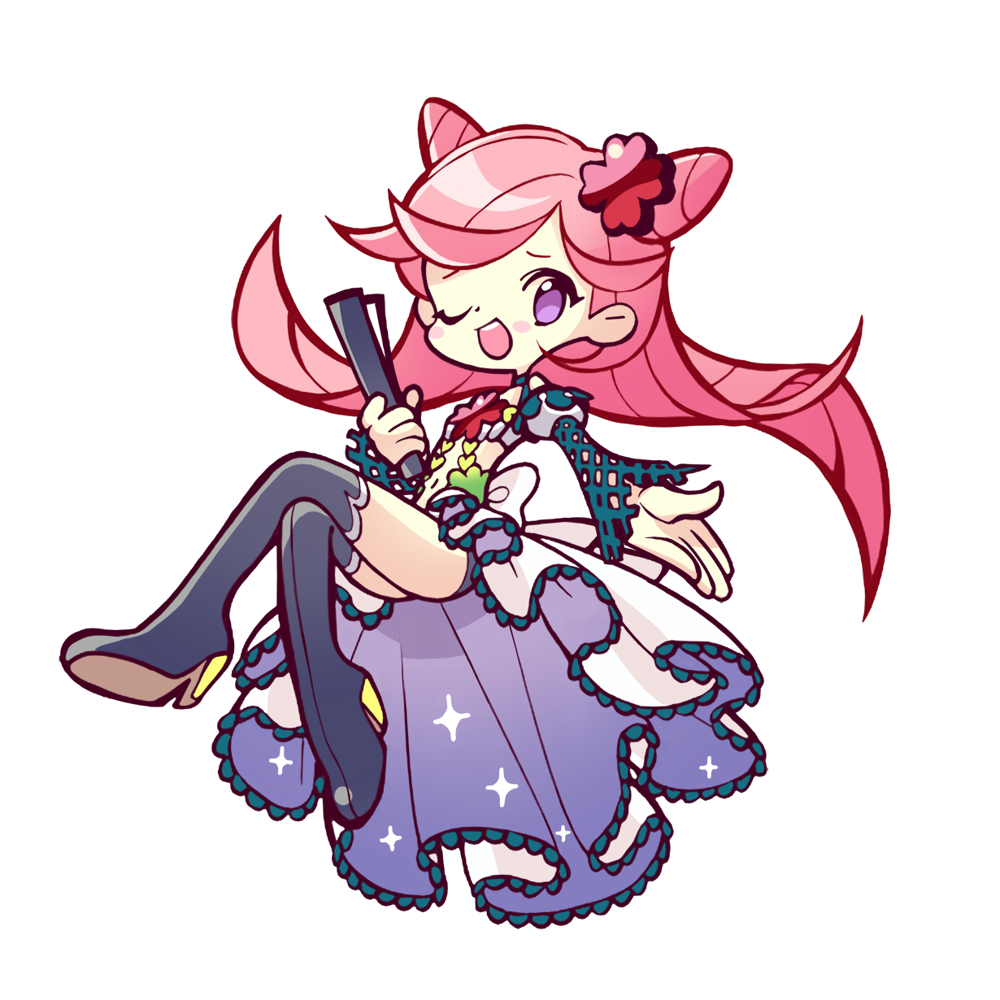
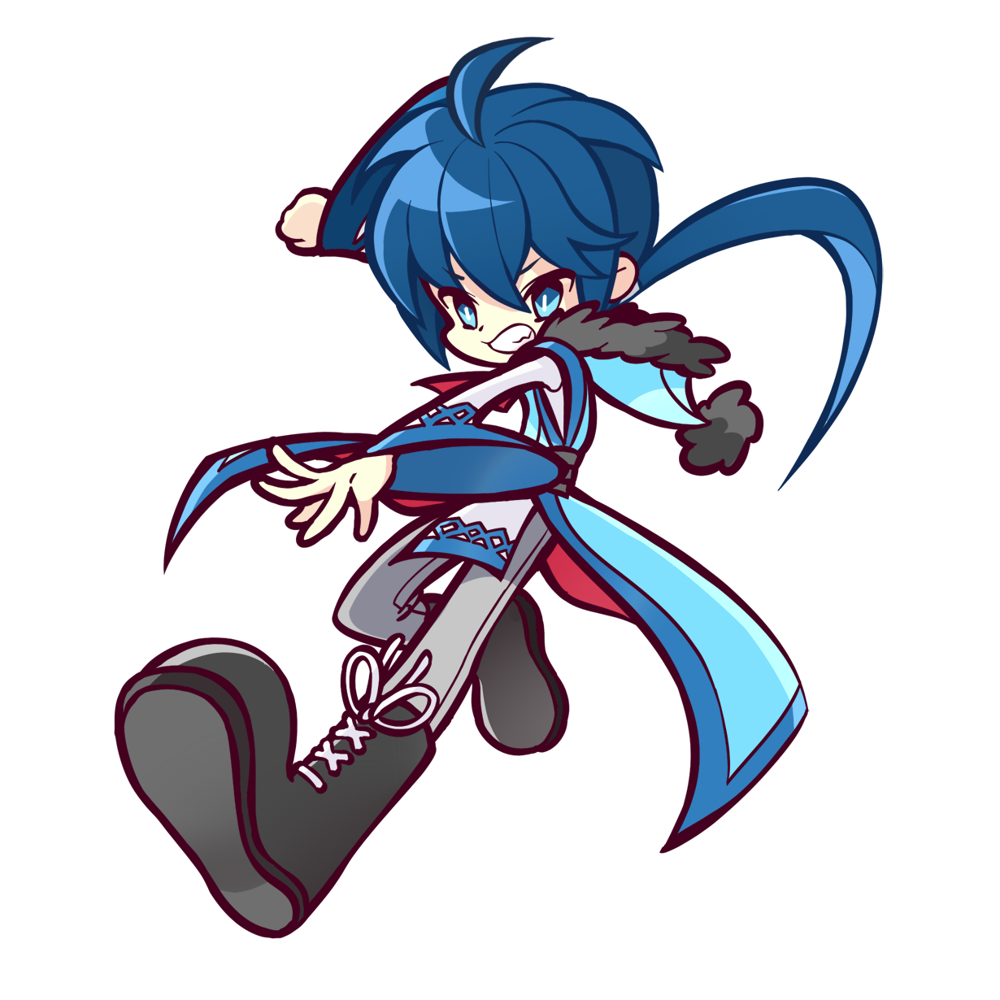
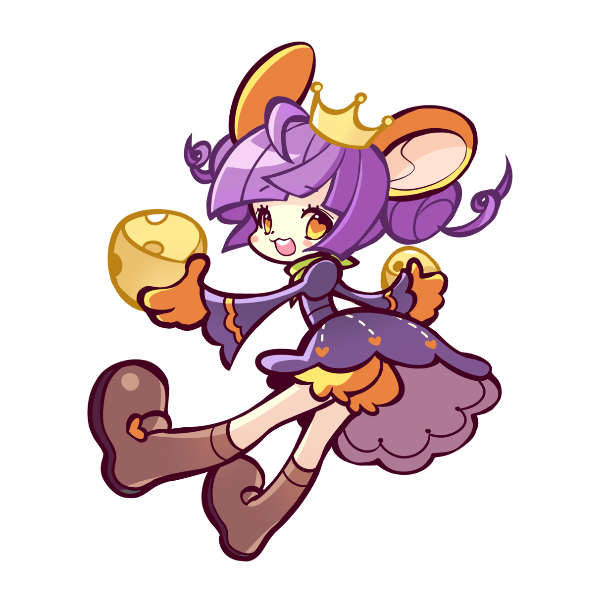
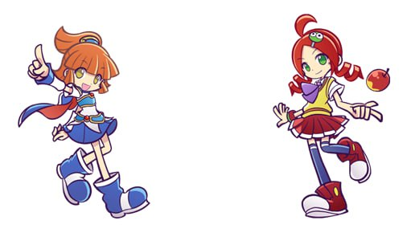
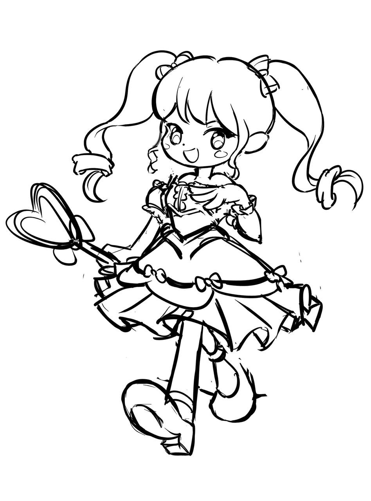

## 기존 사용 캐릭터 
1) 총 4종중 첫번째 두번째 2종 사용
2) 첫번째 두번째 캐릭터는 공격 액션이 있음 
  - 애초 액션별로 컷을 따로 그리는 것으로 기획 되었으나
  - 마지막에 이미지는 한컷으로 공격, 실패, 미쓰등 추가 액션은 이펙트로 처리 하는 것으로 정리 되었다. 
3) 좌우에 동일 캐릭터 일 경우 칼라가 달라야 해서 칼라가 다른 버전이 있음

<table width = 100%>
  <tr>
    <td width = 25% > 
      
    </td>
        <td width = 25% > 
      
    </td>
        <td width = 25% > 
      
    </td>
        <td width = 25% > 
      
    </td>
  </tr>
</table>

## 현재 샘플에 사용된 캐릭터 
1) 뿌요 뿌요 캐릭터중 2종 선택 (장시내)
2) 이미지 한컷
3) 액션넘버 
  = 아이들 
  - 데미지

<table width = 100%>
  <tr>
    <td width = 50% > 
      
    </td>
    <td width = 50%></td>
  </tr>
</table>

## 자체 준비중 캐릭터 
1) 스타일없는 프리드로잉

<table width = 100%>
  <tr>
    <td width = 25% > 
      
    </td>
        <td width = 25% > 
      
    </td>
        <td width = 25% > 
      
    </td>
        <td width = 25% > 
      
    </td>
  </tr>
</table>

2) 뿌요 뿌요 라이크 
  - 비슷하게 

3) 뿌요 뿌요 라이크 
  - 느낌도 비슷하게 

4) 오리지날 캐릭터
  - 점핑파티 디자인 참조 
  - 일단 직업 캐릭터로 이쁘게...  
