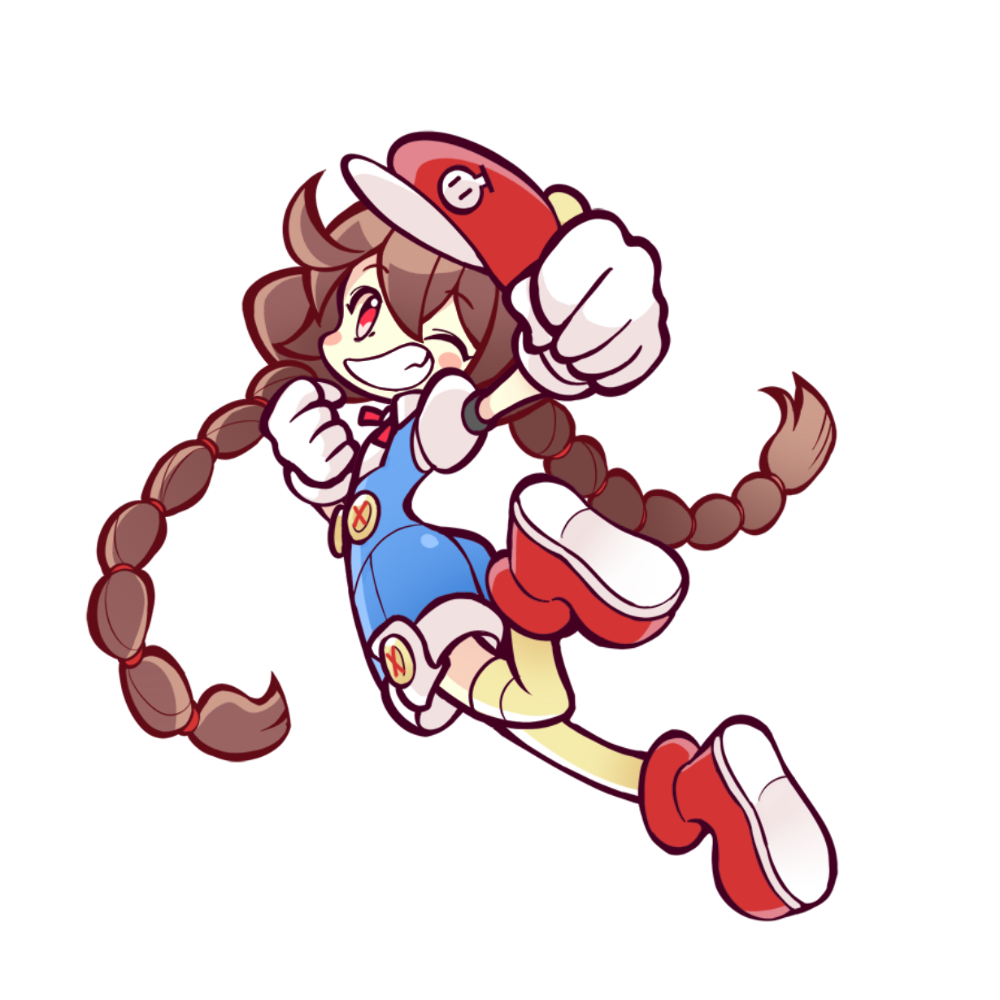

# 캐릭터 제작 플랜 (가안)
## 1. 캐릭터 이미지 제작
1) 기간 : 장당 2~3일 -> 주당 2장 정도 
2) 방향 : 뿌요 이미지를 쓰느냐에 따라 달라진다. 
    - 사용할 경우 -> 이질감 없이 추가 캐릭터 이미지 사용할수 있게 작업
    - 사용할수 없을 경우 -> 기존 작업물과 여러 스타일을 참조 
3) 총량 : 개발 기간내에 총량
    - 잔여 개발 예상 기간은 2달로 예싱
    - 해당 기간에 추가 되는 이미지는 20여장 미만이 될것으로 예상
    - 설정과 디자인이 변수 
---

# 기존 사용 캐릭터 
## 1. 타자로 매니아 캐릭터
1) 총 4종중 첫번째 두번째 2종 사용
2) 첫번째 두번째 캐릭터는 공격 액션이 있음 
    - 최초 기획은 액션마다 컷을 추가 하는 것이었다.
    - 작업 기간이 많이 걸려서 1컷에 이펙트로 액션을 주는 방식으로 수정 
3) 좌우에 동일 캐릭터 일 경우 칼라가 달라야 해서 칼라가 다른 버전이 있음

<table width = 100%><tr>
    <td width = 25% ></td>
    <td width = 25% ></td>
    <td width = 25% ></td>
    <td width = 25% ></td>
</tr></table>

## 2. 현재 샘플에 사용된 뿌요 뿌요 캐릭터 
1) 뿌요 뿌요 캐릭터중 2종 선택 (장시내)
2) 이미지 한컷
3) 액션넘버 
  = 아이들 
  - 데미지

<table width = 100%><tr>
    <td width = 60% ></td>
    <td width = 40%></td>
</tr></table>
---

# 자체 준비중 캐릭터 
## 1. 프리드로임
1) 오더 : 스타일없이 편하게 빨리 작업 해줄것
2) 결과 : 호불호가 있음 (좋다는 사람과 별로라는 사람이 나뉨)

<table width = 100%><tr>
    <td width = 25% ></td>
    <td width = 25% ></td>
    <td width = 25% ></td>
    <td width = 25% ></td>
</tr></table>

## 2. 뿌요 뿌요 라이크 첫번째 
1) 오더 : 뿌요뿌요 처럼 -> 뿌요 이미지를 사용한다는 전제에서 튀지 않게 캐릭터 추가가 목적 
2) 결과 : 이쁘긴 한데 비슷한듯 아닌듯 하고 배색이 좀 애매

<table width = 100%><tr>
    <td width = 25% ></td>
    <td width = 25% ></td>
    <td width = 25% ></td>
    <td width = 25% ></td>
</tr></table>

<table width = 100%><tr>
    <td width = 25% ></td>
    <td width = 25% ></td>
    <td width = 25% ></td>
    <td width = 25% ></td>
</tr></table>

## 3. 뿌요 뿌요 라이크 두번째
1) 오더 : 오더 명확 -> 뿌요 같아야 한다.
2) 결과 : 비슷 -> 칼라링이랑 외곽정리까지 종료되진 않았지만..  

<table width = 100%><tr>    
    <td width = 20% ></td>
    <td width = 20% ></td>
    <td width = 20% ></td>
    <td width = 20% ></td>
    <td width = 20% ></td>
</tr></table>

## 4. 다른 스타일 첫번째 -> 점핑파티 참조
1) 오더 : 점핑파티 참조 
2) 결과 : 
    - 원작 디자인이 좀 둔탁해서 이쁘게는 안나왔다. 
    - 배색도 단순한편 -> 채도가 높은 기물이 들어가서 엑세서리를 해줘야 할것 같다.    

<table width = 100%><tr>    
    <td width = 25% ></td>
    <td width = 25% ></td>
    <td width = 25% ></td>
    <td width = 25% ></td>
</tr></table>

<table width = 100%><tr>
    <td width = 25% ></td>
    <td width = 25% ></td>
    <td width = 25% ></td>
    <td width = 25% ></td>
</tr></table>

## 5. 다른 스타일 두번째 -> 프리코네 참조
1) 오더 : 프리커넥트와 비슷한 스타일 -> 시간 소요 예상 (4/5~4/7)
