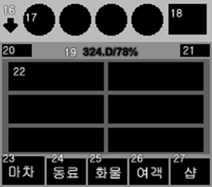

## UI 가이드 (상단부)
<table>
        <body>
    <tr>
        <td valign = top>
                
            * 기본 UI    
        </td>
        <td valign = top>
             
            * 강화 메뉴 숨김 상태             
        </td>
        <td valign= top>
    
1) 레벨 : 마차 레벨 
2) 골드 : 최대 골드 수량 
3) 다이아 : 최대 다이아 수량
4) 게임속도 : 광고보고 게임 속도 2배
5) 옵션 : 설정, 우편함, 절전모드
6) 축 : 골드, 공격력, 동료 축 (광고 보고 축)
7) 회전판 : 열쇠들, 다이아 뽑기 회전 룰렛
8) 보상 : 방치보너스용
9) 패스 : 시즌패스와 일반 패스
10) 날짜 : "21일째 새벽"
11) 웨이브 게이지 : 
12) 보스 아이콘 :
13) 퀘스트 안내 판넬
14) 일일 퀘스트 : 
15) 이벤트 :   
        - 일일 퀘스트  
        - 보스 던전 
        - 골드 던전 
        - 강도단 아치트 습격 
         
      
</td>
</tr> 
</body>
</table>

## UI 가이드 (중단부)
<table>
        <body>
    <tr>
        <td valign = top>
                
            * 강화 UI    
        </td>
        <td valign= top>
    
16) 하이드 버튼 : 강화 메뉴가 하이드 된다. 
17) 동료 윈도우 : 최대 4인
        - 동료 얼굴, 재사용 게이지, 스킬 시간 게이지, 레벨 
18) 마차 윈도우 : 마차 연구 시간이 표기 된다.
        - 연구 관련 시간 표시
        - 승객 인원 표시
19) 전투력(컨디션) 표기 -> 표기 방식 => 12D/78% 
20) 공격 강화 메뉴 전환 버튼
        - 공격 관련 탭만 모아서 보여준다.
21) 방어 강화 메뉴 전환 버튼
        - 방어 관련 탭만 모아서 보여준다. (유틸리티로 포함)
22) 강화 버튼들 (공격, 방어)            
        - 아이콘, 타이틀, 강화 비용및 관련 수치
      
</td>
</tr> 
</body>
</table>

## UI 가이드 (하단부)
<table>
        <body>
    <tr>
        <td valign = top>
                
            * 강화 UI    
        </td>
        <td valign= top>
    
23) 마차 : 강화 메뉴가 하이드 된다. 
        - 마차 정보를 볼수 있다. 
        - 우측에는 연구, 화물, 동료, 여객으로 가는 단축 버튼 
        - 하단에는 현재 스탯 정보와 사용하는 마차의 고유 기능을 볼수 있다.  
      
</td>
</tr> 
</body>
</table>

## UI 가이드 (하단부)
<table>
<body>

<tr>
<td valign = top>
  
</td>
<td valign= top>
23) 마차 
        - 마차 정보를 볼수 있다. 
        - 우측에는 연구, 화물, 동료, 여객으로 가는 단축 버튼 
        - 하단에는 현재 스탯 정보와 사용하는 마차의 고유 기능을 볼수 있다.  
</td>
</tr> 
</body>
</table>

23) 마차 
      - 마차 강화 : 기념 주화로 업그레이드
      - 마차 교체 : 교체 레벨 충족시에 다이아로 교체 
      - 기술 강화 : 기존 게임의 연구 -> 시간을 사용하여 수련 (다이아로 즉시 완료)
      - 마차 청소 : 시간을 사용하여 청소를 하면 동료, 여객의 컨디션이 올라간다.

24) 동료
      - 원작의 오브
      - 고용 레벨 표기 (스테이지 별로 고용 가능하다.)
      - 스테이지 클리어 마다 골드 보상  
        - 동료 정보 판넬
        - 동료 강화 버튼   
  
25) 화물
      - 하단에 인벤 싣을수 있는 모든 화물이 표기 (인벤토리)
        - 화물 정보 판넬
        - 화물 강화 버튼 
      - 상단에 마차 화물칸으로 여기에 장착한다.

26) 여객
      - 3스테이지부터 여객 영엽 가능
      - 마차 종류에 따라 여객 슬롯 제한
        - 여객 정보 판넬
        - 여객 강화 버튼  
27) 샵   
      - 소환 (카드 소환)
      - 패키지
      - 재화
