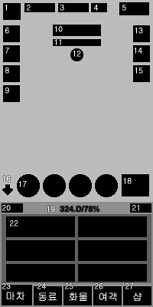
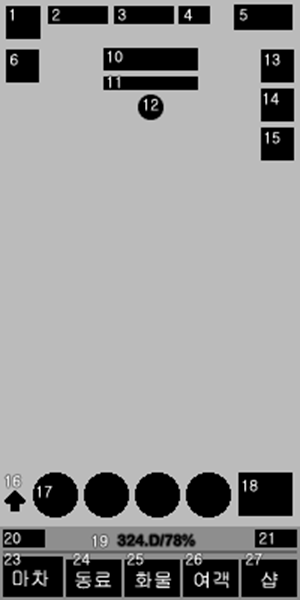

## UI 가이드

<table>
    <tr>
        <td valign = top>
             
1) 메뉴 기본 
2) 일반적인 경우            
            
        </td>
        <td valign = top>
             
1) 강화 메뉴 숨김 상태
2) 16번 버튼을 클릭하면 강화 메뉴가 숨김 상태로 변한다.            
        </td>
        <td valign= top>
    
1) 레벨 : 마차 레벨 
2) 골드 : 최대 골드 수량 
3) 다이아 : 최대 다이아 수량
4) 게임속도 : 광고보고 게임 속도 2배
5) 옵션 : 설정, 우편함, 절전모드
6) 축 : 골드, 공격력, 동료 축 (광고 보고 축)
7) 회전판 : 열쇠들, 다이아 뽑기 회전 룰렛
8) 보상 : 방치보너스용
9) 패스 : 시즌패스와 일반 패스
10) 날짜 : "21일째 새벽"
11) 웨이브 게이지 : 
12) 보스 아이콘 :
13) 퀘스트 안내 판넬
14) 일일 퀘스트 : 
15) 이벤트 :            
            
            
            
        </td>
    </tr>
</table>

### 기본 UI
- 강화를 위한 기본 UI
- 슬라이딩해서 하단부로 하이드 할수 있다. 
- 자동 버터느, 동료 4인 윈도우, 마차 윈도우가 기본

1) 레벨 : 마차 레벨 
2) 은화 : 최대 은화 수량 (아웃 게임 기획 없어지면 골드로 대체)
3) 다이아 : 최대 다이아 수량
4) 게임속도 : 광고보고 게임 속도 2배
5) 옵션 : 설정, 우편함, 절전모드

6) 축 : 골드축, 공격력 축, 동료 축 (광고 보고 축)
7) 회전판 : 열쇠들, 다이아 뽑기 회전 룰렛
8) 보상 : 방치보너스용 (현재 기획에선 주로 화물)
9) 패스 : 시즌패스와 일반 패스 

10) 날짜 : "21일째 새벽"
11) 웨이브 게이지 : 
12) 보스 아이콘 :

13) 퀘스트 안내 판넬 : 현재 퀘스트와 보상 다이아를 표기 
14) 일일 퀘스트 : 
15) 이벤트 : 개발사가 제공하는 한시적인 이벤트
    - 매일 점심 파워업 이벤트 (공격력이 2배로 폭팔) 
    - 게릴라 상점 : 특정 오브젝트를 판다. (다이아로 상품 목록 수정)  
    - 던전 (추후 스펙 -> 넣을지 정리 필요)
        - 필요 재화를 추가로 얻을수 있는 던전 (보스 던전, 골드 던전등)
        - 매일 2개씩 열쇠가 지급되고 광고 보고 추가 2회 도전이 가능하다.
        - 던전 입장 화면        

16) 하이드 버튼 : 강화 메뉴가 하이드 된다. 
17) 동료 윈도우 : 최대 4인
18) 마차 윈도우 : 마차 연구 시간이 표기 된다.
19) 전투력(컨디션) 표기 -> 표기 방식 => 12D/78% 
20) 공격 강화 메뉴 전환 버튼
21) 방어 강화 메뉴 전환 버튼
22) 강화 버튼들 (공격, 방어)

23) 마차 
      - 마차 강화 : 기념 주화로 업그레이드
      - 마차 교체 : 교체 레벨 충족시에 다이아로 교체 
      - 기술 강화 : 기존 게임의 연구 -> 시간을 사용하여 수련 (다이아로 즉시 완료)
      - 마차 청소 : 시간을 사용하여 청소를 하면 동료, 여객의 컨디션이 올라간다.

24) 동료
      - 원작의 오브
      - 고용 레벨 표기 (스테이지 별로 고용 가능하다.)
      - 스테이지 클리어 마다 골드 보상  
        - 동료 정보 판넬
        - 동료 강화 버튼   
  
25) 화물
      - 하단에 인벤 싣을수 있는 모든 화물이 표기 (인벤토리)
        - 화물 정보 판넬
        - 화물 강화 버튼 
      - 상단에 마차 화물칸으로 여기에 장착한다.

26) 여객
      - 3스테이지부터 여객 영엽 가능
      - 마차 종류에 따라 여객 슬롯 제한
        - 여객 정보 판넬
        - 여객 강화 버튼  
27) 샵   
      - 소환 (카드 소환)
      - 패키지
      - 재화
