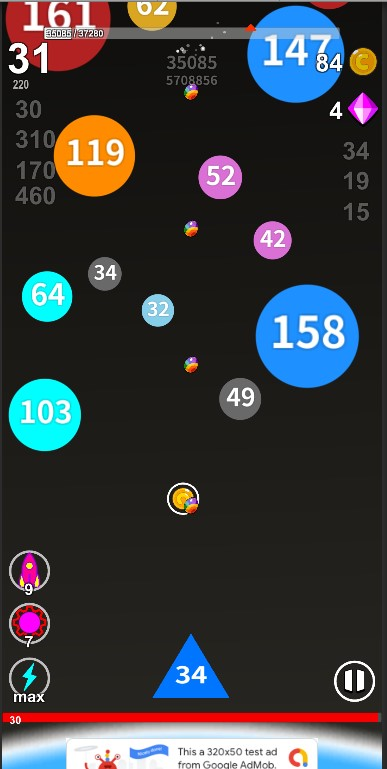
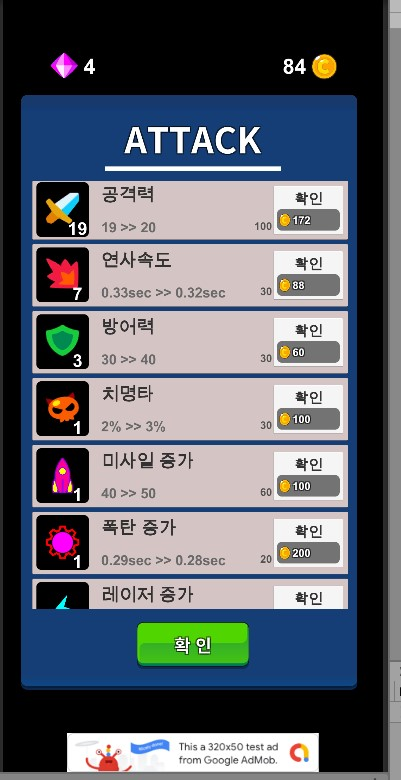
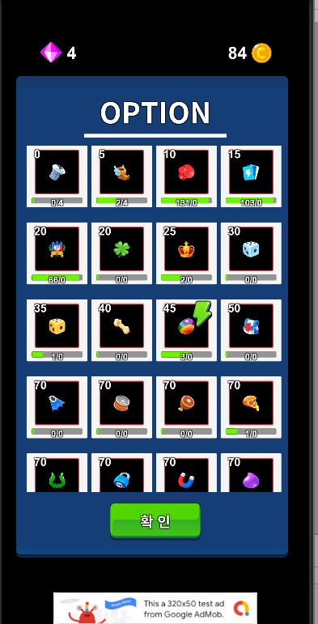
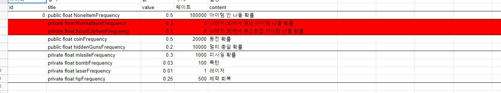
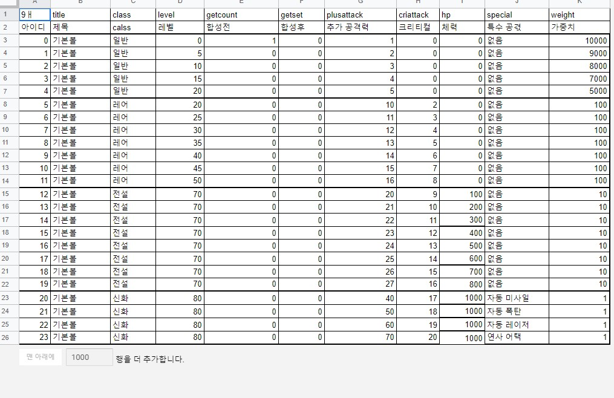

## 이문서는 샘플 게임을 기반으로 작성 되었습니다. 
## --------------------------------------------
## 게임 설명

 | |
--- | --- |  --- | 
 

### 왼쪽 그림 설명 1: 원으로 된 유성 -> 지구로 날아온다.
### 완쪽 그림 설명 2: 삼각형으로 된 우주선 -> 날아오는 유성을 파괴하는 게임
### 왼쪽 그림 설명 3: 하단부에 큰 원인 지구 -> 유성이 부닫쳐서 파괴되면 게임 종료
### 가운데 그림 설명 : 유성을 파괴하여 골드를 획득 -> 능력을 강화하여 더 크고 빠른 유성을 상대한다.
### 오른쪽 그림 설명 : 우주선에 총알을 뽑기를 통해 교체 할수 있다. 
###
### 아래 나오는 수식들은 실제 코드에서 사용하는 프로그램 등차 수열 수식이다.
### 등차수열 기본 수식을 바탕으로 인자를 변수로 넣어주면 각 스탯의 필요 코인량이 나온다.

## --------------------------------------------
## 중요 언어 정리
1) 레벨 : 스테이지의 하부 단위 -> 경험치를 모아 다음 레벨로 성장하고 10레벨에서 보스를 만난다.
2) 스테이지 : 레벨 10개로 구성되어 있다. 보스를 클리어 하면 다음 스테이지로 이동한다.
3) 지구 : 하단에 위치 -> 체력 게이지를 가지고 있다. 유성이 부닫치면 체력이 감소하여 0이 되면 게임 종료
4) 유성 : 원으로 되어 있고 체력이 표기 되어 있다. 체력의 수치에 따라 크기가 결정된다.
5) 우주선 : 삼각형 모양, 총알이 나가며 유성을 파괴하는 임무를 가지고 있다. 공격력이 표기 되어 있다. 

## -------------------------------------------
## 주요 설정
1) 스테이지 난이도를 결정하는 중요 요소 
    - 다음 유성이 나올때까지의 딜레이 시간
    - 유성의 체력 -> 스테이지 별로 상승한다.
  
2) 스테이지 클리어 하기 위한 중요 요소
    - 골드를 사용하여 기본 스탯 상승 -> 공격력, 연사속도, 체력, 치명타확률
    - 골드를 사용하여 추가 스탯 상승 -> 미사일, 폭탄, 레이저 수량 증가 (보유 수량이 늘어난다.)
    - 뽑기를 통해 총알 교체 -> 장착 하면 공격력 강화및 추가 효과 발생

3) 공격력의 정의 
    - 데미지 -> 공격력 + 총알의 능력 (총알의 공격력 + 부가 효과(총알마다 다름)) 
    - 유성에 데미지 적용시 -> 클리티컬 체크 (확률에 따라 데미지 증가)

4) 방치형 게임과 다른 점 
    - 일반 방치형 게임과 달리 플레이 하는 게임이라는 점
    - 미사일,  폭탄, 레이저, 더블 총알들 확률로 발생하는 아이템의 사용 유무
    - 10스테이지(100레벨)이후 피버 게이지 사용에 따른 변수
        - 피버게이지란? -> 화면 상단에 원형 게이지로 표기
            - 피격 횟수가 100을 넘으면 10초간 더블 총알

## ---------------------------------------------
## 스탯 데이터 적용
### 항목 설명 -> 게임 로딩시에 구글 스프레드 시트에서 해당 시트를 가져온다..
  
- 위의 시트의 내용을 기반으로 기본 스탯을 정의하고 
- 최초 1회 외에는 해당 스탯의 레벨은 세이브데이터에 저장해서 가져온다.  
- 현재 : 최초 기본 수치
- 레벨 : 해당 스탯의 현재 레벨
- 스탯 상승 계수 : 다음 레벨에서 상승 수치
- 맥스 레벨 : 최대 레벨 (이후 레벨업이 되지 않는다.)
- 개방 레벨 : 해당 스탯이 개발되는 레벨 (이전에는 보이지 않는다.)
- 코인 : 골드 소모량 상승 계수

### 기본 스탯 적용 - 등차 수열을 기반으로 적용
1) 각 스탯의 상승치는 명확하게 보이는 경우가 일반적
    - 공격력은 1,2,3,4,5 같은 식으로 올라가고 
    - 체력은 10,20,30,40 같은식으로 진행된다.
    - 공격력의 10배가 체력인 것은 기획적이 설정이다.    
        - 체력이 공격력에 10배수인 이유는 
        - 기본 공격력 외에 다른 공격력 강화요소를 넣겠다는 뜻
        - 공격력 강화 요소는 일반적으로 스킬, 장비등을 뜻한다. 
        - 본게임은 추가 공격력 강화요소가 총알 장착과 랜덤으로 발생되는 아이템뿐이기 때문에 
        - 실제 게임 플레이가 어렵다. 

3) 스탯 상승시 필요 코인량을 구하는 공식 
    - _level : 세이브 데이터에서 해당 스탯의 현재 레벨을 가져 온다.
    - coin0  : 위에 시트에서 코인 계수를 가져 온다.
    - 필요한 스탯의 성장시 필요한 코인량을 구하는 공식
        - (((_level * (_level + 1) / 2) - (_level - 1)) * coin0);        
        
3) 해당 공식을 통한 필요 코인량
       
    |:---------------------------------------|1레벨|2레벨|3레벨|4레벨|5레벨|
    |:---|---:|:---:|:---:|:---:|:---:|
    |공격력 상승 수치(+1) |1|2|3|4|5|
    |필요 코인 수량|1|2|4|7|11|
   
    |:---------------------------------------|1레벨|2레벨|3레벨|4레벨|5레벨|
    |:---|---:|:---:|:---:|:---:|:---:|
    |공격 속도 상승 수치(-0.01s)|0.4s|0.39s|0.38s|0.37s|0.36s|
    |필요 코인 수량|4G|8G|16G|28G|44G|
        
    |:---------------------------------------|1레벨|2레벨|3레벨|4레벨|5레벨|
    |:---|---:|:---:|:---:|:---:|:---:|
    |체력 상승 수치(+10)|10|20|30|40|50|
    |필요 코인 수량|15G|30G|60G|105G|165G|
        
    |:---------------------------------------|1레벨|2레벨|3레벨|4레벨|5레벨|
    |:---|---:|:---:|:---:|:---:|:---:|
    |크리티컬 데미지 상승 수치(+1%)|1.00%|2.00%|3.00%|4.00%|5.00%|
    |필요 코인 수량|100G|200G|400G|700G|1100G|
    
    - 이하 스탯은 중요 변수가 아니므로 생략

## 게임 데이터 적용
### 게임 데이터 설명 - 게임 로딩시에 구글 스프레드 시트에서 해당 시트를 가져온다..
 
- 스테이지 : 스테이지 아이디
- 적용 : 몇 레벨까지 적용 될것인지 
- 타이틀 : 스테이지 이름
- 유성 체력 : 작은수, 제한수, 높은수, 가끔 높은수 하단에 다시 설명
- 보스 : 보스의 체력 수치
- 볼스피드 : 유성의 하강 속도
- 딜레이 : 유성 출현 후 다음번 유성의 출현 사이 시간 (공격스피드와 비슷)
- 코인 확률 : 한번에 아이템으로 코인이 나올때 최대 수량이 몇개 까지인지.
- 실제 코인 드랍 확률은 코드에 적여 있음  
- 보상 : 골드, 다이아, 아이템(미사일, 폭탄, 레이저) 수량 

### 아이템 드랍 확률
- 아래 표를 기준으로 유성을 폭팔하면 아이템이 드랍된다. 
- 게임 레벨이나 스테이지 위치에 따라 균일하여 아이템이 드랍되는 일반 방치형과 달리
- 본 게임은 사실상 스탯이 성장하고 스테이지 클리어를 하지만 
- 아케이드 게임과 비슷한 구조를 가지고 있어 래덤하게 아래 확률을 기준으로 드랍된다.  
 

### 총알 확률
- 다이아로 뽑기를 하여 아래 기주으로 총알이 나온다. 
- 제일 오른쪽 가중치가 확률 
- 개발 게임 자체가 출시를 목적으로 한것이 아니기 때문에 샘플이라 확률 표기 안했음
 

### 게임 데이터를 수식으로 정리하지 않은 이유
- 위에 작은수, 큰수, 제한수, 가끔 큰수는 스테이지에서 나올 유성의 체력이다. 
- 작은수(min) : 유성 체력의 제일 적은 수치
- 제한수(setmin) : 스테이지안에 레벨 50% 진행전까지 제한수 보다 높은 수는 나오지 않는다.
- 높은수(max) : 유성 체력의 제일 높은 수치
- 가끔 높은수(stmax) : 높은수보다 더 높은 수치가 가끔 나온다 (중간 보스 느낌)  
- 애초 유성의 체력등은 아래와 같이 정리 되었다. (bid -> 현재 스테이지 아이디)
    - /*
    - min     = (((bid * (bid + 1) / 2) - (bid - 1)) * (bid + 10));
    - max     = (((bid * (bid + 1) / 2) - (bid - 1)) * (bid + 50)); 
    - setmin  = (((bid * (bid + 1) / 2) - (bid - 1)) * (bid + 20)); 
    - setmax  = (((bid * (bid + 1) / 2) - (bid - 1)) * (bid + 801));
    - */
- 그러나 기획자가 재미없다고 직접 밸런스를 잡겠다고 해서 아래와 같이 시트에서 가져오게 되었다. 
    - min     = 시트에서 작은수를 가져 온다. (코드에서 -> DataManager.Instance.stageList[bid].min;)
    - max     = 시트에서 높은수를 가져 온다. (코드에서 -> DataManager.Instance.stageList[bid].max;)
    - setmin  = 시트에서 제한수를 가져 온다. (코드에서 -> DataManager.Instance.stageList[bid].minset;
    - setmax  = 사투애소 가끔 높은수를 가져 온다. (코드에서 -> DataManager.Instance.stageList[bid].maxset; 

### 위에 수치를 기반으로 유성을 출현 시킨다. 
   1) 유성의 체력 결정
        - 각 스테이지마다 해당 스테이지의 낮은수 ~ 높은수까지를 체력 풀로 한다. 
        - 해당 풀에서 랜덤함수를 돌려 수치를 골라내고 유성의 체력으로 결정한다.
        - 스테이지 진행이 50% 이하일 경우
            - 낮은수 ~ 제한수로 사이에서 추출 한다.  
        - 스테이지 진행이 70%이상일 경우.
            - 10%이하 활률로 낮은수 ~ 가끔 높은수에서 추출 하고 
            - 90% 확률ㄹ로 낮은수 ~ 높은수에서 추출 한다.
        - 스테이지 진행이 95% 일 경우
            - 보스 출현 -> 보스는 시트에 설정한 체력을 가지고 있다. 
            - 이 게임에서 보스는 미완성으로 일단 큰 수치로 나온다.
   2) 유성의 크기 결정
        - 작은수의 최저치를 스케일 0.3 설정하고
        - 높은수 최대치를 2.0으로 스케일을 정한다. 
        = 가끔 높은수의 최대치가 나올경우 비율만큼 스케일을 키운다. 

   3) 유성을 파괴하면 경험치와 이이템을 준다. 
        - 해당 체력을 경험치로 준다.  
        - 일정 확률로 아이템을 준다. (필요 하다면 별도 표기) 

### 경험치
1) 경험치란?
   - 유성을 파괴할 경우 체력을 경험치로 받는다. 
   - 경험치를 얻을때마다 경험치 게이지가 상승한다. 
   - 경험치 게이지가 채워지면 다음 레벨로 성장한다. 
2) 경험치 상승 공식
    - bid  : 현재 스테이지 아이디
    - level : 현재 속해 있는 스테이지의 레벨 
    - 최초 시작 경험치 
        - 0 
    - 경험치 상승 공식 
        - (((level * (level + 1) / 2) - (level - 1)) * 10) * (bid+5); 

### 기획자가 밸런스를 잡고 나면 규칙성을 찾아서 수식으로 전환한다.
    - 불규칙성 (점진적인 변화 없이 불규칙한 변화가 있는 경우)
    - 재미있는 규칙을 찾아내지 못한 경우
    - 위와 같은 경우 수식과 코드를 병행하여 함수로 정리하는 경우도 있다.
    
### 규칙성이나 재미있는 공식을 만들지 못했을 경우 
    - 프로그램 로직으로 구성한다. 
    - 코드로 대응하면 조건부 함수를 만들수 있다. 
