# 구글스프레드시트 셀 색상 데이터 불러오기

---

<aside>
💡 **HEADER**

</aside>

---

# 개요

---

구글 스프레드 시트의 셀 색상을 구분하여 클래스 JSON화한 데이터를 유니티에서 클래스 리스트로 받는 방법 

<aside>
⚠️ 작성시기 2023년 06월

</aside>

<aside>
⚠️ Google Shpread Sheet,Visual Studio 2022, Unity 에서 진행되었습니다.

</aside>

---


구글 스프레드 시트의 셀 색상 등 정보를 받아 변환시켜 데이터를 유니티에 전송하려면 Apps Script의 웹 앱 배포를 통하여 구현할 수 있다.<br><br>

먼저 구글 스프레드 시트를 만들어서 다음과 같은 예시로 만든다.

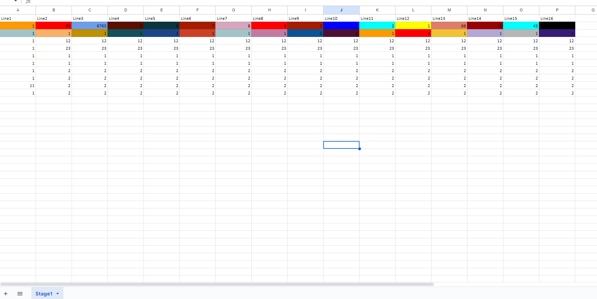<br><br>


확장 프로그램의 Apps Script를 클릭.<br><br>

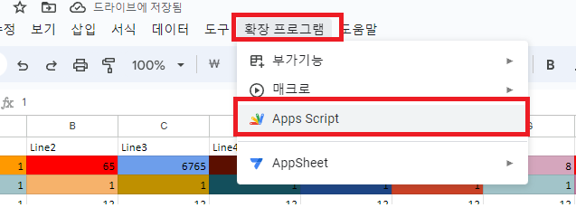<br><br>

아래와 같이 작성한다.<br>
- 여기서 중요한 포인트가 있는데, 첫번째로는 doPost(Post방식 전송), doGet(Get방식 전송)이다.<br>
- 해당 네임으로 function을 구성하고 return 값에 이미지처럼 json 형식으로 리턴(전송)하면 된다.<br>
- 다음으로는 시트, 값, 색상인데, 시트는 가져올 시트이름을 설정하면 되고, 특히 색상은 backgrounds에 설정한 값처럼 range(범위).getBackgrounds();를 불러오면 된다.<br>
- 여기서 색상 값은 #ffffff 처럼 HEX값이 String으로 반환된다.<br>
- 다음으로는 셀에 대한 값을 Mapdata라는 클래스 값으로 변환하고 컬러 값을 원하는 값으로 변환시켜서 for 반복문을 통해 시트의 데이터를 Mapdata 클래스 배열로 받은 후 Json으로 전송하면 된다.


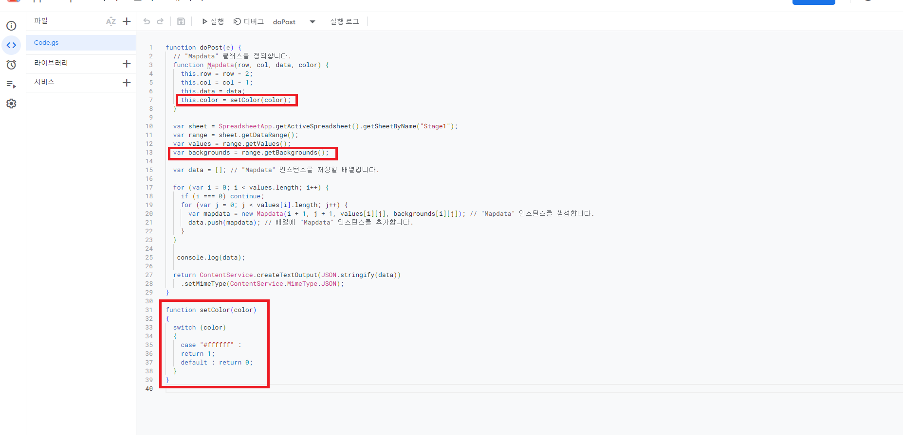<br><br>

- 웹 앱으로 배포하기 전 실행 버튼을 클릭하여 console.log(data);에 나오는 값들을 확인한다.<br>
- 상단 메뉴에 실행 버튼을 누르면 다음과 같은 팝업이 나올 수 있다. 권한 검토를 클릭 후 계정 선택을 한다.<br><br>
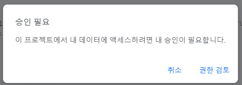<br><br>
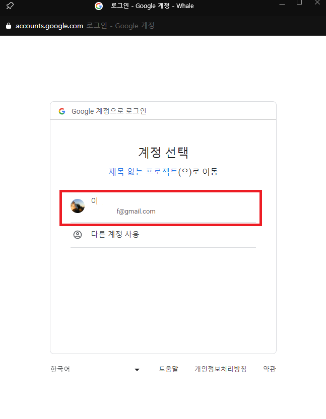<br><br>

단순히 해당 시트 앱이 권한을 허용받지 않았다는 내용이니 고급 버튼을 누르고 프로젝트로 이동을 클릭한다.<br><br>

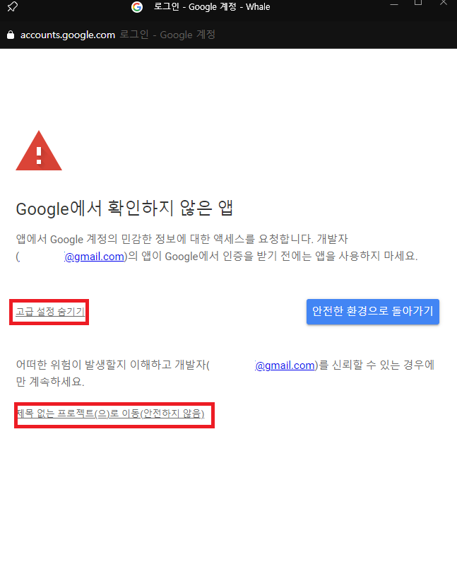<br><br>

허용 버튼을 누르면 정상적으로 진행 할 수 있다. 만일 실행 버튼 누르지 않고 배포할 시에도 같은 상황이 나오니 똑같이 진행하면 된다.<br><br>
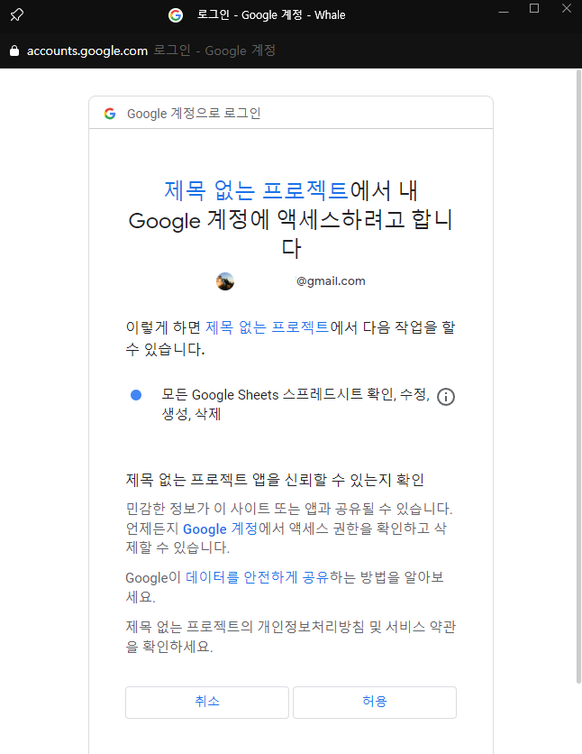<br><br>

정상적으로 로그가 찍히는 것을 확인할 수 있다.<br><br>
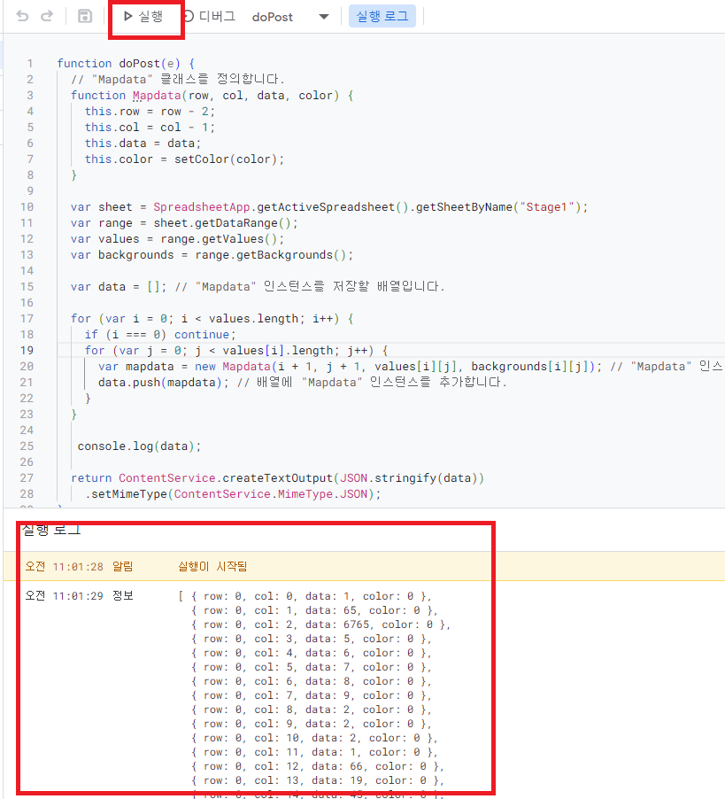<br><br>

정상적으로 데이터가 나오는 것이 확인되었으면 배포 버튼을 클릭하고 새 배포 버튼을 누른다.<br><br>

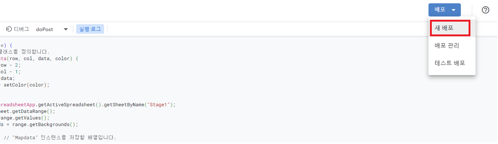<br><br>

- 유형 선택의 톱니바퀴 아이콘을 클릭하여 웹 앱을 클릭하고 다음 사용자 인증 정보로 실행에서 [나]로 설정하고<br>
- 액세스 권한이 있는 사용자를 모든 사용자로 설정한다.<br>
- 배포 버튼을 누른다.<br><br>
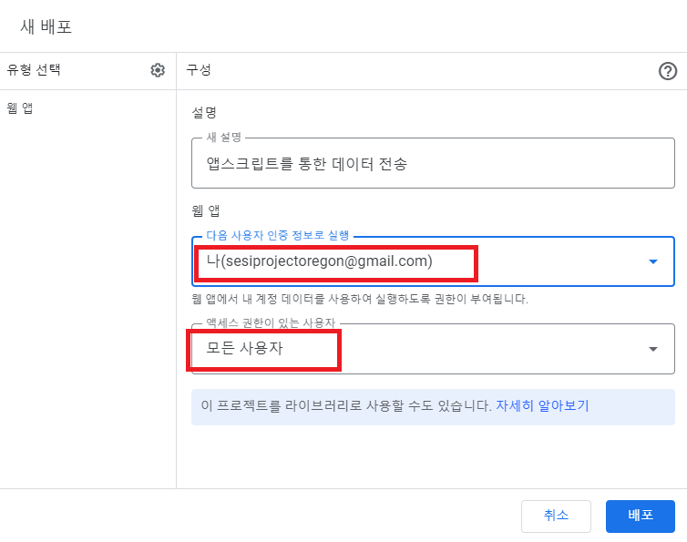<br><br>


- 정상적으로 배포가 완료되었다. 아래 웹 앱의 URL을 복사한다.<br><br>
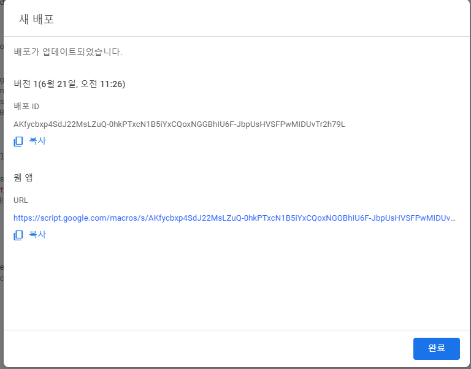<br><br>


- 기존 유니티 웹 데이터를 받아오는 것과 동일하게 웹 앱 URL을 붙여넣은 후<br>
- Mapdata 클래스 리스트에 Json Convert하면 정상적으로 완료되었다.<br><br>
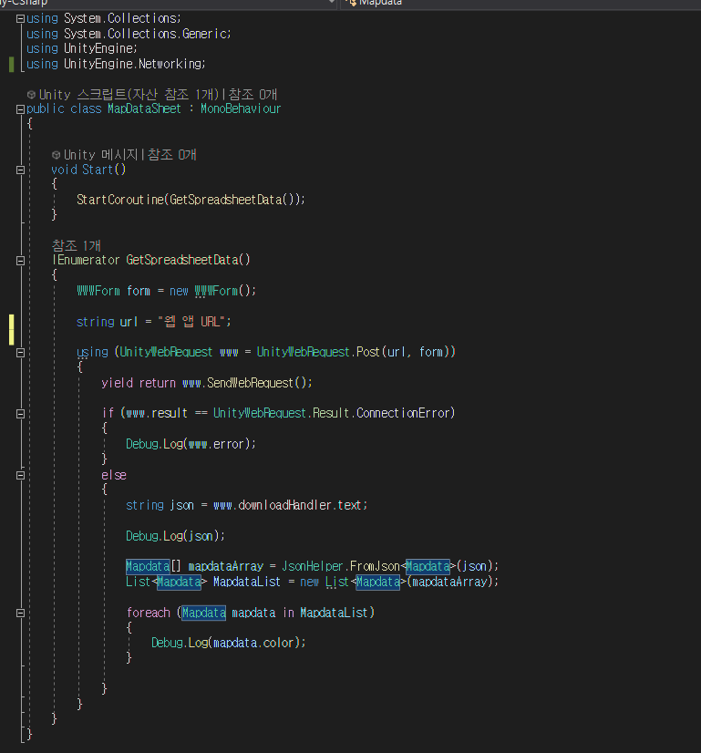<br><br>

▼ 코드 기재
----------------------------------------
```cpp
using System.Collections;
using System.Collections.Generic;
using UnityEngine;
using UnityEngine.Networking;

public class MapDataSheet : MonoBehaviour
{

    void Start()
    {
        StartCoroutine(GetSpreadsheetData());
    }

    IEnumerator GetSpreadsheetData()
    {
        WWWForm form = new WWWForm();

        string url = "웹 앱 URL";


        using (UnityWebRequest www = UnityWebRequest.Post(url, form))
        {
            yield return www.SendWebRequest();

            if (www.result == UnityWebRequest.Result.ConnectionError)
            {
                Debug.Log(www.error);
            }
            else
            {
                string json = www.downloadHandler.text;

                Debug.Log(json);

                Mapdata[] mapdataArray = JsonHelper.FromJson<Mapdata>(json);
                List<Mapdata> MapdataList = new List<Mapdata>(mapdataArray);

                foreach (Mapdata mapdata in MapdataList)
                {
                    Debug.Log(mapdata.color);
                }
                
            }
        }
    }
}

[System.Serializable]
public class Mapdata
{
    public int row;
    public int col;
    public int data; 
    public int color;
}


public static class JsonHelper
{
    public static T[] FromJson<T>(string json)
    {
        string newJson = "{ \"array\": " + json + "}";
        Wrapper<T> wrapper = JsonUtility.FromJson<Wrapper<T>>(newJson);
        return wrapper.array;
    }

    [System.Serializable]
    private class Wrapper<T>
    {
        public T[] array;
    }
}

```

----------------------------------------

<br><br>

- 그리고 Apps Script의 내용을 바꾼 후 저장했다고 해서 바로 업데이트가 되는 것이 아니므로<br>
- 배포 관리를 통해 배포 버전 관리를 해줘야 한다.<br>
- 수정 아이콘을 클릭하고 반드시 버전을 새 버전을 클릭하고 설명이 필요하면 기재한 후 배포 버튼을 누르면 정상적으로 적용된다.<br><br>
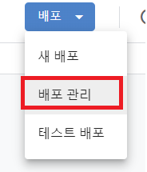<br><br>
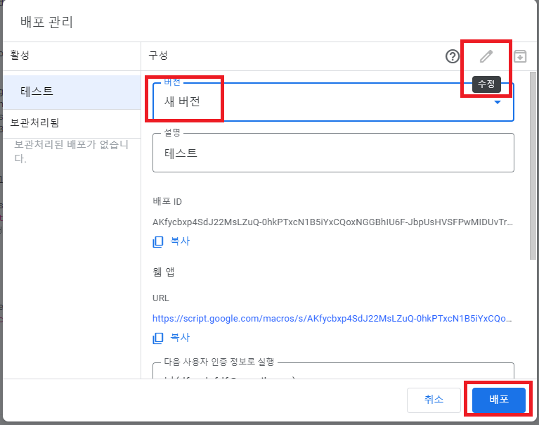<br><br>


