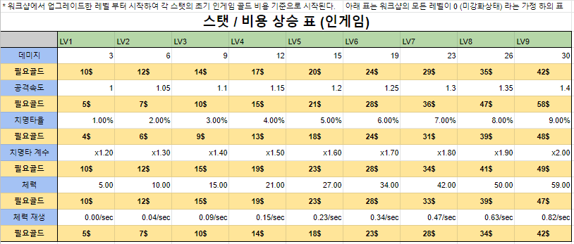
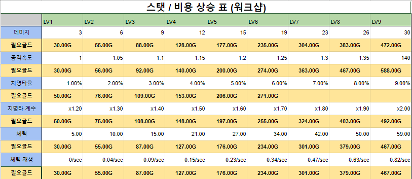
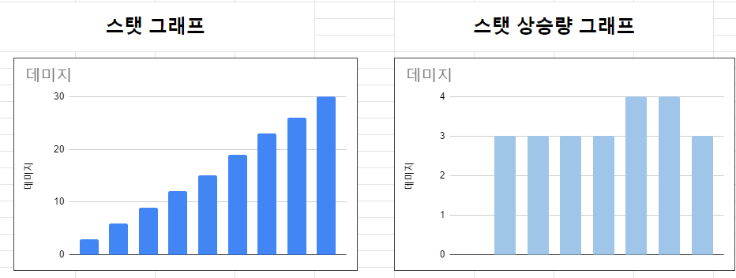

## --------------------------------------------------------------------
## 스탯과 골드에 관하여 

## 0. 기본자료
### - 기본 용어 
* 골드 : "인게임" 강화재화 게임 중 스탯을 강화하는데 골드를 소모함
* 코인 : "워크샵" 강화재화 게임 플레이 중이 아닌 때에 기본 스탯을 강화하는데 사용함
* 스탯 : 실제 적용되는 스탯 골드를 통하여 스탯을 강화하거나 코인을 통해서 강화가 가능

### -인게임 레벨별 스탯/필요골드표

(이미지1)
* 해설 :
더 타워 "인게임" 상에서 스탯을 강화하는데 소모되는 골드와 스탯이 정리된 표입니다.
단. 인게임 스탯의 0강화 즉 초기스탯은  워크샵에 레벨에 따라 변동하기에 위 표는 워크샵 강화를 아무것도 하지 않은 상태입니다.

### -인게임 레벨별 스탯/필요골드 상승량 정리

(이미지2)
* 해설 :
강화의 단계별로 상승하는 스탯의 양, 그와함께 올라가는 강화에 필요한 골드의 양의 상승치가 정리된 표입니다.

### -워크샵 레벨별 스탯/필요코인 상승표

(이미지3)
* 해설 :
더 타워 "워크샵"에서 스탯을 강화하는데 소모되는 골드와 스탯이 정리된 표입니다.

## 1. 스탯 상승

*아래 이미지는 데미지 그래프입니다.
*다른 스탯의 경우 스프레드 시트의 표를 참조해주세요

(이미지4)
 
데미지 스탯의 증가량은 (3 -> 6 -> 9 -> 12) 와 같은 형식으로 상승하고 (*참조 이미지 1*) 
다른 스탯들 역시 전체적으로 균등한 상승 그래프를 그리고 있습니다. (*스프레드시트 참조*)
데미지의 경우 중간에 잠깐 상승량이 증가하지만 다시 원래대로 돌아옵니다.(*참조 이미지 4*)
이와 같이 대부분의 스탯이 동일하거나 거의 비슷한 상승량을 가지고 스탯이 상승합니다. 
하지만 *체력, 체력 재생* 스탯은 상승량도 레벨과 함께 증가하는 형태로 상승합니다.

전체적으로 이렇다할 기준이 없이 그저 균등히 상승만 하고 있기에 정확한 식의 도출이 어렵습니다.

## 2. 골드 상승 

### 데미지
### 공격속도
### 치명타율
### 치명타 계수
### 체력
### 체력 재생
