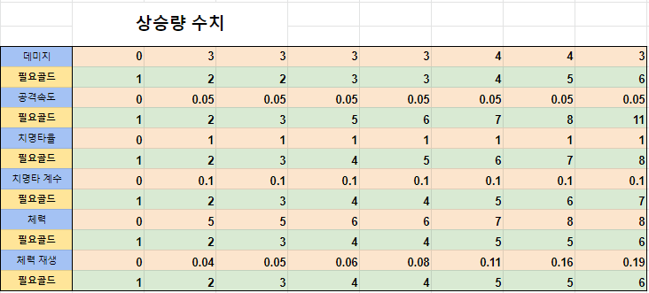

## 이 문서는 더 타워 아이들 디펜스 게임의 데이터 관련 분석 문서입니다.
https://docs.google.com/spreadsheets/d/1T1UXtlJNzFyKRKVxBZO2HHQEnU1Jqi7ZLAzR9Tq5UyM/edit#gid=0
## --------------------------------------------------------------------

## 결론 (아직 진행중이라 잠재적 결론입니다.)
### 결과
  - 스탯 상승은 분석 가능
  - 스탯 상승을 위한 골드 소모량이 분석이 쉽지 않음
  - 몬스터 체력, 경험치, 골드는 시간이 필요

### 데이터 분석을 해보니
  - 전형적인 기획자 베이스게임 (구조가 어렵다)
  - 골드 소모량 상승 패턴이 복잡하다.
  - 아마도 기획자 개인의 성공의 경험을 바탕으로 기획된 것 같음

### 따라 하려면
  - 현재까지는 데이터 스탯 상승은 분석된 방향으로 진행하고 
  - 스탯 레벨업 골드 소모량은 데이터 배껴서 시트를 만들어서 사용

### 우리 기획을 추가하면
  - 무기, 스킬, 동료를 추가 하는데 모두 기본 스탯 데이터에서 특정 수치를 증폭하는 개념
  - 결국 우리 기획을 넣으면 사실상 공격력 강화가 되기 때문에 전체적인 컨텐츠 소비 속도가 빨라질 것
     
## --------------------------------------------------------------------

## 데이터 분석 
### 데이터 패턴 통해 역산
1) 중요 스탯 데이터 상승 패턴
    - 이 게임은 복잡하다.
    - 요즘 게임 패턴 : 공격력 상승 1,2,3,4,5,6
    - 더 타워 패턴 : 3,6, (등차수열을 쓰지 않고 임의 패턴을 만들었음)
  
2) 골드 소모량 패턴
    = 일정 패턴을 알기 어럽다.
    - 시트로 가져왔을 가능성 
    - 아래는 관련 분석 데이터이다.  

3) 몬스터 관련 진행중
    - 데미지량을 통해 언제 죽는지 체크
    - 몬스터 처치후 경험치, 골드량 체크 
    - 위를 체크 후 확인 (골드 소모량과 비슷할거 같음)
    - 이 게임은 방치형이 아니기 때문에 웨이브당 수치가 있을 가능성이 있음
    - 해당 웨이브의 총량은 몬스터 수량으로 나누어 출현했을 가능성  
  
### 해킹툴을 통한 분석 (아직도 진행 중)
1) 최신 게임들은 리버스 엔지니어링이 쉽지 않다. 
    - 모바일 게임이 64비트 대응 되면서부터 어려워짐  
    - 컴파일러가 모노방식 -> il2cpp 방식으로 변화된것이 주요 이슈
    - 보안 관련도 변화가 있다고 함

2) 이전에는 
    - DNSpy, il2cpp 덤퍼 같은 툴로 간단하게 리버스 엔지니어링이 됨 (특별한 능력이 있거나 하는 것이 아님)
    - 심지어 초기 게임들은 apk를 알집, 반디집으로 풀면 소스를 다 볼수 있었음    
    - 현재는 이미지는 분석 가능하나 
    - 나머지는 구조 정도 보는 정도 (실제 도움이 되지 않는다.)

3) 이전 방법으로 해보니
    = 큰 도움이 되지 않음 
    - 구조 정도를 볼수 있는 수준
    - 이미지 리소스는 볼수 있음

3) ida pro (아이닷프로라고 보통 읽음) 사용하여 리버스 엔지니어링 중
    - 실제 많이 사용하는 리버스 엔지니어링 툴 (디버깅 툴이 원래 목적)
    - 유료 툴로 가격은 6천불 정도 (다른 툴에 비해 크랙이 쉽게 구해지지 않아 조금 걸렸음)
    - 100% 다 되는 것은 아님 

4) 현재 진행 상태
    - 어셈블리(기계어)로 소스를 리버스 엔지니어링 한 상태 
    - 소스를 쓸수 있는 상태는 아님 
    - 이 방식은 소스에서 특정 수치를 수정하는 빌드를 만드는 게 원래 목적
    - 기계어를 변환하여 
    - 골드 소모량의 공식, 몬스터 체력등이 있는지 체크하는 중
    - 에셈블리라서 시간이 걸림 (영준씨가 진행하고 있음)
   
5) 예상
    - 각 데이터별 골드 상승 공식 확인 목적
    - 몬스터 관련 스탯 분석 목적
    - 1주일 정도 예상 (본 문서 종료와 별도로 진행 예정)
    - 실패할 가능성도 있음  

## --------------------------------------------------------------------
## 스탯과 골드에 관하여 

## 0. 기본자료
### 인게임 레벨별 스탯/필요골드표

(이미지1)
### 인게임 레벨별 스탯/필요골드 상승량 정리

(이미지2)
### 워크샵 레벨별 스탯/필요코인 상승표

(이미지3)
## 1. 스탯 상승

### 데미지

### 공격속도

### 치명타율

### 치명타 계수

### 체력

### 체력 재생

## 2. 골드 상승 

### 데미지
### 공격속도
### 치명타율
### 치명타 계수
### 체력
### 체력 재생

