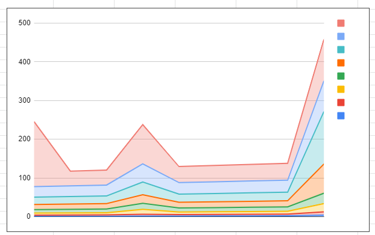
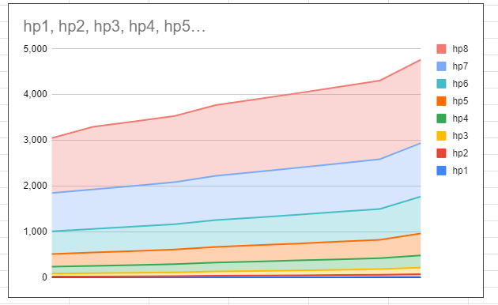

# 더 타워 아이들디펜스에 대해서

---

<aside>
💡 **HEADER**

</aside>

---

# 개요

이 문서는 더 타워 아이들 디펜스 게임의 데이터 관련 분석 문서입니다.


<aside>
⚠️ 작성시기 2023년 02월
</aside>

<aside>
⚠️ unity 버전은 관계없습니다 (기획문서)
</aside>
---

https://docs.google.com/spreadsheets/d/1T1UXtlJNzFyKRKVxBZO2HHQEnU1Jqi7ZLAzR9Tq5UyM/edit#gid=0

## --------------------------------------------------------------------

## [1. 결론](#결론)

## [2. 데이터 분석](#데이터-분석)

## [3. 스프레드 시트 설명](#스프레드-시트-설명)


## --------------------------------------------------------------------

## 결론
### 결과
1) 데이터 분석 결과
    - 스탯 상승 패턴 분석 완료 
    - 골드 상승 패턴 분석 완료  
    - 몬스터 관련 패턴 분석중
    - 스테이지 구성 패턴 분석중
2) 현재까지 데이터 패턴 분석
    - 각 스탯 데이터의 성장 곡선 그래프를 예싱하고 (상상하고)
    - 해당 그래프의 모양을 만들수 있는 수열을 재료로 삼아
    - 엑셀 시트에서 수열을 보정(엑셀 함수 사용)하여 만든것 같음
    - 완료된 시트를 내려받아 사용한 것으로 추측
3) 품평
    - 데이터 밸런스를 수열을 베이스로 잡는 스타일
    - 프로그램과 기획이 분리되었을때 나타나는 전형적인 스타일
    - 하지만 코딩에 로직을 넣으면 훨씬 쉬워진다.
    - 좀 어려운 구조인데 쉽게 구조를 짜면 밸런스 조절도 쉬워짐
    - 결론적으로 옳고 그름은 판단하지 못하겠음 
 
  
### 우리 기획을 추가하면
  - 무기, 스킬, 동료를 추가 하는데 모두 기본 스탯 데이터에서 특정 수치를 증폭하는 개념
  - 공격력 139% 상승 이럲식이고 실제 추가 스탯 수치가 들어가지 않는다.
  - 결국 우리 기획을 넣으면 사실상 강화가 되기 때문에 전투력이 올라가 전체적인 컨텐츠 소비 속도가 빨라질 것
     
## --------------------------------------------------------------------

## 데이터 분석 
### 방법 1 - 데이터 패턴 통해 역산(금주내로 대부분 정리 가능 할것 같음)
1) 중요 스탯 데이터 상승 패턴 분석
    - 상승 패턴 값들의 레벨별 차를 통해 규칙성을 확인하면 해당 수열을 찾는다.
    - 특정 수열을 기반으로 추가 수식이 있는 경우가 대부분
    - 역산하면 대부분 파악 가능
    - 엑셀에서 추가 작업(조건문등을 붙였을 경우)을 했을 경우 찾기 어려움         

2) 몬스터 관련 진행중   
  
### 방법 2 - 해킹툴을 통한 분석 
1) 최신 게임들은 리버스 엔지니어링이 쉽지 않다. 
    - 모바일 게임이 64비트 대응 되면서부터 어려워짐 (구글 정책)

2) 이전에는 
    - DNSpy, il2cpp 덤퍼 같은 툴로 간단하게 리버스 엔지니어링이 됨 
    - 심지어 초기 게임들은 apk를 알집, 반디집으로 풀면 소스를 다 볼수 있었음
    - 특별한 능력이 필요하지 않았음 

3) 이전 방법으로 해보니
    - 구조 정도를 볼수 있는 수준
    - 이미지 리소스는 볼수 있음

3) ida pro (아이닷프로라고 보통 읽음) 사용하여 리버스 엔지니어링 중
    - 좀더 전문적인 툴 (유료 6천불 - 크랙버전 구해 사용)
    - 소스를 어셈블리(기계어)로 리버스해서 분석하는 방법
    - 이 역시 소스를 사용할수는 없으나 분석은 어느정도 가능한
    - 특정 수치를 변환하여 해킹 버전을 만드는데 사용 (골드 무한 버전 뭐이런...)     
   
4) 예상
    - 변수들은 어느정도 체크가 가능하나 많은 시간 소모
    - 각 데이터별 상승 공식 확인 목적 

5) 종료
    - 어셈블리 전체적인 프로그램 구조를 파악 했음
    - 다행히 c++ 프로그래머가 내부에 있어서 어느정도 분석 가능
    - 그러나
        - 일단 어셈블리라서 분석이 쉽지 않고 
        - 그럼에도 소스 구조를 보니 데이터를 가져오는 것으로 보이고 (특정 시트에서)
        - 가져오는 데이터의 값으로 연산하기 때문에 어느 부분이 어떤 식인지 분석이 쉽지 않음
        - 분석을 위해 장시간 소모 예상   
     

### 방법 3 - 자료 확보     
1) 위키에서 얻듯이 전문 커뮤니티에서 해당 데이터 시트 확보중
2) 몇몇 필요 데이터는 확보해서 분석 중
3) 몬스터 체력치 분석을 위해 필요
    - 본 게임은 방치형이 아니라 몬스터 체력치 분석이 쉽지 않음
    - 방치형의 경우 일정 구간에서 동일한 체력치와 경험치, 골드를 주는데 비해
    - 본 게임은 웨이브중 다양하게 나온다.  

## --------------------------------------------------------------------

## 스프레드 시트 설명
- 아래 시트를 클릭하면 관련 스프레드 시트를 볼수 있음
- 해당 시트로 진입하면 돌아올때 백 버튼으로 돌아와야 함..(본문서는 새창 기능이 없음)
- https://docs.google.com/spreadsheets/d/1T1UXtlJNzFyKRKVxBZO2HHQEnU1Jqi7ZLAzR9Tq5UyM/edit#gid=0

### 주의 사항
1) 더 타워는 인게임과 아웃게임이 있는 구조이다. 
    - 아웃게임 -> 모든 수치를 업그레이드 하고 저장 할수 있다. -> 워크샵으로 표현 
    - 인게임 -> 아웃게임에서 업그레이드 한 수치에서 게임 출발하는 개념

2) 인게임은 로그라이크 게임개념이다.
    - 인 게임은 게임이 시작되면 모든 수치들이 처음으로 돌아가는 구조     

3) 우리는 인게임 구조만 사용한다. 
    - 우리 게임은 인게임이 저장되는 형태로 제작될 것이다.
    - 아웃게임이 없는 구조이다.  

### 스탯 관련 설명
0) 용어
 - A000000 와 같은 코드는 Oeis 에서 사용하는 수열 코드 
 - Oeis 는 온라인 정수열 사전의 이름
 -  https://oeis.org/
 
1) 데미지 
    - 레벨에 따른 상승패턴 -> 3,6,9,12,15,19,23,26,30
      - A224702 수열에 3을 더한 값을 기반으로 상승 수열이 만들어짐
    - 재료가 된 수열 
      - 0>3>3>3>3>4>4>3

2) 공격속도
    - 레벨에 따른 상승패턴-> 1,1.05,1.1,1.15,1.2,1.25,13
      * 레벨당 0.05 상승
       
3) 치명타율 
    - 레벨에 따른 상승패턴 -> 1,2,3,4,5,6
      * 레벨당 1% 상승  

4) 치명타 계수
    - 레벨에 따른 상승패턴 ->x1.20,	x1.30	,x1.40,	x1.50	,x1.60,	x1.70,	x1.80,	x1.90,	x2.00
      * 레벨당 0.1 상승  
5) 체력
    - 레벨에 따른 상승패턴 ->5.00,	10.00	,15.00	,21.00	,27.00	,34.00,	42.00,	50.00	,59.00
      * A049982 수열에 5를 더한 값을 기반으로 상승 수열이 만들어짐
    - 재료가 된 수열 
      - 0>5>5>6>6>7>8>8
      - 
6) 체력 재생
    - 레벨에 따른 상승패턴 ->5.00,	10.00	,15.00	,21.00	,27.00	,34.00,	42.00,	50.00	,59.00
      * A157726 수열에 0.01을 곱한 값을 기반으로 상승 수열이 만들어짐
    - 재료가 된 수열 
      - 0>0.04>0.05>0.06>0.08>0.11>0.16>0.19

### 강화 소모 골드 관련 설명
1) 데미지 골드
    - 레벨에 따른 상승패턴 ->  10$,12$,14$,17$,20$,24$,29$,35$,42$
      * A003114 수열을 기반으로 상승 수열이 만들어짐      
    - 재료가 된 수열 
      - 0>2>2>3>3>4>5>6

2) 공격속도 골드
    - 레벨에 따른 상승패턴 ->  5$,7$,10$,15$,21$,28$,36$,47$,58$
      * A006431 수열을 기반으로 상승 수열이 만들어짐
    - 재료가 된 수열 
      - 0>2>3>5>6>7>8>11
 
3) 치명타율 골드
    - 레벨에 따른 상승패턴 -> 4$,6$,9$,13$,18$,24$,31$,39$,48$
      * 순수 자연수 증가값 (1, 2, 3, 4 ....)을 상승수열로 사용 (단 1은 제외)
    - 재료가 된 수열 
      - 0>2>3>4>5>6>7>8

4) 치명타 계수
    - 레벨에 따른 상승패턴 -> 10$,12$,15$,19$,23$,28$,34$,41$,49$
      * A025528 수열을 기반으로 상승 수열이 만들어짐
    - 재료가 된 수열 
      - 0>2>3>4>4>5>6>7

5) 체력 골드
    - 레벨에 따른 상승패턴 -> 10$,12$,15$,19$,23$,28$,33$,39$,47$
      * A005374 수열을 기반으로 상승 수열이 만들어짐
    - 재료가 된 수열 
      - 0>2>3>4>4>5>5>6

6) 체력 재생 골드
    - 레벨에 따른 상승패턴 -> 5$,7$,10$,14$,18$,23$,28$,34$,42$
      * A025528 수열을 기반으로 상승 수열이 만들어짐
    - 재료가 된 수열 
      - 0>2>3>4>4>5>5>6

***
### 적 능력치 설명
0) 용어해설 
 * 더 타워의 난이도는 "티어" 와 "웨이브" 를 통하여 결정됩니다.
 * 티어의 상승, 웨이브의 상승 = 난이도의 상승 = 적 스탯의 상승 으로 연결됩니다.
 * 더 타워의 골드/코인 보상은 기본적인 수치에 "티어" 에 따른 가중치를 곱하여 결정됩니다.
 * 더 타워의 적은 Basic Fast Tank Ranged Boss 의 5가지 종류의 적이 존재합니다.
1) Basic
```
 * 가장 기본적인 적
 * 다른 적들의 기본적인 베이스 스텟
 * 모든 적은 이 Basic을 기반으로 스탯이 결정됨
 * 지급하는 기본 코인/골드는 1 
```
2) Fast
```
 * 속도가 빠른 적
 * Basic의 2배의 이동속도를 가짐
 * 지급하는 기본 코인/골드는 2
```
3) Tank
```
 * 튼튼하고 속도도 빠른 적
 * Basic의 1.5배의 이동속도, 5배의 체력을 가짐
 * 지급하는 기본 코인/골드는 4 
```
4) Ranged
```
 * 원거리 발사체를 발사하는 적
 * 그 외 스탯은 Basic과 동일
 * 지급하는 기본 코인/골드는 2 
```
5) Boss
```
 * 가장 강력한 적
 * Basic의 1.3배의 이동속도, 20배의 체력을 가짐
 * 지급하는 기본 코인/골드는 5 
```
***
### 적 능력치 상승에 대한 설명
0) 기본적인 능력치 상승에 대한 설명
    * 기본적으로 웨이브/티어 의 상승에 따라 적의 능력치(체력, 공격력)가 상승됨
    * 티어에 따른 상승은 등차수열을 기반으로 상승 (상세 공식 확인 불가)
    * 작게 보면 한 웨이브 크게 보면 10의 배수 단위의 웨이브로 적의 능력치는 상승
    * 아래 서술되는 상승 수치는 모두 Basic 기준 (나머지 적은 Basic 기반으로 배수계산만 하기 때문)
 ```
 실질적인 상승 패턴이나 수열은 찾아내지 못하였음. 규격화되어있는 패턴에 따라서 상승하는것이 아닌 
 전체적인 흐름만 동일하게 상승하고 있고 상승량 역시 일정하지 못함.
 ```
1) 10 웨이브마다의 상승
다음은 티어 1의 81~90 웨이브 구간만큼의 상승량 
```
6>5>5>9>5>5>5>5>12
```
위와 같이 4번째 웨이브와 9번째 웨이브 구간에서 상승량이 눈에 띄게 상승했다가 다시 안정되는 것을 볼 수 있다. 
모든 구간이 이와 같이 4번째, 9번째 웨이브 구간에서 눈에 띄게 상승하는 패턴을 가지고 상승한다. (단. 상승량은 동일하지 않음)


2) 전체적인 상승량

1에서 설명한 것과 같이 10웨이브씩 끊었을때 4번째, 9번째 웨이브에서 성장폭이 크게 올라갔다가 그 외 나머지는 평이하게 스탯이 성장함 
이러한 형태의 성장이 쌓여서 전체적으로 보았을때는 평이한 등차수열과 같은 형태로 성장하고 있음. 



***
### 보상 골드/코인 상승에 대한 설명
더 타워에서 보상되는 적의 기본 골드에 티어에 따른 가중치를 곱하여 결정된다.
* 골드 지급량 공식은 아래와 같다
```
몬스터 기본골드 * 티어 가중치 * (골드 보너스 스탯 강화 등 ) = 지급골드 
```
* 티어에 따른 가중치 량은 아래와 같다
```
1 -> 1.8 -> 2.6 -> 3.4 -> 4.2 -> 5 -> 5.8 -> 6.6 -> 7.5 -> 8.6
```
* 상승치에 대하여
```
0.8씩 상승하다가 후반부로 갈수록 상승량이 0.9, 1.1 로 치솟는 형태로 가중치가 상승하는 형태이다.
```
