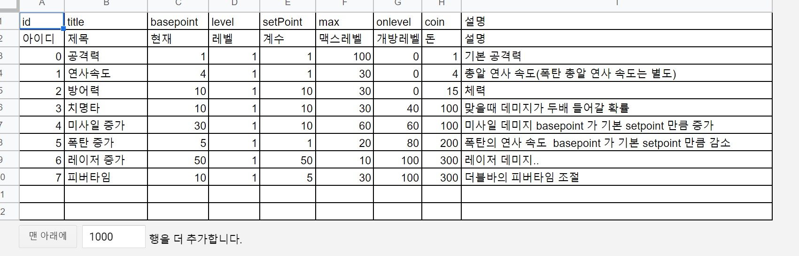
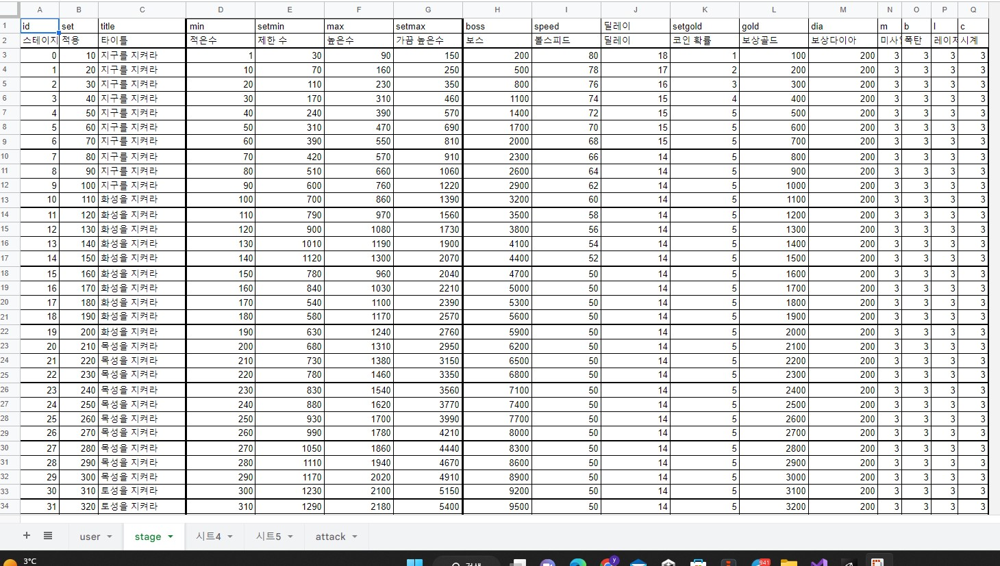

## 이문서는 세시 소프트가 제각한 게임의 기획서 텍스트 자료입니다. 

## --------------------------------------------

## 목차
## [1. 게임 게요](#게임-개요)

## [2. UI 설명](#UI-설명)

## [3. 게임 진행](#게임-진행)

## --------------------------------------------
## 게임 개요.
### 개요
- 2023년 세시소프트가 제작하는 새로운 판타지의 방치형 게임 
- 라스트 카우보이!
  
### 배경 스토리
1) 매년 추수 시기마다 농작물을 약탈 당하는 당하는 마을이 있다. 
5) 참다 못한 이들은 "건맨인 나"(!)를 고용하여 무법자들과 맞서려 한다.  
6) "당신이 대장이 되어 우리에게 싸우는 법을 가르쳐 주세요!" 
7) 나는 마을 한가운데 마차를 방어막으로 삼아 
8) 무기(마차에 장착된 기관총)를 사용하고, 마을 사람들(동료)의 도움을 받아   
9) 무법자들에게서 마을을 지켜낸다. (일본 영화 7인의 사무라이 컨셉 차용)

### 기획의도
1) 중세 판타지가 아닌 새로운 판타지(서부극)의 게임
2) 익숙하지만 재미가 보장된 방치형 디펜스 게임
3) vip 뽑기 + 시즌 패스를 통한 유료 모델 게임

### 벤치 마킹 게임
1) 아이들 디펜스 -> 기본 게임 시스템
    - 중앙에 기지가 있고 사정거리안에 들어오는 적을 처지한다. 
    - 얻어진 재화를 통해 강화한다.
    - 레벨업을 통해 오브젝트를 생성하여 기지를 방어한다.
    - 기지 -> 마차 
        - 마차가 파괴되면 게임 종료
    - 오브 -> 동료
        - 동료들이 나를 도와 방어한다.        

2) 레전드 오브 슬라임 -> 스테이지 구성과 VIP 뽑기
    - 스테이지 구성 
        - 일반적인 방치형 게임의 스테이지 구성 
        - 해당 스테이지 난이도를 클리어 하지 못하면 진행 불가능
        - 보스클 클리어 하면 경험치 대폭 상승 
    - VIP 뽑기 
        - 한장된 가차풀을 가지고 있다. 
        - 가차풀은 서열화 되어 있다. 
        - 뽑기 횟수가 많아지면 뽑기 레벨이 올라가 상위 등급 확률이 높아진다.  

3) 서부극 게임(참고) -> 판타지

### 게임 관련 언어 정리
1) 주인공 존 : 한물간 건맨으로 어느순간 마을 사람들의 희망이 된다.
2) 마차 : 방어막 -> 마을 한가운데 최후의 방어막 -> 수리를 통해 기능을 보강할수 있다. 
3) 몹 : 마차의 위협요소 -> 맹수, 강도단, 무법사등 모두
4) 무기 : 마차에 장착한 기관총으로 주인공의 무
5) 무기 수리 : 무기를 강화하여 능력을 향상 시킨다.
6) 무기 교체 : 무기 융합을 통해 상급 무기로 교체 한다.   
7) 무기 : 마차에 장착된 기관총 -> 수리(강화)를 통해 성능 강화 할수 있고 더 좋은 기관총을 교체(승급)도 가능하다.
8) 동료 : 주이공을 도와줄 사람들 -> 주로 마차의 외곽에소 방어한다. 
9) 장착효과 : 무기나 동료를 장착 했을때 나타나는 효과
10) 보유효과 : 무기나 동료를 장착하지 않고 가지고만 있어도 얻을수 있는 효과 
11) 기차 : 마차의 화면밖에 위치.. 기차역은 아니지만 보그, 혹은 동료들이 내리거나 한다. 
    - 동료를 구하면 기차쪽으로 이동하여 동료가 내린다. (설정 기획 필요) 
12) 게임 승패
    - 파괴 -> 게임 종료
    - 스터의 파괴 -> 마차를 사수
    - 30일의 생존 -> 스테이지 클리어 

## --------------------------------------------
## UI 설명
### 인게임
1) 레벨 : 포장마차 (주인공) 레벨
2) 날씨 : 맑음 -> 흐림(비)까지 날씨 변화 (국지적 난이도 상승 요소)
3) 골드 : 현재 최대 골드량
4) 보석 : 현재 최대 다이아량
5) 생존시간 : 일반 게임 스테이지으 다른 표현 
6) 동료 : 포장 마차 주변을 방어하는 동료 (최대 4명)

### 하단부
1) 좌측 부터 강화, 무기, 동료, 도전, 샵
2) 강화 -> 마차로 표기되는 주인공의 스탯 
3) 무기 -> 마차에 장착되는 24등급으 머신건 관련 UI
4) 동료 -> 마차를 호위하는 동료 최대 6명 (마차 외부 4명, 내부 2명)
5) 도전 -> 특수 목적 던전 같은 개념 -> 보스도전, 골드 도전, 무한도전
6) 샵 -> 패키지, 시즌패스, VIP 뽑기(무기, 동료) 다이아, 골드 판매

## --------------------------------------------
## 게임 진행
### 게임 시작
1) 마차를 강화 
    - 마을 한가운데 마차를 세워놓고 시작
    - 마차 자체를 강화 할수 있다.
    - 마차의 능력 강화는 전 무기, 동료들의 스킬에 기반이 된다.
    - [마차의 강화 스탯 정리](#마차의-강화-스탯-정리) 
2) 마차에 무기를 장착
    -   

4) 마차에는 성능이 좋지 못한 기관총이 달려 있다.
5) 기관총은 능력을 강화와 융합으로 승급시킬수 있다.  
6) 이를 통한 장착및 보유 효과를 통해 공격력이 상승한다.

    - 기관총 기본 스탯 (무기는 모두 동일)   
        - 재장전 시간 : 총알이 떨어진후 다시 장전 하는 시간 3초에서 시작
        - 탄약 수량 : 재장전 없이 발사 할수 있는 총알 수량 20발에서 시작
        - 연발 시간 : 총알과 총알 사이 딜레이 시간
        - 시야 거리 : 적을 볼수 있는 거리 (총을 쏘지는 않지만 총구 방향이 회전한다.)
        - 사정 거리 : 적을 쏠수 있는 거리 (발사) 
        - 안정성 : 에임 -> 안정성으로 -> 명충 스탯을 차감한다. (회피와 다르다.)         
 
    - 장착 효과 
        - 공격력의 변화 -> %로 공격력을 상승 시킨다. 
        - 등급에 따라 상승 (1%, 40%,700%...)
        - 등급 내부에선 강화를 통해 (1%,4%,7%...) 

### UI - 강화 - 스탯강화, 
- 주인공의 스탯을 강화 한다. 
- 여기서는 마차로 표기 된다. 
- 공격력, 체력, 체력 회복이 기본 
- 주요 스탯 하단부에 표로 표기 

### UI - 무기
1) 24종 표기 
  - 마차에 장착하는 주인공의 무기로 머신건(기관총)이다.
  - 외형의 변화는 없으며 마차에서 총구만 보이며 360도 방향으로 공격이 가능하다. 
2) 강화 
  - 골드를 통해 강화 한다. 
  - 장착효과와 보유 효과가 올라간다.
  - 최대 강화 5레벨  
3) 융합
  - 뽑기를 통해 얻은 무기를 최대 25개를 뽑으면 상위 등급으로 승급 할수 있다.   
 
### UI - 동료
1) 24종 표기 
    
3) 강화
  - 수련 시간(시간을 재화로 사용)으로 강화 (다이아를 사용하여 즉시 완료 가능)
  - 최대가 강화는 5레벨까지 
  - 장차횩과와 보유효과가 올라간다. 
  - 각 강화마다 스킬을 배울수 있다. (스킬 총 5개)
  - 액티브 3종, 패시트 2종
4) 융합
  - 뽑기를 통해 같은 동료가 쌓이면 5명을 모아 융합할수 있다. 
  - 융합이 5가 되면 상위 등급으로 승급된다.
  - 수치상으로 같은 동료 25명을 뽑으면 상위 등급 동료로 승급 된다.  
5) 장착 
  - 동료를 어디에 둘것인지 결정
  - 마차 외곽 : 마차의 동서남북위치에 배치
  - 마차 내부 : 마차 안쪽에 배치하여 무기를 보조
6) 스킨 교체 (기획 미정)
  - 날씨에 따라 복장 변화 (컨디션 도입) 

### UI - 도전
  1) 추가 보상을 위한 던전
  2) 보스 도전 : 현재까지 등장한 보스만 따로 클리어 하는 던전 
  3) 골드 도전 : 골드 보상을 위한 던전
  4) 무한 도전 : 웨이브의 끊김없이 지속되는 도전 (연속으로 몹 클리어 -> 1일 3회 무료 뽑기가 보상)
### UI - 샵
1) 패키지 구매 : 기간 패키지 (월간, 주간, 일일) 초보자 패키지 -> 스킨 구매는 기간 패키지에 포함
2) 시즌패스 : 추가 보상을 위주로 구성 -> 이벤트 페이지에서도 노출
3) 소환 : 무기뽑기, 동료뽑기
4) 다이아 구매 : 현금으로 다이아 구매
5) 골드 구매 : 다이아로 골드 구매 

## --------------------------------------------
##

### 게임 진행
1) 

##
## --------------------------------------------
##

### 뽑기 3 
### 무기
1) 마차에 장착하여 몹을 공격하여 파괴시킨다. 

### 무기
1) 무기란?
 - 포장마차안에 장착된 라스트 카우보이의 무기 
 - 공격력등 데미지를 강화한다.  
2) 무기의 구성
 - 마차에 장착된 주인공의 무기로 기관총이다. 
 - 같은 기관총이지만 총 24종으로 서열화 되어 있다. (1등급 ~ 24등급)
 - 24등급은 희귀도 레벨에 따라 8등급까지 노말, 12등급까지 고급, 16등급까지 레어, 20등급까지 영웅, 24등급가지 신화 구성
3) 장착효과와 보유 효과 
 - 무기를 장착하면 공격력을 플러스 해준다. (장착효과) 
 - 장착하지 않아도 보유만 해도 보유효과를 가지게 되는데 
 - 보유효과는 희귀도에 따라 고급은 1개, 레어는 2개, 영웅은 3개, 신화는 4개가 있다.   
4) 무기의 습득
 - 최초 무기는 피스톨로 게임 시작부터 보유
 - 새로운 무기 습득 방법 1 : 다이아 뽑기를 통해 새로운 무기 습득
 - 새로운 무기 습득 방법 2 : 하위 등급 무기를 5개씩 5세트를 모으면 상위 등급 무기로 승급된다.
5) 무기를 구성하는 스탯

### 동료
 1) 동료란?
  - 마자의 주변을 방어하는 동려 
  - 마차 외곽에서 마차에 장착한 무기 사정거리보다 더 먼 몹들을 물리친다. 

고립된 포장마차
### 그안에 라스트 카우보이가 무기를 들고 
### 강도단, 맹수들의 위협을 물리치고 생존

##
## --------------------------------------------
##
## 언어 정리
1) 라스트 카우보이 : 주인공인 나로 화면에서는 포장마차. 
2) 포장 마차의 HP 게이지 : 주인공이 포장마차 안에 있다는 설정으로 0이 되면 게임 조욜
3) 게임종료 : HP 게이지가 0이되면 게임 종료
4) 웨이브 : 포장마차(나)를 공격하는 일정 수량의 몬스터들의 공격 패턴 ()
5) 경험치 : 몬스터를 처치하면 해당 몬스터의 체력을 경험치로 받는다.
6) 생존 시간 : 경험치를 모아 레벨업을 하면 시간이 흐른다.(스테이지 이도오가 같은 개념)
7) 포장마차 : 나를 표현하는 대체제로 화면 중앙에 배체하여 체력 게이지를 가지고 있다.
8) 무기 : 

##
## --------------------------------------------
##
## 게임 구조
1) 대장인 나의 성장
 - 나는 포장 마차로 표현되고 HP 게이지가 표현된다.
 - 마차가 공격을 받아 게이지가 0이 되면 게잊 종료 
 - 공격력, 체력, 체력회복등을 기본 스탯이라고 하며 골드를 이용하여 강화한다.
 - 레벨 상승시마다 추가 스탯이 개방되며 골드를 통해 강화                                                  
 - 레벨업시에 특수 능려이 개방되며 이를 특수 능력 강화라고 한다. 
 - 포장마차를 공격하여 포장마차가       
3) 뽑기를 통해 더 좋은 무기로 교체 (24개 등급 무기 존재)
4) 뽑기를 통해 더 좋은 호위 부대로 교체 (24명의 동료 풀 존재) 

화면 중앙에 포장 마차를 배치하고 포장마차를 습격하려는 위협에서 
### 마차안에 카우보이가 총으로 저항 (마차 안에 있는 이가 마지막 카우보이)
### 카우보이의 무기를 교체 할수 있고 -> 피스톨, 리볼버, 라이플, 샷건, 머신건으로 교체 가능
### 호위 동료 배치 -> 마차 배치 무기의 사정거리에 최대 4명가지 배치
### 마차 동료 배치 -> 마차에 2명까지 배치(배치)

## --------------------------------------------
## 중요 언어 정리
1) 웨이브 : 마차를 공격하는 무리들 
 
## -------------------------------------------
## 주요 설정
1) 스테이지 난이도를 결정하는 중요 요소 
    - 다음 유성이 나올때까지의 딜레이 시간
    - 유성의 체력 -> 스테이지 별로 상승한다.
  
2) 스테이지 클리어 하기 위한 중요 요소
    - 골드를 사용하여 기본 스탯 상승 -> 공격력, 연사속도, 체력, 치명타확률
    - 골드를 사용하여 추가 스탯 상승 -> 미사일, 폭탄, 레이저 수량 증가 (보유 수량이 늘어난다.)
    - 뽑기를 통해 총알 교체 -> 장착 하면 공격력 강화및 추가 효과 발생

3) 공격력의 정의 
    - 데미지 -> 공격력 + 총알의 능력 (총알의 공격력 + 부가 효과(총알마다 다름)) 
    - 유성에 데미지 적용시 -> 클리티컬 체크 (확률에 따라 데미지 증가)

4) 방치형 게임과 다른 점 
    - 일반 방치형 게임과 달리 플레이 하는 게임이라는 점
    - 미사일,  폭탄, 레이저, 더블 총알들 확률로 발생하는 아이템의 사용 유무
    - 10스테이지(100레벨)이후 피버 게이지 사용에 따른 변수
        - 피버게이지란? -> 화면 상단에 원형 게이지로 표기
            - 피격 횟수가 100을 넘으면 10초간 더블 총알

## ---------------------------------------------
## 스탯 데이터 적용
### 항목 설명 -> 게임 로딩시에 구글 스프레드 시트에서 해당 시트를 가져온다..
  
- 현재 : 최초 기본 수치
- 레벨 : 해당 스탯의 현재 레벨
- 스탯 상승 계수 : 다음 레벨에서 상승 수치
- 맥스 레벨 : 최대 레벨 (이후 레벨업이 되지 않는다.)
- 개방 레벨 : 해당 스탯이 개발되는 레벨 (이전에는 보이지 않는다.)
- 코인 : 골드 소모량 상승 계수

### 기본 스탯 적용 - 등차 수열을 기반으로 적용
1) 기본 적용 공식 
    - _level : 세이브 데이터에서 해당 스탯의 현재 레벨을 가져 온다.
    - coin0  : 위에 시스에서 파싱한 고인 계수를 가져 온다.
    - 성장시 필요한 코인량을 구하는 공식
        - (((_level * (_level + 1) / 2) - (_level - 1)) * coin0);        
        
2) 해당 공식을 통한 필요 코인량
       
    |:---------------------------------------|1레벨|2레벨|3레벨|4레벨|5레벨|
    |:---|---:|:---:|:---:|:---:|:---:|
    |공격력 상승 수치(+1) |1|2|3|4|5|
    |필요 코인 수량|1|2|4|7|11|
   
    |:---------------------------------------|1레벨|2레벨|3레벨|4레벨|5레벨|
    |:---|---:|:---:|:---:|:---:|:---:|
    |공격 속도 상승 수치(-0.01s)|0.4s|0.39s|0.38s|0.37s|0.36s|
    |필요 코인 수량|4G|8G|16G|28G|44G|
        
    |:---------------------------------------|1레벨|2레벨|3레벨|4레벨|5레벨|
    |:---|---:|:---:|:---:|:---:|:---:|
    |체력 상승 수치(+10)|10|20|30|40|50|
    |필요 코인 수량|15G|30G|60G|105G|165G|
        
    |:---------------------------------------|1레벨|2레벨|3레벨|4레벨|5레벨|
    |:---|---:|:---:|:---:|:---:|:---:|
    |크리티컬 데미지 상승 수치(+1%)|1.00%|2.00%|3.00%|4.00%|5.00%|
    |필요 코인 수량|100G|200G|400G|700G|1100G|
    
    - 이하 스탯은 중요 변수가 아니므로 생략

## 게임 데이터 적용
### 게임 데이터 설명 - 게임 로딩시에 구글 스프레드 시트에서 해당 시트를 가져온다..
 
- 스테이지 : 스테이지 아이디
- 적용 : 몇 레벨까지 적용 될것인지 
- 타이틀 : 스테이지 이름
- 유성 체력 : 작은수, 제한수, 높은수, 가끔 높은수 하단에 다시 설명
- 보스 : 보스의 체력 수치
- 볼스피드 : 유성의 하강 속도
- 딜레이 : 유성 출현 후 다음번 유성의 출현 사이 시간 (공격스피드와 비슷)
- 코인 확률 : 한번에 아이템으로 코인이 나올때 최대 수량이 몇개 까지인지.
- 보상 : 골드, 다이아, 아이템(미사일, 폭탄, 레이저) 수량 

### 게임 데이터를 수식으로 정리하지 않은 이유
- 위에 작은수, 큰수, 제한수, 가끔 큰수는 스테이지에서 나올 유성의 체력이다. 
- 작은수(min) : 유성 체력의 제일 적은 수치
- 제한수(setmin) : 스테이지안에 레벨 50% 진행전까지 제한수 보다 높은 수는 나오지 않는다.
- 높은수(max) : 유성 체력의 제일 높은 수치
- 가끔 높은수(stmax) : 높은수보다 더 높은 수치가 가끔 나온다 (중간 보스 느낌)  
- 애초 유성의 체력등은 아래와 같이 정리 되었다. (bid -> 현재 스테이지 아이디)
    - /*
    - min     = (((bid * (bid + 1) / 2) - (bid - 1)) * (bid + 10));
    - max     = (((bid * (bid + 1) / 2) - (bid - 1)) * (bid + 50)); 
    - setmin  = (((bid * (bid + 1) / 2) - (bid - 1)) * (bid + 20)); 
    - setmax  = (((bid * (bid + 1) / 2) - (bid - 1)) * (bid + 801));
    - */
- 그러나 기획자가 재미없다고 직접 밸런스를 잡겠다고 해서 아래와 같이 시트에서 가져오게 되었다. 
    - min     = 시트에서 작은수를 가져 온다. (코드에서 -> DataManager.Instance.stageList[bid].min;)
    - max     = 시트에서 높은수를 가져 온다. (코드에서 -> DataManager.Instance.stageList[bid].max;)
    - setmin  = 시트에서 제한수를 가져 온다. (코드에서 -> DataManager.Instance.stageList[bid].minset;
    - setmax  = 사투애소 가끔 높은수를 가져 온다. (코드에서 -> DataManager.Instance.stageList[bid].maxset; 

### 위에 수치를 기반으로 유성을 출현 시킨다. 
   1) 유성의 체력 결정
        - 각 스테이지마다 해당 스테이지의 낮은수 ~ 높은수까지를 체력 풀로 한다. 
        - 해당 풀에서 랜덤함수를 돌려 수치를 골라내고 유성의 체력으로 결정한다.
        - 스테이지 진행이 50% 이하일 경우
            - 낮은수 ~ 제한수로 사이에서 추출 한다.  
        - 스테이지 진행이 70%이상일 경우.
            - 10%이하 활률로 낮은수 ~ 가끔 높은수에서 추출 하고 
            - 90% 확률ㄹ로 낮은수 ~ 높은수에서 추출 한다.
        - 스테이지 진행이 95% 일 경우
            - 보스 출현 -> 보스는 시트에 설정한 체력을 가지고 있다. 
            - 이 게임에서 보스는 미완성으로 일단 큰 수치로 나온다.
   2) 유성의 크기 결정
        - 작은수의 최저치를 스케일 0.3 설정하고
        - 높은수 최대치를 2.0으로 스케일을 정한다. 
        = 가끔 높은수의 최대치가 나올경우 비율만큼 스케일을 키운다. 

   3) 유성을 파괴하면 경험치와 이이템을 준다. 
        - 해당 체력을 경험치로 준다.  
        - 일정 확률로 아이템을 준다. (필요 하다면 별도 표기) 

### 경험치
1) 경험치란?
   - 유성을 파괴할 경우 체력을 경험치로 받는다. 
   - 경험치를 얻을때마다 경험치 게이지가 상승한다. 
   - 경험치 게이지가 채워지면 다음 레벨로 성장한다. 
2) 경험치 상승 공식
    - bid  : 현재 스테이지 아이디
    - level : 현재 속해 있는 스테이지의 레벨 
    - 최초 시작 경험치 
        - 0 
    - 경험치 상승 공식 
        - (((level * (level + 1) / 2) - (level - 1)) * 10) * (bid+5); 

### 기획자가 밸런스를 잡고 이후 규칙성을 찾아서 수식으로 전환한다.
- 수식 전환이 불가능 하다면 시트로 정리한다. (현재의 경우처럼)
### 수식 전환이 불가능 한경우
- 불규칙성 (점진적인 변화 없이 불규칙한 변화가 있는 경우)
- 재미있는 규칙을 찾아내지 못한 경우
- 위와 같은 경우 수식과 코드를 병행하여 함수로 정리하는 경우도 있다. 
    - 

