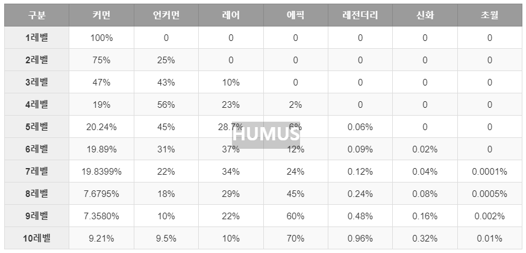

## 이문서는 세시 소프트가 제작 게임의 기획서용 텍스트 자료입니다. 

## --------------------------------------------

## 목차
## [1. 게임 게요](#게임-개요)

## [2. UI 설명](#UI-설명)

## [3. 게임 진행](#게임-진행)

## [4. 게임 스테이터스](#게임-스테이터스)

## [5. 도감](#도감)
### [무기](#무기-6종-24개)
### [동료](#동료-30명)
### [몹](#몹-리스트)

## --------------------------------------------
## 게임 개요.
### 개요
- 2023년 세시소프트가 제작하는 새로운 판타지의 방치형 게임 
- 제목 : 라스트 카우보이! or 7인의 카우보이 (가제)

### 기획의도
1) 중세 판타지가 아닌 새로운 판타지(서부극)의 게임
2) 익숙하지만 재미가 보장된 방치형 디펜스 게임
3) vip 뽑기 + 시즌 패스를 통한 유료 모델 게임

### 배경 스토리
1) 추수때 마다 무법자들에게 농작물을 약탈 당하는 농부들의 마을 
2) 결국 마을 사람들은 유명한 건맨인 "나"를 고용하여 무법자들과 맞서려 한다.  
3) "우리에게 싸우는 법을 가르쳐 주세요!" 
4) 이후 나는 마을을 지켜낸 동료들과 팀을 이뤄 
5) 수많은 마을들을 무법자들에게 지켜낸 전설이 된다.

### 벤치 마킹 게임
1) 더 타워 아이들 타워 디펜스 -> 기본 게임 시스템 차용
    - 중앙에 기지가 있고 사정거리안에 몹이 들어오면 처치한다.      

2) 레전드 오브 슬라임 -> 스테이지 구성과 VIP 뽑기
    - 스테이지 구성 (방치형 게임의 일반적인 구성)
    - VIP 뽑기, 시즌패스

3) 서부극 게임(참고) -> 판타지
    - 서부 판타지
    - 미니 게임 (사냥, 낚시등 이벤트 참조)

### 게임 구조
1) 기지 방어 디펜스임게임
    - 상승하는 적이 중앙에 기지를 파괴하기 위해 몰려온다.
    - 기지의 전투력을 강화하여 적을 물리치는 게임 

2) 동료와 무기를 통해 추가 공격력 상승
    - 뽑기를 통해 동료와 무기를 얻어 전투력을 상승시킨다.     

3) VIP 뽑기를 통한 빌링 구조
    - 유료 재화인 다이아 뽑기를 기반으로 한 빌링 구조
    - 뽑을수록 상위 등급 재료가 나올 확률이 올라간다.
    - 아래표는 레전드 오브 슬라임의 VIP 뽑기 확률 (뽑기 레벨에 따라 확률이 다르다.)
        

### 게임 관련 중요 개념 정리
1) 배경 관련 
    - 웨이브 : 일정시간 몰려오는 적의 패턴 보통 10초 ~ 5분.
    - 레벨 (웨이브 4개): 웨이브 4번을 클리어 하면 보스가 나오고 이 보스를 클리어 하면 레벨을 클리어 했다고 설정
    - 에피소드 (레벨 10개): 10개의 레벨을 클리어 하면 에피소드 1개가 클리어 된 걸로 설정 
    - 스테이지 (스테이지마다 틀림): 에피소드를 모드 클리어하면 스테이지 클리어
    - 레벨, 에피소드, 스테이지 종료시에 보스를 클리어 해야 한다. 
    - 각각 레벨보스, 에피소드 보스, 스테이지 보스라 부른다.

2) VIP 뽑기
    - 뽑기 레벨에 따라 등급별 확률이 조정되는 뽑기 
    - 뽑기를 많이 할 수록 뽑기 레벨이 올라간다.
  
4)  강화, 융합, 승급
    - 강화 
        - 마차 강화 : 골드로 강화 -> 전체적인 능력을 향상
        - 무기 강화 : 골드로 강화 -> 공격력을 향상 
        - 동료 강화 : 골드로 강화 -> 공격 패턴을 다양하게 한다
        - 스킬 강화 : 수련 시간을 소모 -> 다이아로 즉시 완료 가능
    
    - 융합
        - 무기 융합 : 무기 5개를 합치는 것
        - 동료 융합 : 동료 5명을 한명으로 합치는 것
        - 스킬 융합 : 없음
          
    - 승급
      - 융합된 무기나 동료가 5개가 되면 상우 등급으로 승급할수 있다. 
      - 뽑기를 통해 얻지 못해도 융합을 통해 승급 할수 있다. 
      - 스킬 승급 : 없음 -> 새로운 스킬은 동료 강화를 통해서만 이루어진다. 
 
5) 스킬
    - 스킬은 동료가 가지고 있는 특수 능력이다. 
    - 동료가 강화 될때마다 1개씩 추가로 배우게 된다.
    - 수련을 통해서 스킬도 강화 할수 있다. 
    - 동료중 한명인 인디어 루의 경우
        - 액티브 스킬 3개 -> 불같은 공격(연타 공격), 강인한 육체(체력 회복 수치 +100%), 분쇄 (범위안에 몹들을 밀어낸다.)
        - 패시브 스킬 2개-> 날으는 도끼 (도끼 던지기 공격), 악어신의 축복(초당 호위들의 체력을 1% 회복)  
        - 호위에 배치하면 액티브로, 마차 보조에 배치하면 패시브 사용된다.
6) 컨디션
    - 몹은 어두워 질수록, 날씨가 좋지 못할수록 컨디션이 올라간다.
    - 컨디션이 올라가면 공격력, 공격속도가 컨디션에 따라 상승한다.

7) 이벤트
    - 웨이브를 이벤트라 부르며 이벤트는 전투, 생활 이벤트로 나누어 진다.
    - 전투 이벤트가 일번적인 웨이브이다.
    - 생활이벤트는 전투 이외의 것으로 별도의 사냥도 이에 포함된다. 
    - 전투와 생활 이벤트 비율은 9:1이다.

8) 시간과 날씨
    - 에피소드는 시간으로 설정된다.
    - 에피소드 하나가 클리어 되면 시간이 흐른것으로 설정된다.
    - 시간이 흘러 밤이 될수록 몹의 난이도는 올라간다. 
    - 날씨가 흐려지면 몹의 난이도가 올라간다. 

9) 몹
    - 기지를 공격하는 모든 것을 통칭
    - 인간형, 동물형, 기타형으로 구분 
    - 인간형 -> 무법자, 산적등등
    - 동물형 -> 쥐에서 부터 곰까지 
    - 기타형 -> 그외
    - 몹의 스탯 구성은 동료의 구조와 동일하다.

## --------------------------------------------
## UI 설명
### 인게임
1) 레벨 : 포장마차 (주인공) 레벨
2) 날씨 : 맑음 -> 흐림(비)까지 날씨 변화 (국지적 난이도 상승 요소)
3) 골드 : 현재 최대 골드량
4) 보석 : 현재 최대 다이아량
5) 생존시간 : 일반 게임 스테이지으 다른 표현 
6) 동료 : 포장 마차 주변을 방어하는 동료 (최대 4명)

### 하단부
1) 좌측 부터 강화, 무기, 동료, 도전, 샵
2) 강화 -> 마차로 표기되는 주인공의 스탯 
3) 무기 -> 마차에 장착되는 24등급으 머신건 관련 UI
4) 동료 -> 마차를 호위하는 동료 최대 6명 (마차 외부 4명, 내부 2명)
5) 스테이지 -> 기획중 -> 현재는 일반 방치형 게임처럼 진행 할 예장
6) 도전 -> 특수 목적 던전 같은 개념 -> 보스도전, 골드 도전, 무한도전
7) 샵 -> 패키지, 시즌패스, VIP 뽑기(무기, 동료) 다이아, 골드 판매

## --------------------------------------------
## 게임 진행
### 게임 시작
1) 강화를 통해 전체 스탯을 올린다.
    - 마을 한가운데 마차를 세워놓고 시작
    - 캐릭터 즉, 대장인 나를 강화한다.
    - 능력 강화는 전체 무기, 동료들의 스킬에 기반이 된다.
    - [강화 스탯 정리](#강화-스탯-정리)  

2) 무기를 장착하고 강화와 융합을 통해 공격력을 올린다.
    - 마차에 탑승한 주인공의 무기로 기관총이다. 
    - 무기를 수리(강화) 하여 능력을 강화 한다.
    - 무기를 교체(승급)하여 능력을 상승 시킨다.
    - [무기를 구분하는 스탯](#무기-구분-스탯) 
    - [무기의 능력을 구분하는 스탯](#무기-능력-스탯)   

3) 동료
    - 마을 사람들이 마을을 수호하는 나를 따르게 된다.
    - 뽑기를 통해 소환하는 것을 고용이라고 한다.
    - 고용된 동료를 

4) 스킬
 
5) 몹을 물리치고 마을을 방어하면 스테이지를 클리어 할수 있다.
    - 스테이지 구성      
      - 웨이브 4개 -> 레벨 -> 레벨마다 보스 존재
      - 레벨 10 -> 에피소드 1개
      - 에피소드 24개 -> 스테이지로 구성되어 있다.    
    - 스테이지의 클리어
      - 보스를 물리치고 레벨을 클리어하면 다음 에피소드가 진행된다.
      - 최초 오전 10시부터 다음날 10시까지가 진행시간이다. (게임 내 시간) 
      - 시간이 흐를수록 날씨가 나빠질스럭 난이도가 올라간다.    

6) 스테이지 클리어가 힘들 경우 추가 스탯의 강화하여 능력을 강화 한다. 
    - 스테이지 진행 됨에 따라 차례로 추가 스탯들이 개방된다. (캐릭터 레벨도 고민중) 
    - 공격 스피드부터 개방된다.
    - [강화 스탯 정리](#강화-스탯-정리) 
 
7) 몹의 종류
    - 마차를 공격하는 생명체(?)
    - 야수, 인간, 마차등 서부 판타지의 많은 
    - 야수 -> 늑대, 코요태, 멧돼지등 맹수에거 쥐등 농부에게 해가 되는 짐승들
    - 사람 -> 부랑자, 강도, 무법자, 탈영병, 악한 인디언등 
    - 기물 -> 마차나 기관총 부태등 야수나 사람에 속하지 않는 몹을 통칭
    - 좀 더 크게 표현 된 몹들이 해당 레벨의 보스로 나타난다.
   

8) 이벤트 진행 
    - 화면 상단 우측에 이벤트 표기 ㄱ4(경험치 획득 기준에 따라 이벤트 진행)
    - [이벤트 리스트](#이벤트-리스트)      
    - 다이아로 이벤트 보상 -> 자연스럽게 VIP 뽑기로 유도
    - 스테이지 이벤트 진행 => 스테이지로 이동 (기획중)
    - 몹도 기본 스탯에 영향을 받는다. 동료를 구성하는 것과 같은 형태로 몹도 구성된다.
    - [몹 관련 스탯 정리](#몹-관련-스탯) 

9) VIP 뽑기
    - 게임 진행을 위해 스킬, 무기, 동료는 스탯 상승의 플러스 요인
    - 무기 -> 물리적 공겨력 (사거리 만큼 기지 방어)
    - 동료는 -> 물리적 공격력 (무기의 사거리 밖에서 기지 방어)
    - 스킬 -> 
    - 그런데 이 세가지는 모두 VIP 뽑기를 통해서만 습득 할수 있다. 
    - 게임은 다이아를 지속적으로 공급해주고 뽑기로 유저를 유저하는 구조를 가지고 있다. 

## --------------------------------------------
## 게임 스테이터스
### 게임 데이터 스탯
  - 강화되지 않으나 게임 진행을 위해 필요한 스탯 정리
  
### 강화 스탯 정리
  - 주인공 스탯 정리 -> 마차로 표현
  
### 무기 스탯 정리
  - 무기 24종 관련 스탯
  - 무기의 특성을 가르는 스탯 (히든스탯으로 게임에 표기 되지 않는다.)
  - 총알 수량량 리롤드만 UI로 표기 된다.
    
### 동료 스탯 정리
  - 동료 30종 관련 스탯
   
### 스킬 스탯 정리
  - 동료 1명당 5개의 스킬 -> 총 150개
  - 스킬 방향은 공격의 방법을 위주로 기획된다.  

## --------------------------------------------
## 도감 
### 설정이 완료되면 무기 리스트, 동료 리스트로 구분하여 시트로 정리할 예정
### 보유효과, 장착효과
1) 동료, 무기에 적용되어 있는 효과
2) 보유효과 -> 뽑기를 통해 확보만 하면 얻을수 있는 효과
3) 만일 무기 6종을 가지고 있다면 장착하지 않아도 보유효과는 합산되어 부가된다.
4) 장착효과 -> 장착해야지만 얻을수 있는 효과
5) 일반적으로 장착 효과가 보유 효과에 비해 10배이상으로 기획되어 있다. 

### 무기 6종 24개
- 마차에 장착된 기관총
- 총 24 등급 (레벨?)
    - 1-4 등급 : 고물 기관총 (노말 1-4등급)
    - 5-8 등급 : 오스먼드 기관총 (고급 1-4등급)
    - 9-12 등급 : 노획품 기관총  (레어 1-4등급)
    - 13-16 등급 : 윌튼의 기관총 (영웅 1-4등급)
    - 17-20 등급 : 데를의 기관총 (전설 1-4등급)
    - 21-24 등급 : 바리조프의 기관총 (신화 1-4등급)
- 노말은 장착 효과만
- 이후 보유효과가 희귀도 레벨에 따라 하나씩 늘어난다.
- 각 레벨안에서 강화가 가능하다. 

1) 고물 기관총 - 노말 1,2,3,4등급
    - 고물 기관총
    - 마을 창고에 남겨져 있던 오랜된 기관총
    - 10연발이었고 재장전도 쉽지 않은 고물이다. 
    - 없는 것보단..  
2) 오스먼드 기관총 - 고급  1,2,3,4등급
    - 산적들과 전쟁이 결정나자 은행가 오스먼드가 마을에 기증한 기관총
    - 꽤 좋은 물건이나 총을 모르는 오스먼드가 구식을 사왔다.
    - 연발 능력은 향상되었으나 재장전이 고물 기관총과 거의 차이가 없다.

3) 노획품 기관총 - 레어 1,2,3,4등급
    - 전투중 산적들의 기관총을 노획했다. 
    - 무기에 박식한 만큼 성능이 좋은 기관총이다. 

4) 윌튼의 기관총 - 영웅 1,2,3,4등급
    - 전직 군인인 윌튼이 군수품을 가져왔다. 
    - 거의 최신 총으로 연발능력, 재장전 시간, 사정거리등이 우수하다.
    - 다만 군대에서 가져올때 고장을 내서 폐품으로 위장하여 가져온 탓에 수리가 잦은 것이 유일한 결점
    - 수리가 잦은 것 외에는 좋은 기관총이다.
      
5) 데롤 장군의 기관총 전설 1,2,3,4등급
    - 윌튼의 사정을 안 전 부대의 장군 데롤이 기관총을 지원해줬다. 
    - 월튼이 가져온곳보다 최신 기관총으로 긴말 필요없는 명품 
      
6) 바리조프의 신 기관총  신화 1,2,3,4등급
    - 러시아 발명가 바리조프가 만든 악마의 기관총
    - 폭팔력이 있는 총알을 사용하여 폭탄 기관총이라 불리웠다. 
    - 범위 공격이 가능한 이상한 기관총(고증 없음)

### 동료 30명명
- 마을 사람들이 하나둘 마을을 위해 나선다.
- 노말, 고급, 레어, 여웅, 전설, 신화 클래스로 나뉘며 
- 각 클래스 마다 물리 - 근접 - 근접 연사 - 원거리 - 특수 각각 1명으로 구서오디어 있다. 

1) 나이프 잭 (물리 - 칼)
    - 스물살 청년덩치가 작다.
    - 어릴때부터 칼을 잘써서 나이프 잭이라 불렸다. 
    - 신중하게 던지는 나이프 솜씨가 일품
    - 마차 수리도 가능한 친구 
2) 톰 아저씨 (근접 - 피스톨)
    - 왕년에 대단한 건맨이었다고 말하던 톰 아저씨
    - 그가 쓰는 피스톨은 아버지의 유품이다.
    - 누구보다 빨리 마을을 지키기 위해 나섰다. 
    - 연사가 안되는 피스톨을 빠르게 2연발하는 재주를 가졌다. 
3) 매트 (근접 연사 - 리볼버)
    - 마을 농장에서 일하는 흑인 
    - 노예는 아니지만 함께 지냈던 에드 할아버지 옆에서 농사를 짖는다.
    - 에드 할아버지를 아버지처럼 생각
    - 무료할때마다 리볼버로 동전 맞추기를 하였다.  
 4) 베조프 촌장 (원거리 - 라이플)
    - 육십먹은 아저씨   
    - 마을 촌장으로 산적들에게 맞서는 결정을 내렸다. 
    - 아끼는 라이플 한자루가 있다. 
5) 서머스 부인 (특수 - 힐러, 피스톨)
    - 산적들에게 서머스씨가 죽고 복수할 날만 기다렸다. 
    - 젊어서 간호사로 일했던 경험이 있다.
    - 서머스가 남긴 피스톨을 가지고  있다.   
6) 인디언 루 (물리 - 도끼)
    - 마을에 살고 있는 인디언루
    - 자신의 부족이 모두 죽고 혼자 남았다.
    - 마을 이집 저집 일을 도와주고 곡식을 얻어 먹고 산다.  
    - 라이플을 가지고 있지만 주로 도끼로 싸운다.
    - 시야가 좋다. 
7) 월튼 대위 (근접 - 피스톨)
    - 전직 군인이며 장교라고 본인이 항상 소개 한다.
    - 오래된 피스톨 한자루를 가지고 있다.
    - 정의롭고 용감한 인물이라 같이있다는 것만으로도 의지가 되는 인물이다.  
8) 엉덩이 잭슨 (근접 연사 - 리볼버)
    - 큰 엉덩이가 유명해 누구나 엉덩이 잭슨이라 부른다.
    - 마을 술집에서 일한다.
    - 남의 놀림도 웃어 넘기는 유한 남자
    - 느릿 느릿하지만 속사능력을 가지고 있다. 
9) 미세스 에이미 (원거리 - 라이플)
    - 그의 남편을 본사람은 없지만 마을에서 술집을 한다.
    - 본인이 미세스 에이미라 소개 했기 때문에 다들 그렇게 부른다.
    - 산적에게 모욕을 당하고 거금을 들여 라이플 한자루를 사서 두었다.
    - 기술은 없지만 최신식 라이플의 위력은 대단하다. 
10) 은행가 오스먼드씨 (특수 - 돈, 샷건)
    - 어린 시절 살던 이 마을에서 여생을 보내려 왔다.
    - 산적의 이야기를 듣고 분노 했다. 
    - 샷건 한자루를 가지고 다니는데 물소 사냥을 하던 물건이라고 한다.
    - 건맨을 고용하는데 돈을 많이 냈다. 
11) 허풍쟁이 추 (물리 - 맨손)
    - 늘 뛰어난 무술 실력을 가지고 있다고 자랑했던 추
    - 하지만 산적이 나타났을때 말한마디 못했다. 
    - 사람들이 비난했지만 추는 변명하지 않았는데 
    - 그날밤 나에게 다가와 추는 자신의 무술을 보여주었다.
    - 맨손의 무술가  
12) 피스톨 리 (근접 - 피스톨)
    - 말끔한 차림의 신사 1
    - 피스톨로 연사가 가능한 능력을 가진 인물
13) 스티븐 베인 (근접 연사 - 리볼버)
    - 농부중 하나 
    - 처음으로 싸움에 나선 농부중 하나 
    - 배운지 몇일이 안됐지만 천부적으로 리볼버를 잘 다룬다.       
14) 샤냥꾼 포 (원거리 - 라이플)
    - 인디언으로 오래전부터 마을에 살았다. 인디어 루보다는 마을 사람 느낌
    - 백인여자와 결혼해서 살지만 마을일에 간섭하지 않았다.  
    - 산적들에 의해 아들이 죽고 각성한 상태
15) 대장장이 마르볼리 (특수 - 수리, 리볼버)
    - 마을의 대장장이                              
    - 뛰어난 수리 능력을 지녔다. 
    - 이와중에도 마을일을 하면 돈을 받길 원하는 인물
16) 다릴 한나 (물리 - 채찍, 곰)
    - 서커스단에서 일했다는 말이 있다. 
    - 채찍을 아주 잘쓴다고 한다. 
    - 집에서 곰을 키운다고 하는데 본 사람은 별로 없다. 
17) 푸크 (근접 - 피스톨)
    - 마을에서 가정을 꾸리고 사는 흑인
    - 산적들과도 아는 사이 
    - 이제 편을 정해야 하는 입장
    - 피스톨을 마치 리볼버처럼 사용하는 기술자  
18) 카우보이 보 (근접 연사 - 리볼버)
    - 마을밖에서 카우보이로 일하는 인물 
    - 산적들에게 1년에 한마리씩 상납해왔다.
    - 별로 나쁘지 않은 딜이었는데 어느날 산전떼가 술이 취해 소떼 20마리를 죽이자 
    - 갑자기 불구대천의 원수가 됐다.  
19) 카우보이 브랜든 (원거리 - 라이플)
    - 보와 같이 일하는 동업자
    - 보랑 일심동체 - 그냥 보의 의견을 항상 듣는다.
    - 라이플을 개조해서 3발을 기본 장착하는 능력의 소유자
    - 재장전의 특기가 있다.  
20) 몽고인 울란 (특수 - 시야, 활)
    - 18살 몽고인 소녀지만 친척 아저씨의 친구인 허풍쟁이 추와 함께 어릴때 미국으로 넘어왔다. 
    - 매 사냥꾼 아버지의 피를 이어받아 대단히 뛰어난 시력을 가지고 있다. 
    - 당시 조선에서 유래된 사정거리가 긴 각궁을 잘 쏜다.
    - 각종 샤냥으로 고기를 팔아 돈을 벌어왔다.
    - 가난한 집안에서 추에게 울란을 판것이지만 추는 울란을 딸처럼 키웠다.

### 몹 리스트
