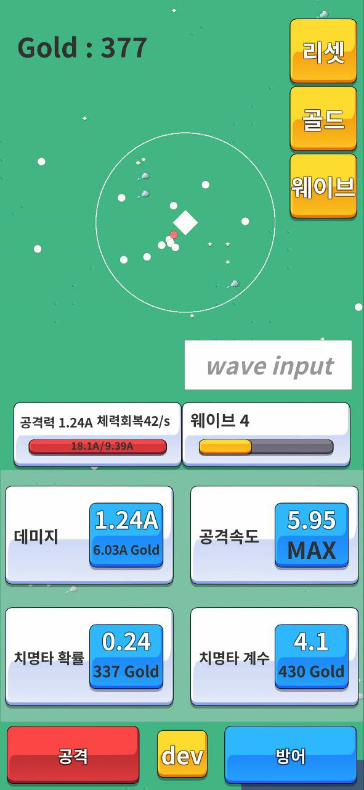
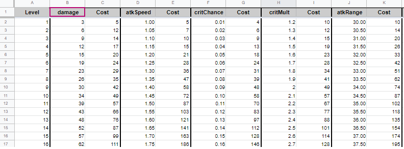
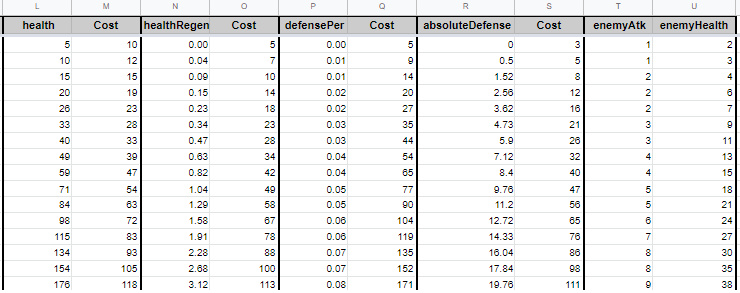

# 샘플 프로젝트 구조에 대하여

---

<aside>
💡 **HEADER**

</aside>

---

# 개요

---
샘플 프로젝트에 대한 전체적인 설명입니다.

<aside>
⚠️ 작성시기 2023년 02월

</aside>

---

## 게임 설명

 

###

#### 1. 원으로된 적이 네모로 날아온다.
#### 2. 원으로 된 적들을 파괴하여 골드를 획득 -> 업그레이드를 하여 강력해지는 적들을 상대한다.
#### 3. 네모를 가운데로 한 가느다란 원은 공격할 수 있는 범위를 표시.
#### 4. 적들이 네모를 공격하여 체력을 모두 잃으면 게임 종료.
#### 5. 최상단 좌측 현재 자신이 보유한 골드 표시.
#### 5. 상단 우측 "리셋" 버튼은 스탯 및 골드 초기화, "골드" 버튼은 골드 지급, "웨이브" 버튼은 바로 밑 "wave input"란에 숫자 입력 후 버튼을 누를 시 해당 웨이브로 이동한다.
#### 6. 중단 좌측 발사체 공격력과 초당 체력 회복량 및 체력 게이지 바 적용
#### 7. 중단 우측 현재 웨이브와 남은 웨이브 시간 게이지 바 적용
#### 8. 중하단 각 파란색 버튼 클릭 시 필요 골드 충족 시 해당 스탯 업그레이드.
#### 9. 하단 "공격" 및 "방어" 버튼 클릭 시 관련된 스탯 업그레이드 버튼들이 중하단에 반영된다. 
#### 10. 하단의 중간에 위치한 "dev" 버튼 클릭 시 상단 우측 3개의 노란 버튼을 ON/OFF한다.

### --------------------------------------------
### 아래 첨부한 구글 시트 링크는 더 타워를 기반으로 만든 레벨별 스텟 및 업그레이드 비용이며, 적군의 웨이브당 체력, 공격력도 반영되어있다. 
https://docs.google.com/spreadsheets/d/1qCt3RHlyt0kz3FoBf-5NzXZz-LHhP0Adpw8i7nLRoiY/edit#gid=0

## --------------------------------------------
## 중요 언어 정리
1) 골드 : 스탯 업그레이드를 위한 필요 재화. 적 처치 당 1씩 증가하고, 각 웨이브 클리어 당 10씩 증가한다.
2) 웨이브 : 스테이지와 동일한 개념. 총 5000웨이브가 있다.

## --------------------------------------------
## 주요 설정
1) 웨이브 난이도를 결정하는 중요 요소
  - 다음 적들이 나올때까지의 대기 시간
  - 웨이브 별로 적들의 공격력과 체력이 적용된다.
  - 5 웨이브 당 보스 웨이브가 존재하며, 일반 웨이브는 적 출몰 26초, 대기시간 9초로 총 35초, 보스 웨이브는 적 출몰 26초, 대기시간 11초로 총 37초가 적용된다. 

2) 웨이브를 클리어 하기 위한 중요 요소
  - 골드를 사용하여 공격 스탯을 상승 -> 데미지, 공격속도, 치명타 확률, 치명타 계수, 공격 범위
  - 골드를 사용하여 방어 스탯을 상승 -> 체력, 체력 재생, 방어율, 절대방어

3) 데미지 정의
  - 발사체 명중 시 적에게 입힐 데미지 -> 데미지, 크리티컬 적용 시 데미지 * 치명타 계수 적용
  - 적에게 피격 시 피해 데미지 -> (적 데미지 * 방어율) - 절대방어

## ---------------------------------------------
## 스탯 데이터 적용
### 게임 로딩 시 아래 구글 스프레드 시트 데이터를 가져온다.
  - 원작도 같은 방식으로 개발되었다. 
  - cost 값과 데미지, 치명타 개수, 체력, 체력 재생등 4가지는 전문 수열을 사용하였다.

 

- 업그레이드한 각 스탯들의 레벨은 세이브 데이터에 저장해서 가져온다.
- 위 시트를 기반으로 각 레벨별 스탯 및 웨이브별 적 체력, 공격력을 정의한다.
- 레벨 : 각 스탯에 해당되는 레벨
- 스탯 : 데미지, 공격 속도 등 수치
- 코스트 : 다음 스탯 레벨업을 위한 필요 골드 비용

