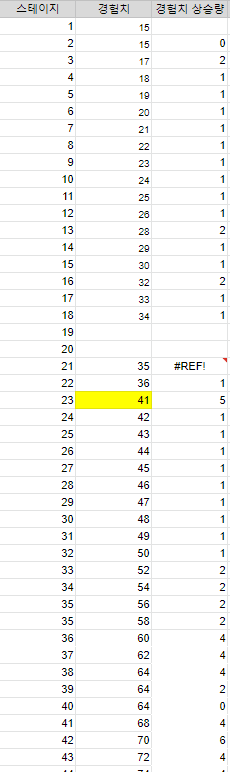

# 스테이지별 경험치 공식에 대하여

---

<aside>
💡 **HEADER**

</aside>

---

# 개요

스테이지별 경험치는 몬스터 처치 당 순수 기본 획득량입니다.
경험치 상승 획득량은 일부 일정하지 않은 스테이지들이 다수 존재하며 일정한 구간에서는 특정 스테이지 구간별 상승폭으로 증가합니다.

<aside>
⚠️ 작성시기 2023년 02월

</aside>
<aside>
⚠️ unity 버전은 관계없습니다 (기획문서)
</aside>

***

## 스테이지별 경험치 획득표


***

## 공식
정확한 공식은 일정하지 않지만 
5~6 스테이지별 1 2 4 6 8 상승으로 추정 공식은 다음과 같습니다.

```
1 * (2 + (S / 5 or 6 에서 소수 절사))
```

