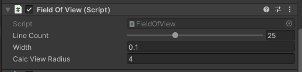
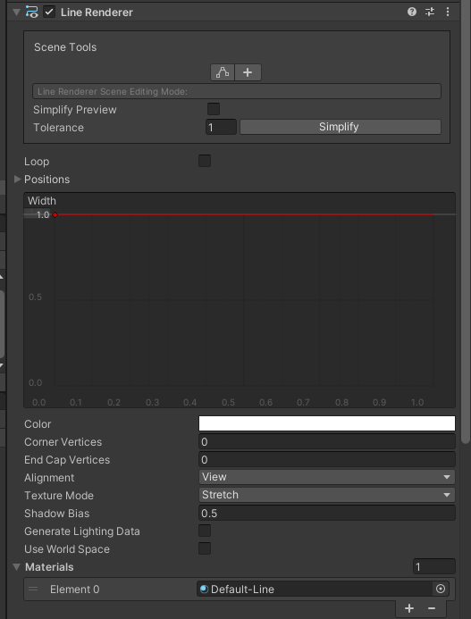

## 원형 범위를 사용한 코드 (개발실 TF팀 박경담)

원형 범위 안의 특정 타겟을 특정해 총알을 쏘는 코드
* 인스펙터 설정을 해주세요
- width 원의 두께
- Calc View Radius 원의 반지름
- line count 원의 부드러움
<br>
* 이 코드를 넣은 오브젝트에 라인렌더러 추가 필요
<br>
* 라인렌더러의 마테리얼을 지정해주세요
* 라인렌더러의 use world space 옵션 체크를 해제해주세요
```C#
using System.Collections;
using System.Collections.Generic;
using UnityEngine;

public class FieldOfView : MonoBehaviour
{
    [Range(6, 60)]
    //원 드로잉에 사용할 선분의 매수
    public int lineCount;
    //선분의 폭
    public float width;

    //라인렌더러
    private LineRenderer LineDrawer;

    // 그리는 원의 반지름
    public float calcViewRadius;


    void Start()
    {
        LineDrawer = GetComponent<LineRenderer>(); LineDrawer.loop = true;
        // 원형 드로우
        Draw();
    }
    public void Draw()
    {
        LineDrawer.positionCount = lineCount;
        LineDrawer.startWidth = width;
        // 원을 만들기 위한 하나의 선분 각도를 계산
        float theta = (2f * Mathf.PI) / lineCount;
        float angle = 0;
        // 선분 개수만큼 원형으로 라인을 생성 => 원 
        for (int i = 0; i < lineCount; i++)
        {
            float x = calcViewRadius * Mathf.Cos(angle);
            float y = calcViewRadius * Mathf.Sin(angle);
            LineDrawer.SetPosition(i, new Vector3(x, y, 0));
            //switch 0 and y for 2D games
            angle += theta;
        }
    }
}

    
  
```

